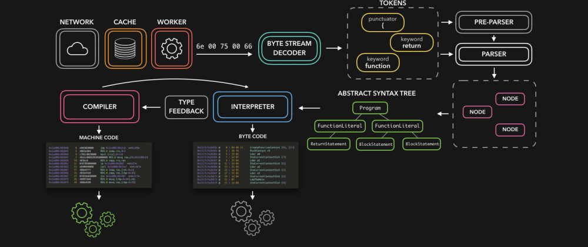

# JavaScript: Under the Hood



# The JavaScript Engine

A JavaScript Engine is the one which takes in our code and converts it into a machine-readable language.

And there are various JavaScript Engines that are available for use.

- Chakra, Microsoft IE/Edge
- SpiderMonkey, FireFox
- V8, Chrome

# Inside the JavaScript Engine

V8 is one of the most popular JavaScript Engines which is used by Chrome and NodeJs. It’s written in C++, a low-level language.

So, to keep an overwatch on these engines, a standard was created called ECMA which provides a specification on how to write an engine and all the features of JavaScript. 

We will take the V8 engine to explore things further but the fundamental concepts remain the same in all engines.


This is what a JS Engine will look like inside. The code that we input will pass through the following stages,
1. Parser
2. AST
3. Interpreter produces ByteCode
4. Profiler
5. The compiler produces Optimized Code

In detail:

1. A **Parser** is the one which identifies, analyzes and classifies various parts of our program such as whether is it a function? is it a variable? etc by looking on the various JavaScript Keywords.
2. **AST (Abstract Syntax Trees)** then constructs a tree-like structure based on the classification from the parser. There’s an AST Explorer which you can check out to know how the tree is constructed.
3. The Tree is then given to the **interpreter** which then produces a ByteCode. And as we saw earlier, byte code is not the lowest level of code but it can be interpreted. At this stage, the browser with the help of the V8 engine does its work with the available byte code so that the user doesn’t need to wait.
4. On the same time, the **profiler** looks for any code optimizations and then passes the input to the compiler. The **compiler** produces an optimized code while the byte code is used temporarily to render things on the browser. And as soon as the optimized code is produced by the compiler, the temporary byte code is completely replaced by this new optimized code.
4. And hence in this way, we could use the best of both the interpreter and the compiler. The interpreter executes the code while the profiler looks for optimization and the compiler creates an optimized code. Then the byte code is replaced by the optimized code which will be a lower-level code such as a Machine Code.


# Interpreter VS Compiler

Generally, there are two ways of converting the code into a machine-readable language. And the concept that we are gonna talk about applies not only to JavaScript but also to most of the programming languages like Python, Java, etc.

- An **Interpreter** reads the code line by line and executes it immediately.
- A **Compiler** reads on your entire code, does some optimization and then produces an optimized code.

Okay. Let us go over one more time with an example.
```javascript
function add(a, b) {
    return a+b
}
for(let i = 0; i < 1000; i++) {
    add(1 + 1)
}
```
The above example just calls a function called add for 1000 times which adds two numbers and returns the sum.
1. If we give this file to an **Interpreter**, it reads on line by line and executes the function immediately till the loop is over. So it just translates the code into something which our computer can understand on the go.
2. And if we give this file to a **Compiler**, it reads on the entire program, does some analysis of what we wanted to do and produces an optimized code in some other language which a machine can understand. It’s like taking X(our JS file) & producing Y(Optimized code that a machine can understand). And if we use an interpreter on Y(Optimized code), the result will be the same as it was before while interpreting X(JS Code).


And from the above image, **byte code** is just an intermediate code which still needs to be interpreted for the computer to process. But both the interpreter and compiler converts **source code** into **machine code** but the only difference is on how the conversion is done.
- An **Interpreter** converts the source code line by line to equivalent Machine Code.
- A **Compiler** converts the entire source code to Machine Code at once.

## Pros and Cons of Interpreter & Compiler
- An **interpreter** has the advantage of executing the code immediately without the need of any compilation. And this may seem helpful for running JS files in the browser since we don’t want to wait. But this gets slow down when there is more JS code to interpret. Remember our little code snippet where we called a function 1000 times. In that case, the output remains the same even though the function add was called 1000 times. These kinds of situations make an interpreter slow.
- But a **compiler** can do some optimization in such cases by replacing the loop with a single number 2 (Because we added 1 + 1 every time) as it remains the same for all the 1000 iterations. The final code that a compiler gives out will be optimized and can be executed much faster.

So with the pros and cons of a compiler and interpreter in mind, what if we used the best of both? And this where **JIT (Just In Time)** Compiler comes in. It’s a combination of both the interpreter and the compiler and most of the browsers are now implementing this feature to be faster and efficient. And the V8 engine also uses this feature.

## Note on Byte Code
As Machine Code, a byte code cannot be understood by all the computers. It still needs a middleware like Virtual Machine or an Engine like Javascript V8 to interpret it to a machine-readable language. And that’s why our browsers can execute this byte code from the interpreter during those above said 5 stages with the help of JavaScript Engines.

# Compilation
When your JavaScript file is loaded by the browser, V8's parser transforms it into an abstract syntax tree (AST). This tree is used by Ignition —an interpreter which produces bytecode. Bytecode is an abstraction of machine code able to be executed by compiling to non-optimized machine code. V8 executes it in the main thread while TurboFan, the optimizing compiler, makes some optimizations in another thread and produces optimized machine code.
This pipeline is called just-in-time (JIT) compilation.


# Call Stack

JavaScript is a single-threaded programming language with a single call stack. It means that your code is executed synchronously. Whenever a function runs, it will run entirely before any other code runs.

When V8 invokes your JavaScript functions it has to store the runtime data somewhere. Call Stack is the place in memory which consists of stack frames. Each stack frame corresponds to a call to a function which has not yet terminated with a return. A stack frame is composed of:
- local variables
- argument parameters
- return address

If we execute a function, V8 pushes frame on top of the stack. When we return from a function, V8 pops off the frame.


Call Stack in Chrome Dev Tools

Everything else is allocated dynamically in a large unstructured piece of memory called the Heap.

# Heap

Sometimes V8 doesn’t know at compile time how much memory an object variable will need. All the memory allocation for such data happens in the heap — unstructured region of memory. Objects on the heap live on after we exit the function that allocated the memory.

V8 has a built-in Garbage Collector (GC). Garbage collection is a form of memory management. It’s like a collector which attempts to release the memory occupied by objects that are no longer being used. In other words, when a variable loses all its references GC marks this memory as “unreachable” and releases it.

You can investigate heap by making a snapshot in Chrome Dev Tools.


Heap snapshot in Chrome Dev Tools (2.2 MB for a blank page!)

# Browser Runtime

So V8 can execute JavaScript according to the standard, synchronously, using a single call stack. But there is not much we can do with it. We need to render the UI. We need to handle user interactions with the UI. Moreover, we need to handle user interactions while making network requests. But how do we achieve concurrency when all our code is synchronous? It’s possible thanks to the browser engine.

The browser engine is responsible for rendering pages with HTML and CSS. In Chrome it’s called Blink. It’s a fork of WebCore which is a layout, rendering, and Document Object Model (DOM) library. Blink is implemented in C++ and exposes Web APIs like DOM elements and events, XMLHttpRequest, fetch, setTimeout, setInterval and so on, which are accessible via JavaScript.

Let’s consider the following example with setTimeout(onTimeout, 0):


As we can see f1() and f2() functions are pushed to the stack first and then onTimeout is executed.

The key point is that we are registering a function to run at a later time. Whether it’s a user click or a timeout. Our asynchronous callback is executed by V8 only after the corresponding event is fired.

So how does the example above works?

## Concurrency

Right after the setTimeout function is executed — the browser engine places setTimeout’s callback function into an event table. It’s a data structure which maps registered callbacks to events, in our case onTimeout function to timeout event.

Once the timer expires, in our case immediately as we put 0 ms as the delay, the event is fired and the onTimeout function is put in the event queue (aka the callback queue or message queue or task queue). The event queue is a data structure which consists of callback functions (tasks) to be processed in the future.

And last but not least, the event loop, a constantly running loop, checks whether Call Stack is empty. If so the first added callback from the event queue is executed, hence moved to the call stack.

The processing of functions continues until the call stack is once again empty. Then the event loop will process the next callback in the event queue (if there is one).

```js
const fn1 = () => console.log('fn1')
const fn2 = () => console.log('fn2')
const callback = () => console.log('timeout')
fn1()
setTimeout(callback, 1000)
fn2()
// output:
// fn1
// fn2
// timeout
```


```js
const fn1 = () => console.log('fn1')
const fn2 = () => console.log('fn2')
const onTimeout = () => console.log('timeout')
const onResolve1 = () => console.log('resolved1')
const onResolve2 = () => console.log('resolved2')
fn1()
setTimeout(onTimeout, 0)
Promise.resolve()
  .then(onResolve1)
  .then(onResolve2)
fn2()
// output:
// fn1
// fn2
// resolved1
// resolved2
// timeout
```


Pay attention to the execution order of `onResolve1`, `onResolve2` and `onTimeout` callbacks.

## Blocking vs Non-Blocking

In simple terms, all the JavaScript code is considered blocking. While V8 is busy with processing stack frames — the browser is stuck. The UI of your app is blocked. The user won’t be able to click, navigate, or scroll. Responses from your network requests won’t be processed until V8 finishes its work.

Imagine that you have to parse an image in your program that’s running in the browser.

```js
const fn1 = () => console.log('fn1')
const onResolve = () => console.log('resolved')
const parseImage = () => { /* long running parsing algorithm */ }
fn1()
Promise.resolve().then(onResolve) // or any other Web API async fn
parseImage()
```


In the example above, the event Loop is blocked. It can’t process callbacks from event/job queue because the call stack contains frames.

Web API gives us a possibility to write non-blocking code via asynchronous callbacks. When calling functions like setTimeout or fetch, we are delegating all the work to C++ native code which runs in a separate thread. As soon as the operation is completed the callback is put to Event Queue. Meanwhile, V8 can continue further execution of JavaScript code.

With such concurrency model, we can handle network requests, user interactions with UI and so on without blocking the JavaScript execution thread.


