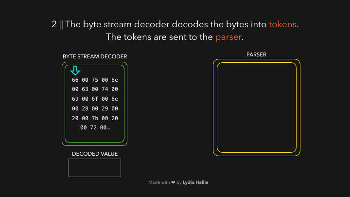
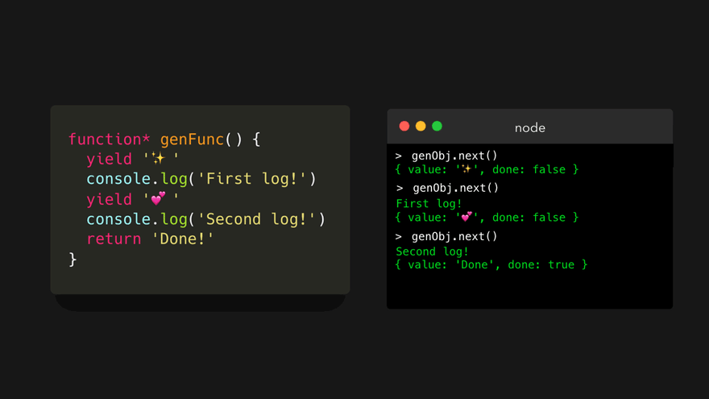
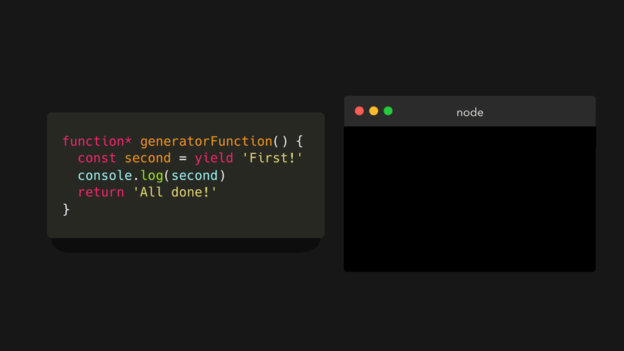
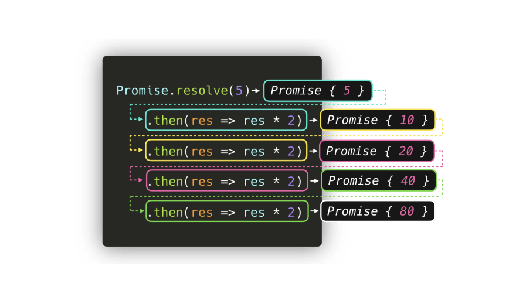

- [1 JavaScript Visualized: Event Loop](#1-javascript-visualized-event-loop)
- [2 JavaScript Visualized: Hoisting](#2-javascript-visualized-hoisting)
- [3 JavaScript Visualized: Scope (Chain)](#3-javascript-visualized-scope-chain)
- [4 JavaScript Visualized: the JavaScript Engine](#4-javascript-visualized-the-javascript-engine)
- [5 JavaScript Visualized: Prototypal Inheritance](#5-javascript-visualized-prototypal-inheritance)
- [6 JavaScript Visualized: Generators and Iterators](#6-javascript-visualized-generators-and-iterators)
- [7 JavaScript Visualized: Promises & Async/Await](#7-javascript-visualized-promises--asyncawait)
  - [Introduction](#introduction)
  - [Promise Syntax](#promise-syntax)
  - [Microtasks and (Macro)tasks](#microtasks-and-macrotasks)
  - [Async/Await](#asyncawait)


# 1 JavaScript Visualized: Event Loop

https://dev.to/lydiahallie/javascript-visualized-event-loop-3dif


JavaScript is single-threaded: only one task can run at a time. Usually that’s no big deal, but now imagine you’re running a task which takes 30 seconds.. Ya.. During that task we’re waiting for 30 seconds before anything else can happen (JavaScript runs on the browser’s main thread by default, so the entire UI is stuck) 😬 It’s 2019, no one wants a slow, unresponsive website.

Luckily, the browser gives us some features that the JavaScript engine itself doesn’t provide: a Web API. This includes the DOM API, `setTimeout`, HTTP requests, and so on. This can help us create some async, non-blocking behavior 🚀

When we invoke a function, it gets added to something called the call stack. The call stack is part of the JS engine, this isn’t browser specific. It’s a stack, meaning that it’s first in, last out (think of a pile of pancakes). When a function returns a value, it gets popped off the stack 👋


The `respond` function returns a `setTimeout` function. The `setTimeout` is provided to us by the Web API: it lets us delay tasks without blocking the main thread. The callback function that we passed to the `setTimeout` function, the arrow function `() => { return 'Hey' }` gets added to the Web API. In the meantime, the `setTimeout` function and the respond function get popped off the stack, they both returned their values!


In the Web API, a timer runs for as long as the second argument we passed to it, 1000ms. The callback doesn’t immediately get added to the call stack, instead it’s passed to something called the queue.


This can be a confusing part: it doesn't mean that the callback function gets added to the callstack(thus returns a value) after 1000ms! It simply gets added to the queue after 1000ms. But it’s a queue, the function has got to wait for its turn!

Now this is the part we’ve all been waiting for… Time for the event loop to do its only task: connecting the queue with the call stack! If the call stack is empty, so if all previously invoked functions have returned their values and have been popped off the stack, the first item in the queue gets added to the call stack. In this case, no other functions were invoked, meaning that the call stack was empty by the time the callback function was the first item in the queue.


The callback is added to the call stack, gets invoked, and returns a value, and gets popped off the stack.


Reading an article is fun, but you'll only get entirely comfortable with this by actually working with it over and over. Try to figure out what gets logged to the console if we run the following:
```js

const foo = () => console.log("First");
const bar = () => setTimeout(() => console.log("Second"), 500);
const baz = () => console.log("Third");

bar();
foo();
baz();
```
Got it? Let's quickly take a look at what's happening when we're running this code in a browser:


1. We invoke `bar`. `bar` returns a `setTimeout` function.
2. The callback we passed to `setTimeout` gets added to the Web API, the `setTimeout` function and `bar` get popped off the callstack.
3. The timer runs, in the meantime `foo` gets invoked and logs `First`. `foo` returns (undefined),`baz` gets invoked, and the callback gets added to the queue.
4. `baz` logs `Third`. The event loop sees the callstack is empty after baz returned, after which the callback gets added to the call stack.
5. The callback logs `Second`.

# 2 JavaScript Visualized: Hoisting


If you’re new to JavaScript, you may have experienced “weird” behavior where some variables are randomly undefined, ReferenceErrors get thrown, and so on. Hoisting is often explained as putting variables and functions to the top of the file but nah, that’s not what’s happening, although the behavior might seem like it 😃

When the JS engine gets our script, the first thing it does is **setting up memory** for the data in our code. No code is executed at this point, it’s simply just preparing everything for execution. The way that function declarations and variables are stored is different. Functions are stored with a **reference to the entire function**.


With variables, it’s a bit different. ES6 introduced two new keywords to declare variables: `let` and `const`. Variables declared with the `let` or `const` keyword are stored `uninitialized`.


Variables declared with the `var` keyword are stored with the default value of `undefined`.


Now that the creation phase is done, we can actually execute the code. Let's see what happens if we had 3 console.log statements on top of the file, before we declared the function or any of the variables.

Since functions are stored with a reference to the entire function code, we can invoke them even before the line on which we created them! 🔥


When we reference a variable declared with the var keyword before their declaration, it’ll simply return its default value that it was stored with: undefined! However, this could sometimes lead to "unexpected" behavior. In most cases this means you’re referencing it unintentionally (you probably don’t want it to actually have the value of undefined) 😬


In order to prevent being able to accidentally reference an undefined variable, like we could with the var keyword, a ReferenceError gets thrown whenever we try to access uninitialized variables. The "zone" before their actual declaration, is called the temporal dead zone: you cannot reference the variables (this includes ES6 classes as well!) before their initialization.


When the engine passes the line on which we actually declared the variables, the values in memory are overwritten with the values we actually declared them with.


All done! 🎉 Quick recap:

- Functions and variables are stored in memory for an execution context before we execute our code. This is called hoisting.
- Functions are stored with a reference to the entire functions, variables with the `var` keyword with the value of `undefined`, and variables with the `let` and `const` keyword are stored `uninitialized`.

# 3 JavaScript Visualized: Scope (Chain)


Let's take a look at the following code:
```js
const name = "Lydia"
const age = 21
const city = "San Francisco"


function getPersonInfo() {
  const name = "Sarah"
  const age = 22

  return `${name} is ${age} and lives in ${city}`
}

console.log(getPersonInfo())
```

We're invoking the `getPersonInfo` function, which returns a string containing the values of the `name`, `age` and `city` variables:
`Sarah is 22 and lives in San Francisco`. But, the `getPersonInfo` function doesn't contain a variable named `city` 🤨? How did it know the value of city?

First, memory space is set up for the different contexts. We have the default **global context** (`window` in a browser, `global` in Node), and a **local context** for the `getPersonInfo` function which has been invoked. Each context also has a **scope chain**.

For the `getPersonInfo` function, the scope chain looks something like this (don't worry, it doesn't have to make sense just yet):


The scope chain is basically a "chain of references" to objects that contain references to values (and other scopes) that are referencable in that execution context. (⛓: "Hey, these are all the values you can reference from within this context".) The scope chain gets created when the execution context is created, meaning **it's created at runtime**!

In the following examples, the key/value pairs in the execution contexts represent the references that the scope chain has to the variables.


The scope chain of the global execution context has a reference to 3 variables: `name` with the value `Lydia`, `age` with the value `21`, and `city` with the value `San Francisco`. In the local context, we have a reference to 2 variables: `name` with the value `Sarah`, and `age` with the value `22`.

When we try to access the variables in the `getPersonInfo` function, the engine first checks the local scope chain.


The local scope chain has a reference to `name` and `age`! `name` has the value of `Sarah` and `age` has the value of `22`. But now, what happens when it tries to access `city`?

In order to find the value for `city` the engine "goes down the scope chain". This basically just means that the engine doesn't give up that easily: it works hard for you to see if it can find a value for the variable `city` in the outer scope that the local scope has a reference to, the **global object** in this case.


In the global context, we declared the variable `city` with the value of `San Francisco`, thus has a reference to the variable `city`. Now that we have a value for the variable, the function `getPersonInfo` can return the string `Sarah is 22 and lives in San Francisco` 🎉

We can go down the scope chain, but we can't go up the scope chain. (Okay this may be confusing because some people say up instead of down, so I'll just rephrase: You can go to outer scopes, but not to more inner... (innerer..?) scopes. I like to visualize this as a sort of waterfall:


Or even deeper:


Let's take this code as an example.


It's almost the same, however there's one big difference: we only declared `city` in the `getPersonInfo` function now, and not in the global scope. We didn't invoke the `getPersonInfo` function, so no local context is created either. Yet, we try to access the values of `name`, `age` and `city` in the global context.


It throws a ReferenceError! It couldn't find a reference to a variable called city in the global scope, and there were no outer scopes to look for, and it cannot go up the scope chain.

This way, you can use scope as a way to "protect" your variables and re-use variable names.

Besides global and local scopes, there is also a **block scope**. Variables declared with the `let` or `const` keyword are scoped to the nearest curly brackets (`{}`).
```js
const age = 21

function checkAge() {
  if (age < 21) {
    const message = "You cannot drink!"
    return message
  } else {
    const message = "You can drink!"
    return message
  }
} 
```
You can visualize the scopes as:


We have a global scope, a function scope, and two block scopes. We were able to declare the variable message twice, since the variables were scoped to the curly brackets.

To quickly recap:

- You can see "scope chain" as a chain of references to values that we can access in the current context.
- Scopes also make it possible to re-use variable names that were defined further down the scope chain, since it can only go down the scope chain, not up.


# 4 JavaScript Visualized: the JavaScript Engine


Note: This post is mainly based on the V8 engine used by Node.js and Chromium-based browsers.

The HTML parser encounters a script tag with a source. Code from this source gets loaded from either the **network**, **cache**, or an installed **service worker**. The response is the requested script as a **stream of bytes**, which the byte stream decoder takes care of! The **byte stream decoder** decodes the stream of bytes as it’s being downloaded.


The byte stream decoder creates **tokens** from the decoded stream of bytes. For example, `0066` decodes to `f`, `0075` to `u`, `006e` to `n`, `0063` to `c`, `0074` to `t`, `0069` to `i`, `006f` to `o`, and `006e` to `n` followed by a white space. Seems like you wrote function! This is a reserved keyword in JavaScript, a token gets created, and sent to the **parser** (and `pre-parser`, which I didn't cover in the gifs but will explain later). The same happens for the rest of the byte stream.



The engine uses two parsers: the **pre-parser**, and the **parser**. In order to reduce the time it takes to load up a website, the engine tries to avoid parsing code that's not necessary right away. The preparser handles code that may be used later on, while the parser handles the code that’s needed immediately! If a certain function will only get invoked after a user clicks a button, it's not necessary that this code is compiled immediately just to load up a website. If the user eventually ends up clicking the button and requiring that piece of code, it gets sent to the parser.

The parser creates nodes based on the tokens it receives from the byte stream decoder. With these nodes, it creates an Abstract Syntax Tree, or AST. 🌳


Next, it's time for the **interpreter**! The interpreter which walks through the AST, and generates **byte code** based on the information that the AST contains. Once the byte code has been generated fully, the AST is deleted, clearing up memory space. Finally, we have something that a machine can work with! 🎉


Although byte code is fast, it can be faster. As this bytecode runs, information is being generated. It can detect whether certain behavior happens often, and the types of the data that’s been used. Maybe you've been invoking a function dozens of times: it's time to optimize this so it'll run even faster! 🏃🏽‍♀️

The byte code, together with the generated type feedback, is sent to an **optimizing compiler**. The optimizing compiler takes the byte code and type feedback, and generates highly optimized machine code from these. 🚀


JavaScript is a dynamically typed language, meaning that the types of data can change constantly. It would be extremely slow if the JavaScript engine had to check each time which data type a certain value has.

In order to reduce the time it takes to interpret the code, optimized machine code only handles the cases the engine has seen before while running the bytecode. If we repeatedly used a certain piece of code that returned the same data type over and over, the optimized machine code can simply be re-used in order to speed things up. However, since JavaScript is dynamically typed, it can happen that the same piece of code suddenly returns a different type of data. If that happens, the machine code gets de-optimized, and the engine falls back to interpreting the generated byte code.

Say a certain function is invoked a 100 times and has always returned the same value so far. It will assume that it will also return this value the 101st time you invoke it.

Let’s say that we have the following function sum, that’s (so far) always been called with numerical values as arguments each time:

```js
function sum(a, b){
    return a + b
}

sum(1, 2)
```
This returns the number 3! The next time we invoke it, it will assume that we’re invoking it again with two numerical values.

If that’s true, no dynamic lookup is required, and it can just re-use the optimized machine code. Else, if the assumption was incorrect, it will revert back to the original byte code instead of the optimized machine code.

For example, the next time we invoke it, we pass a string instead of a number. Since JavaScript is dynamically typed, we can do this without any errors!

```js
function sum(a, b){
    return a + b
}

sum('1', 2)
```
This means that the number 2 will get coerced into a string, and the function will return the string "12" instead. It goes back to executing the interpreted bytecode and updates the type feedback.


# 5 JavaScript Visualized: Prototypal Inheritance


Ever wondered why we can use built-in methods such as `.length`, `.split()`, `.join()` on our strings, arrays, or objects? We never explicitly specified them, where do they come from?

We often have to create many objects of the same type. Say we have a website where people can browse dogs!

For every dog, we need object that represents that dog! 🐕 Instead of writing a new object each time, I'll use a constructor function (I know what you're thinking, I'll cover ES6 classes later on!) from which we can create Dog **instances** using the new keyword.

Every dog has a name, a breed, a color, and a function to bark!

```js
function Dog(name, breed, color) {
    this.name = name
    this.breed = breed
    this.color = color
    this.bark = function() {
        return 'Woof!'
    }
}
```
When we created the `Dog` constructor function, it wasn't the only object we created. Automatically, we also created another object, called the **prototype**! By default, this object contains a constructor property, which is simply a reference to the original `constructor` function, `Dog` in this case.


The `prototype` property on the Dog constructor function is non-enumerable, meaning that it doesn't show up when we try to access the objects properties. But it's still there!

Okay so.. Why do we have this property object? First, let's create some dogs that we want to show. To keep it simple, I'll call them `dog1` and `dog2`. `dog1` is `Daisy`, a cute black Labrador! `dog2` is `Jack`, the fearless white Jack Russell 😎

```js
const dog1 = new Dog(
    "Daisy",
    "Labrador",
    "black"
)

const dog2 = new Dog(
    "Jack",
    "Jack Russell",
    "white"
)
```
Let's log dog1 to the console, and expand its properties!


We see the properties we added, like `name`, `breed`, `color`, and `bark`.. but woah what is that `__proto__` property! It's non-enumerable, meaning that it usually doesn't show up when we try to get the properties on the object. Let's expand it! 😃


Woah it looks exactly like the Dog.prototype object! Well guess what, `__proto__` is a reference to the `Dog.prototype` object. This is what **prototypal inheritance** is all about: each instance of the constructor has access to the prototype of the constructor! 🤯


So why is this cool? Sometimes we have properties that all instances share. For example the `bark` function in this case: it's the exact same for every instance, why create a new function each time we create a new dog, consuming memory each time? Instead, we can add it to the `Dog.prototype` object! 🥳


Whenever we try to access a property on the instance, the engine first searches locally to see if the property is defined on the object itself. However, if it can't find the property we're trying to access, the engine **walks down the prototype chain** through the `__proto__` property!


Now this is just one step, but it can contain several steps! If you followed along, you may have noticed that I didn't include one property when I expanded the `__proto__` object showing `Dog.prototype`. `Dog.prototype` itself is an object, meaning that it's actually an instance of the Object constructor! That means that `Dog.prototype` also contains a `__proto__` property, which is a reference to `Object.prototype`!


Finally, we have an answer to where all the built-in methods come from: they're on the prototype chain! 😃

For example the `.toString()` method. Is it defined locally on the `dog1` object? Hmm no.. Is it defined on the object `dog1.__proto__` has a reference to, namely `Dog.prototype`? Also no! Is it defined on the object `Dog.prototype.__proto__` has a reference to, namely `Object.prototype`? Yes! 🙌🏼


Now, we've just been using constructor functions (`function Dog() { ... }`), which is still valid JavaScript. However, ES6 actually introduced an easier syntax for constructor functions and working with prototypes: classes!

Classes are only **syntactical sugar** for constructor functions. Everything still works the same way!

We write classes with the `class` keyword. A class has a `constructor` function, which is basically the constructor function we wrote in the ES5 syntax! The properties that we want to add to the prototype, are defined on the classes body itself.


Another great thing about classes, is that we can easily **extend** other classes.

Say that we want to show several dogs of the same breed, namely Chihuahuas! A chihuahua is (somehow... 😐) still a dog. To keep this example simple, I'll only pass the name property to the Dog class for now instead of `name`, `breed` and `color`. But these chihuahuas can also do something special, they have a small bark. Instead of saying `Woof!`, a chihuahua can also say `Small woof!` 🐕

In an extended class, we can access the parent class' constructor using the `super` keyword. The arguments the parent class' constructor expects, we have to pass to `super: name` in this case.

```js
class Dog {
    constructor(name) {
        this.name = name
    }

    bark() {
        return 'Woof!'
    }
}

class Chihuahua extends Dog {
    constructor(name) {
        super(name)
    }

    smallbark() {
        return 'Small Woof!'
    }
}

const myPet = new Chihuahua("Max")
```
`myPet` has access to both the `Chihuahua.prototype` and `Dog.prototype` (and automatically `Object.prototype`, since `Dog.prototype` is an object).


Since `Chihuahua.prototype` has the `smallBark` function, and `Dog.prototype` has the `bark` function, we can access both `smallBark` and `bark` on `myPet`!

Now as you can imagine, the prototype chain doesn't go on forever. Eventually there's an object which prototype is equal to `null`: the `Object.prototype` object in this case! If we try to access a property that's nowhere to be found locally or on the prototype chain, `undefined` gets returned.


Although I explained everything with constructor functions and classes here, another way to add prototypes to objects is with the `Object.create` method. With this method, we create a new object, and can specify exactly what the prototype of that object should be! 💪🏼

We do this, by passing an existing object as argument to the `Object.create` method. That object is the prototype of the object we create!

```js
const person = {
    name: "Lydia",
    age: 21
}

const me = Object.create(person)
```
Let's log the `me` object we just created.


We didn't add any properties to the me object, it simply only contains the non-enumerable `__proto__` property! The `__proto__` property holds a reference to the object we defined as the prototype: the `person` object, which has a `name` and an `age` property. Since the person object is an object, the value of the `__proto__` property on the `person` object is `Object.prototype`


# 6 JavaScript Visualized: Generators and Iterators


So, what are generator functions? Let's first just look at a regular, old-fashioned function 👵🏼

```js
function normalFunction() {
    console.log("I am the coolest function!")
    console.log("There is no way of stopping me!")
    console.log("Oh boi we're still going go")
    console.log("Okay finally all done now")
}
```
Yep absolutely nothing special about this! It's just a normal function that logs a value 4 times. Let's invoke it!


"But Lydia why did you just waste 5 seconds of my life by making me look at this normal boring function", a very good question. Normal functions follow something called a **run-to-completion** model: when we invoke a function, it will always run until it completes (well, unless there's an error somewhere). We can't just randomly pause a function somewhere in the middle whenever we want to.

Now here comes the cool part: generator functions don't follow the run-to-completion model! 🤯 Does this mean that we can randomly pause a generator function in the middle of executing it? Well, sort of! Let's take a look at what generator functions are and how we can use them.

We create a generator function by writing an asterisk `*` after the `function` keyword.

```js
function* generatorFunction() {         }
```
But that's not all we have to do to use generator functions! Generator functions actually work in a completely different way compared to regular functions:

- Invoking a generator function returns a **generator object**, which is an iterator.
- We can use the `yield` keyword in a generator function to "pause" the execution.

But what does that even mean!?

Let's first go over the first one: Invoking a generator function returns a **generator object**. When we invoke a regular function, the function body gets executed and eventually returns a value. However when we invoke a generator function, a **generator object** gets returned! Let's see what that looks like when we log the returned value.


First we need to take a small step back, and answer the second difference between regular functions and generator functions: We can use the yield keyword in a generator function to "pause" the execution.

```js
function* genFunc() {
    yield '✨'
    console.log('First Log!')
    yield '💕'
    console.log('Second log!')
    return 'Done!'
}
```
What's that `yield` keyword doing there? The execution of the generator gets "paused" when it encounters a `yield` keyword. And the best thing is that the next time we run the function, it remembered where it previously paused, and runs from there on! 😃 Basically what's happening here:

1. The first time it runs, it "pauses" on the first line and yields the string value '✨'
2. The second time it runs, it starts on the line of the previous `yield` keyword. It then runs all the way down till the second `yield` keyword and yields the value '💕'.
3. The third time it runs, it start on the line of the previous `yield` keyword. It runs all the way down until it encounters the `return` keyword, and returns the value 'Done!'.

But... how can we invoke the function if we previously saw that invoking the generator function returned a generator object? 🤔 This is where the generator object comes into play!

The generator object contains a `next` method (on the prototype chain). This method is what we'll use to iterate the generator object. However, in order to remember the state of where it previously left off after yielding a value, we need to assign the generator object to a variable. I'll call it `genObj` short for `generatorObject`.


Yep, the same scary looking object as we saw before. Let's see what happens when we invoke the next method on the genObj generator object!


The generator ran until it encountered the first `yield` keyword, which happened to be on the first line! It yielded an object containing a value property, and a done property.

`{ value: ... , done: ... }`

The `value` property is equal to the value that we yielded.
The `done` property is a boolean value, which is only set to true once the generator function returned a value (not yielded! 😊).

We stopped iterating over the generator, which makes it look like the function just paused! How cool is that. Let's invoke the next method again! 😃


First, we logged the string `First log!` to the console. This is neither a `yield` nor `return` keyword, so it continues! Then, it encountered a `yield` keyword with the value '💕'. An object gets yielded with the value property of '💕' and a `done` property. The value of the done property is `false`, since we haven't returned from the generator yet.

We're almost there! Let's invoke next for the last time.


We logged the string `Second log!` to the console. Then, it encountered a `return` keyword with the value 'Done!'. An object gets returned with the value property of 'Done!'. We actually returned this time, so the value of done is set to true!

The `done` property is actually very important. **We can only iterate a generator object once**. What?! So what happens when we call the next method again?



It simply returns `undefined` forever. In case you want to iterate it again, you just have to create a new generator object!


As we just saw, a generator function returns an iterator (the generator object). But.. wait an *iterator*? Does that mean we can use `for of` loops, and the spread operator on the returned object? Yas! 🤩

Let's try to spread the yielded values in an array, using the `[... ]` syntax.


Or maybe by using a for of loop?!


But what makes an iterator an iterator? Because we can also use `for-of` loops and the spread syntax with arrays, strings, maps, and sets. It's actually because they implement the iterator protocol: the `[Symbol.iterator]`. Say that we have the following values (with very descriptive names lol 💁🏼‍♀️):


The `array`, `string`, and `generatorObject` are all iterators! Let's take a look at the value of their `[Symbol.iterator]` property.


But then what's the value of the [Symbol.iterator] on the values that aren't iterable?


Yeah, it's just not there. So.. Can we simply just add the `[Symbol.iterator]` property manually, and make non-iterables iterable? Yes, we can! 😃

`[Symbol.iterator]` has to return an iterator, containing a `next` method which returns an object just like we saw before: `{ value: '...', done: false/true }`.

To keep it simple (as lazy me likes to do) we can simply set the value of `[Symbol.iterator]` equal to a generator function, as this returns an iterator by default. Let's make the object an iterable, and the yielded value the entire object:

```js
object[Symbol.iterator] = function* () {
    yield this
}
```
See what happens when we use the spread syntax or a `for-of` loop on our object object now!


Or maybe we only wanted to get the object keys. "Oh well that's easy, we just `yield Object.keys(this)` instead of `this`"!

```js
object[Symbol.iterator] = function* () {
    yield Object.keys(this)
}
```

Hmm let's try that.


Oh shoot. `Object.keys(this)` is an array, so the value that got yielded is an array. Then we spread this yielded array into another array, resulting in a nested array. We didn't want this, we just wanted to yield each individual key!

Good news! 🥳 We can yield individual values from iterators within a generator using the `yield*` keyword, so the `yield` with an asterisk! Say that we have a generator function that first yield an avocado, then we want to yield the values of another iterator (an array in this case) individually. We can do so with the `yield*` keyword. We then delegate to another generator!


Each value of the delegated generator gets yielded, before it continued iterating the `genObj` iterator.

This is exactly what we need to do in order to get all object keys individually!


Another use of generator functions, is that we can (sort of) use them as observer functions. A generator can wait for incoming data, and only if that data is passed, it will process it. An example:

```js
function* generatorFunction() {
    const second = yield "First!"
    console.log(second)
    return 'All done!'
}
```
A big difference here is that we don't just have `yield [value]` like we saw in the previous examples. Instead, we assign a value called `second`, and yield value the string `First!`. This is the value that will get yielded the first time we call the `next` method.

Let's see what happens when we call the `next` method for the first time on the iterable.



It encountered the `yield` on the first line, and yielded the value `First!`. So, what's the value of the variable `second`?

That's actually the value that we pass to the `next` method the next time we call it! This time, let's pass the string 'I like JavaScript'.


It's important to see here that the first invocation of the `next` method doesn't keep track of any input yet. We simply start the observer by invoking it the first time. The generator waits for our input, before it continues, and possibly processes the value that we pass to the `next` method.

So why would you ever want to use generator functions?

One of the biggest advantages of generators is the fact that they are **lazily evaluated**. This means that the value that gets returned after invoking the next method, is only computed after we specifically asked for it! Normal functions don't have this: all the values are generated for you in case you need to use it some time in the future.


There are several other use cases, but I usually like to do it to have way more control when I'm iterating large datasets!

Imagine we have a list of book clubs! 📚 To keep this example short and not one huge block of code, each book club just has one member. A member is currently reading several books, which is represented in the `books` array!


Now, we're looking for a book with the id `ey812`. In order to find that, we could potentially just use a nested for-loop or a `forEach` helper, but that means that we'd still be iterating through the data even after finding the team member we were looking for!

The awesome thing about generators, is that it doesn't keep on running unless we tell it to. This means that we can evaluate each returned item, and if it's the item we're looking for, we simply don't call `next`! Let's see what that would look like.

First, let's create a generator that iterates through the `books` array of each team member. We'll pass the team member's `book` array to the function, iterate through the array, and yield each book!

```js
function* iterateBooks(books) {
    for (let i = 0; i < books.length; i++) {
        yield books[i]
    }
}
```
Perfect! Now we have to make a generator that iterates through the `clubMembers` array. We don't really care about the club member itself, we just need to iterate through their books. In the `iterateMembers` generator, let's delegate the `iterateBooks` iterator in order to just yield their books!

```js
function* iterateMemebers(members) {
    for (let i = 0; i < members.length; i++) {
        const clubMember = members[i]
        yield* iterateBooks(clubMember.books)
    }
}
```
Almost there! The last step is to iterate through the bookclubs. Just like in the previous example, we don't really care about the bookclubs themselves, we just care about the club members (and especially their books). Let's delegate the `iterateClubMembers` iterator and pass the `clubMembers` array to it.

```js
function* iterateBookClubs(bookClubs) {
    for (let i = 0; i <bookClubs.length; i++) {
        const bookClub = bookClub[i]
        yield* iterateMembers(bookClub.clubMembers)
    }
}
```
In order to iterate through all this, we need to get the generator object iterable by passing the `bookClub` array to the `iterateBookClubs` generator. I'll just call the generator object `it` for now, for iterator.
```js
const it = iterateBookClubs(bookClubs)
```
Let's invoke the next method, until we get a book with the id `ey812`.


Nice! We didn't have to iterate through all the data in order to get the book we were looking for. Instead, we just looked for the data on demand! of course, calling the `next` method manually each time isn't very efficient... So let's make a function instead!

Let's pass an `id` to the function, which is the id of the book we're looking for. If the `value.id` is the id we're looking for, then simply return the entire `value` (the book object). Else, if it's not the correct `id`, invoke `next` again!
```js
function findBook(id) {
    const genObj = iterateBookClubs(bookClub)
    let result = genObj.next()

    while (!result.done) {
        if (result.value.id === id) {
            return result.value
        } else {
            result = genObj.next()
        }
    }
}
```


Of course this was a tiny tiny data set. But just imagine that we have tons and tons of data, or maybe an incoming stream that we need to parse in order to just find one value. Normally, we'd have to wait for the entire dataset to be ready, in order to begin parsing. With generator functions, we can simply require small chunks of data, check that data, and the values are only generated when we invoke the `next` method!


# 7 JavaScript Visualized: Promises & Async/Await


## Introduction

When writing JavaScript, we often have to deal with tasks that rely on other tasks! Let's say that we want to get an image, compress it, apply a filter, and save it 📸

The very first thing we need to do, is get the image that we want to edit. A getImage function can take care of this! Only once that image has been loaded successfully, we can pass that value to a `resizeImage` function. When the image has been resized successfully, we want to apply a filter to the image in the `applyFilter` function. After the image has been compressed and we've added a filter, we want to save the image and let the user know that everything worked correctly! 🥳

In the end, we'll end up with something like this:
```js
getImage('./imag.png', (image, err) => {
    if (err) throw new Error(err)
    compressImage(image, (compressImage, err) => {
        if (err) throw new Error(err)
        applyFilter(compressImage, (filteredImage, err) => {
            if (err) throw new Error(err)
            saveImage(compressImage, (res, err) => {
                if (err) throw new Error(err)
                console.log("Successfully saved image!")
            })
        })
    })
})
```
Hmm... Notice anything here? Although it's... fine, it's not great. We end up with many nested callback functions that are dependent on the previous callback function. This is often referred to as a callback hell, as we end up with tons of nested callback functions that make the code quite difficult to read!

Luckily, we now got something called promises to help us out! Let's take a look at what promises are, and how they can help us in situations like these! 😃

## Promise Syntax

ES6 introduced Promises. In many tutorials, you'll read something like:

"A promise is a placeholder for a value that can either resolve or reject at some time in the future"

Yeah... That explanation never made things clearer for me. In fact it only made me feel like a Promise was a weird, vague, unpredictable piece of magic. So let's look at what promises really are.

We can create a promise, using a Promise constructor that receives a callback. Okay cool, let's try it out!


Wait woah, what just got returned?

A Promise is an object that contains a status, (`[[PromiseStatus]`]) and a value (`[[PromiseValue]]`). In the above example, you can see that the value of [`[PromiseStatus]`] is "pending", and the value of the promise is undefined.

Don't worry - you'll never have to interact with this object, you can't even access the [`[PromiseStatus]`] and [`[PromiseValue]`] properties! However, the values of these properties are important when working with promises.

The value of the `PromiseStatus`, the state, can be one of three values:

- ✅ fulfilled: The promise has been resolved. Everything went fine, no errors occurred within the promise 🥳
- ❌ rejected : The promise has been rejected. Argh, something went wrong..
- ⏳ pending: The promise has neither resolved nor rejected (yet), the promise is still pending.

Alright this all sounds great, but when is a promise status "pending", "fulfilled" or "rejected"? And why does that status even matter?

In the above example, we just passed the simple callback function · to the Promise constructor. However, this callback function actually receives two arguments. The value of the first argument, often called resolve or res, is the method to be called when the Promise should **resolve**. The value of the second argument, often called `reject` or `rej`, is the value method to be called when the Promise should reject, something went wrong.


Awesome! We finally know how to get rid of the "pending" status and the undefined value! The **status** of a promise is "fulfilled" if we invoked the `resolve` method, and the status of the promise is "rejected" if we invoked the `rejected` method.

The **value** of a promise, the value of [`[PromiseValue]`], is the value that we pass to the either the `resolved` or `rejected` method as their argument.


Okay so, now we know a little bit better how to control that vague `Promise` object. But what is it used for?

In the introductory section, I showed an example in which we get an image, compress it, apply a filer, and save it! Eventually, this ended up being a nested callback mess.

Luckily, Promises can help us fix this! First, let's rewrite the entire code block, so that each function returns a `Promise` instead.

If the image is loaded and everything went fine, let's **resolve** the promise with the loaded image! Else, if there was an error somewhere while loading the file, let's **reject** the promise with the error that occurred.

```js
function getImage(file) {
    return new Promise((res, rej) => {
        try {
            const date = readFile(file)
            resolve(data)
        } catch(err) {
            reject(new Error(err))
        }
    })
}
```
Let's see what happens when we run this in the terminal!


Cool! A promise got returned with the value of the parsed data, just like we expected.

But... what now? We don't care about that entire promise object, we only care about the value of the data! Luckily, there are built-in methods to get a promise's value. To a promise, we can attach 3 methods:

- `.then()`: Gets called after a promise resolved.
- `.catch()`: Gets called after a promise rejected.
- `.finally()`: Always gets called, whether the promise resolved or rejected.

```js
getImage(file) {
    .then( image => console.log(image))
    .catch(error => console.log(error))
    .finally(() => console.log("All done!"))
}
```
The `.then` method receives the value passed to the `resolve` method.


The `.catch` method receives the value passed to the `rejected` method


Finally, we have the value that got resolved by the promise without having that entire promise object! We can now do whatever we want with this value.

FYI, when you know that a promise will always resolve or always reject, you can write Promise.resolve or Promise.reject , with the value you want to reject or resolve the promise with!


In the getImage example, we ended up having to nest multiple callbacks in order to run them. Luckily, the `.then` handlers can help us with that! 🥳

The result of the `.then` itself is a promise value. This means that we can chain as many `.thens` as we want: the result of the previous then callback will be passed as an argument to the next `then` callback!



In the case of the `getImage` example, we can chain multiple `then` callbacks in order to pass the processed image onto the next function! Instead of ending up with many nested callbacks, we get a clean `then` chain.
```js
getImage('./image.png')
.then(image => compressImage(image))
.then(compressedImage => applyFilter(compressedImage))
.then(filteredImage => saveImage(filteredImage))
.then(res console.log("Successfully saved image!"))
.catch(err => throw new Error(err))
```

Perfect! This syntax already looks way better than the nested callbacks.

## Microtasks and (Macro)tasks

Okay so we know a little better how to create a promise and how to extract values out of a promise. Let's add some more code to the script, and run it again:


First, `Start!` got logged. Okay we could've seen that one coming: `console.log('Start!')` is on the very first line! However, the second value that got logged was `End!`, and not the value of the resolved promise! Only after End! was logged, the value of the promise got logged. What's going on here?

We've finally seen the true power of promises! 🚀 Although JavaScript is single-threaded, we can add asynchronous behavior using a `Promise`!

But wait, haven't we seen that before? 🤔 In the JavaScript event loop, can't we also use methods native to the browser such as `setTimeout` to create some sort of asynchronous behavior?

Yes! However, within the Event Loop, there are actually two types of queues: the **(macro)task queue** (or just called the **task queue**), and the **microtask queue**. The **(macro)task queue** is for **(macro)tasks** and the **microtask queue** is for **microtasks**.

So what's a (macro)task and what's a microtask? Although there are a few more than I'll cover here, the most common are shown in the table below!
```
(Macro)task	    setTimeout | setInterval | setImmediate
Microtask	    process.nextTick | Promise callback | queueMicrotask
```
Ahh, we see Promise in the microtask list! 😃 When a Promise resolves and calls its then(), catch() or finally(), method, the callback within the method gets added to the microtask queue! This means that the callback within the then(), catch() or finally() method isn't executed immediately, essentially adding some async behavior to our JavaScript code!

So when is a `then()`, `catch()` or `finally()` callback executed? The event loop gives a different priority to the tasks:

1. All functions in that are currently in the **call stack** get executed. When they returned a value, they get popped off the stack.
2. When the call stack is empty, all queued up **microtasks** are popped onto the callstack one by one, and get executed! (Microtasks themselves can also return new microtasks, effectively creating an infinite microtask loop 😬)
3. If both the call stack and microtask queue are empty, the event loop checks if there are tasks left on the (macro)task queue. The tasks get popped onto the callstack, executed, and popped off!

Let's take a look at a quick example, simply using:

- Task1: a function that's added to the call stack immediately, for example by invoking it instantly in our code.
- Task2, Task3, Task4: microtasks, for example a promise then callback, or a task added with queueMicrotask.
- Task5, Task6: a (macro)task, for example a setTimeout or setImmediate callback


First, Task1 returned a value and got popped off the call stack. Then, the engine checked for tasks queued in the microtask queue. Once all the tasks were put on the call stack and eventually popped off, the engine checked for tasks on the (macro)task queue, which got popped onto the call stack, and popped off when they returned a value.

Okay okay enough pink boxes. Let's use it with some real code!

```js
console.log('Start!')

setTime(() => {
    console.log('Timeout!')
})

Promise.resolve('Promise!)
    .then(res => console.log(res))

console.log('End!')
```
In this code, we have the macro task setTimeout, and the microtask promise then() callback. Once the engine reaches the line of the setTimeout function. Let's run this code step-by-step, and see what gets logged!

On the first line, the engine encounters the `console.log()` method. It gets added to the call stack, after which it logs the value `Start!` to the console. The method gets popped off the call stack, and the engine continues.


The engine encounters the `setTimeout` method, which gets popped on to the call stack. The `setTimeout` method is native to the browser: its callback function (`() => console.log('In timeout')`) will get added to the Web API, until the timer is done. Although we provided the value 0 for the timer, the call back still gets pushed to the Web API first, after which it gets added to the (macro)task queue: `setTimeout` is a macro task!


The engine encounters the `Promise.resolve()` method. The `Promise.resolve()` method gets added to the call stack, after which is resolves with the value `Promise!`. Its then callback function gets added to the microtask queue.


The engine encounters the `console.log()` method. It gets added to the call stack immediately, after which it logs the value `End!` to the console, gets popped off the call stack, and the engine continues.


The engine sees the callstack is empty now. Since the call stack is empty, it's going to check whether there are queued tasks in the **microtask queue**! And yes there are, the promise `then` callback is waiting for its turn! It gets popped onto the call stack, after which it logs the resolved value of the promise: the string `Promise!`in this case.


The engine sees the call stack is empty, so it's going to check the microtask queue once again to see if tasks are queued. Nope, the microtask queue is all empty.

It's time to check the **(macro)task queue**: the `setTimeout` callback is still waiting there! The `setTimeout` callback gets popped on to the callstack. The callback function returns the `console.log` method, which logs the string "In timeout!". The `setTimeout` callback get popped off the callstack.


Finally, all done! 🥳 It seems like the output we saw earlier wasn't so unexpected after all.

## Async/Await

ES7 introduced a new way to add async behavior in JavaScript and make working with promises easier! With the introduction of the `async` and `await` keywords, we can create **async** functions which implicitly return a promise. But.. how can we do that? 😮

Previously, we saw that we can explicitly create promises using the `Promise` object, whether it was by typing `new Promise(() => {})`, `Promise.resolve`, or `Promise.reject`.

Instead of explicitly using the `Promise` object, we can now create asynchronous functions that implicitly return an object! This means that we no longer have to write any `Promise` object ourselves.


Although the fact that **async** functions implicitly return promises is pretty great, the real power of `async` functions can be seen when using the **await** keyword! With the `await` keyword, we can suspend the asynchronous function while we wait for the awaited value return a resolved promise. If we want to get the value of this resolved promise, like we previously did with the `then()` callback, we can assign variables to the awaited promise value!

So, we can suspend an async function? Okay great but.. what does that even mean?

Let's see what happens when we run the following block of code:


Hmm.. What's happening here?


First, the engine encounters a `console.log`. It gets popped onto the call stack, after which `Before function!` gets logged.


Then, we invoke the async function `myFunc()`, after which the function body of `myFunc` runs. On the very first line within the function body, we call another `console.log`, this time with the string `In function!`. The `console.log` gets added to the call stack, logs the value, and gets popped off.


The function body keeps on being executed, which gets us to the second line. Finally, we see an `await` keyword! 🎉

The first thing that happens is that the value that gets awaited gets executed: the function `one` in this case. It gets popped onto the call stack, and eventually returns a resolved promise. Once the promise has resolved and `one` returned a value, the engine encounters the `await` keyword.

When encountering an `await` keyword, the `async` function gets suspended. ✋🏼 The execution of the function body **gets paused**, and the rest of the `async` function gets run in a microtask instead of a regular task!


Now that the async function `myFunc` is suspended as it encountered the `await` keyword, the engine jumps out of the async function and continues executing the code in the execution context in which the async function got called: the **global execution context** in this case! 🏃🏽‍♀️


Finally, there are no more tasks to run in the global execution context! The event loop checks to see if there are any microtasks queued up: and there are! The async `myFunc` function is queued up after resolving the valued of one. `myFunc` gets popped back onto the call stack, and continues running where it previously left off.

The variable `res` finally gets its value, namely the value of the resolved promise that `one` returned! We invoke `console.log` with the value of `res`: the string `One!` in this case. `One!` gets logged to the console and gets popped off the call stack! 😊

Finally, all done! Did you notice how `async` functions are different compared to a promise then? The `await` keyword suspends the `async` function, whereas the Promise body would've kept on being executed if we would've used `then`!
