- [Dynamic programming](#dynamic-programming)
  - [1. The knapsack problem](#1-the-knapsack-problem)
  - [2. Longest common substring](#2-longest-common-substring)
    - [Longest common subsequence (if longest common substring are in the same size)](#longest-common-subsequence-if-longest-common-substring-are-in-the-same-size)
- [K-nearest neighbor (KNN)](#k-nearest-neighbor-knn)
  - [Classifying orange vs. grapefruit](#classifying-orange-vs-grapefruit)
  - [Building a recommendation system](#building-a-recommendation-system)
    - [Regression](#regression)
  - [Introduction to machine learning](#introduction-to-machine-learning)


# Dynamic programming

## 1. The knapsack problem

You have a knapsack that can carry 4 lb of goods and you have three items that you can put into the knapsack.

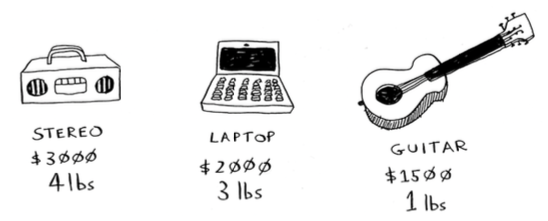

What items should you steal so that you steal the maximum money’s worth of goods? The simple solution would cost O(2^n) time, n is the number of the items.

**Dynamic programming starts by solving subproblems and builds up to solving the big problem.**

1. Every dynamic-programming algorithm starts with a grid. empty.

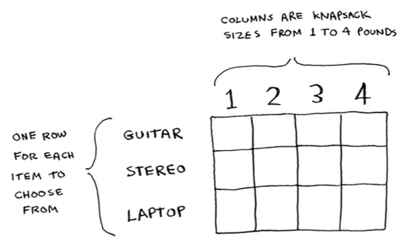

2. Each cell’s value gets calculated with the same formula. Here it it.

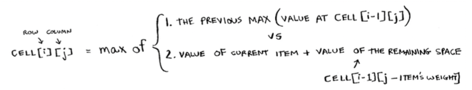

```
CELL[i][j] = max of {
    1. THE PREVIOUS MAX (VALUE AT CELL[i-1][j]),
    2, VALUE OF CURRENT ITEM + VALUE OF THE REMAINING SPACE (CELL[i-1][j - ITEM'S WEIGHT])
}
i: ROW
j: COLUMN
```

3. Now goes to last cell. Compare last max vs the new max

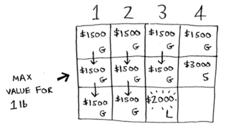

```
$3000 (STEREO) VS ($2000 (LAPTO) + $1500 (GUITAR))
```
4. The answer! A guitar and a laptop!

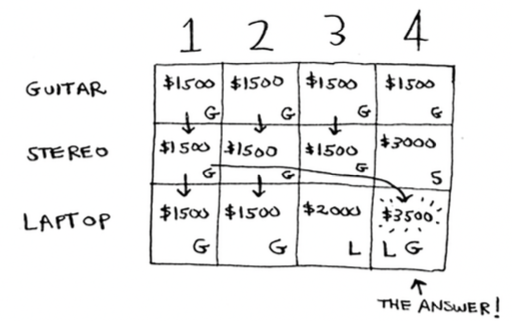

## 2. Longest common substring

Some general tips for dynamic programming follow:
- a. Every dynamic-programming solution involves a grid.
- b. The values in the cells are usually what you’re trying to optimize. For the knapsack problem, the values were the value of the goods.
- c. Each cell is a subproblem, so think about how you can divide your problem into subproblems. That will help you figure out what the axes are. 

**The problem:**
Suppose you run dictionary.com. Someone types in a word, and you give them the definition. 
But if someone misspells a word, you want to be able to guess what word they meant. Alex is searching for "fish", but he accidentally put in "hish". That’s not a word in your dictionary, but you have a list of words that are similar. 

Alex typed "hish". Which word did Alex mean to type: fish or vista?

1. **Making the grid** 
What does the grid for this problem look like? You need to answer these questions: 
- What are the values of the cells? 
- How do you divide this problem into subproblems? 
- What are the axes of the grid? 

In dynamic programming, you’re trying to maximize something. In this case, you’re trying to find the longest substring that two words have in common. What substring do hish and fish have in common? How about hish and vista? That’s what you want to calculate.

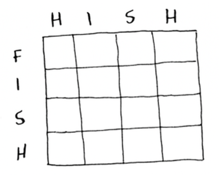

2. Filling in the grid
Here’s the formula for filling in each cell:

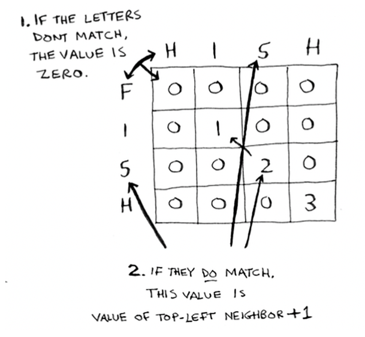

- If the letters don't match, the value is zero.
- If they do match, this value is the value of top-left neighbor + 1

Here’s how the formula looks in pseudocode:

```python
if word_a[i] == word_b[j]: 
    cell[i][j] = cell[i-1][j-1] + 1
else:
    cell[i][j] = 0
```
Here’s the grid for hish vs. vista:


3. **One thing to note: **
for this problem, the final solution may not be in the last cell! For the knapsack problem, **this last cell** always had the final solution. But for the longest common substring, the solution is the **largest number in the grid**—and it may not be the last cell.


### Longest common subsequence (if longest common substring are in the same size)

You’re comparing the longest common substring, but you really need to compare the longest common subsequence: **the number of letters in a sequence that the two words have in common**. How do you calculate the longest common subsequence?

The final grid for longest common subsequence

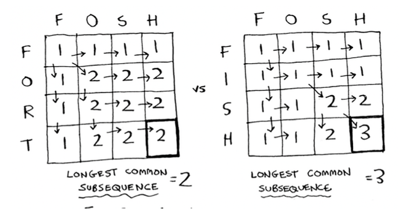

The formula for filling in each cell:


Here’s how the formula looks in pseudocode:
```python
if word_a[i] == word_b[j]: 
    cell[i][j] = cell[i-1][j-1] + 1
else:
    cell[i][j] = max(cell[i-1][j], cell[i][j-1])
```

# K-nearest neighbor (KNN)

## Classifying orange vs. grapefruit

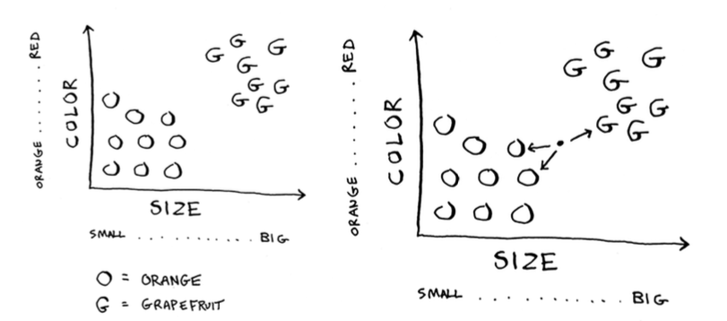

More neighbors are oranges than grapefruit. So this fruit is probably an orange. 

Congratulations: You just used the k-nearest neighbors (KNN) algorithm for classification! 

The whole algorithm is pretty simple.

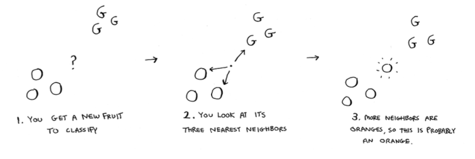

## Building a recommendation system

Feature extraction and distance formula

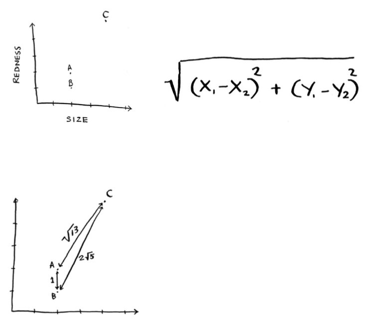

Fruit A and B are similar!

The distance formula confirms what you saw visually: fruits A and B are similar.

Suppose you’re comparing Netflix users, instead. You need some way to graph the users. So, you need to convert each user to a set of coordinates, just as you did for fruit.

Once you can graph users, you can measure the distance between them.

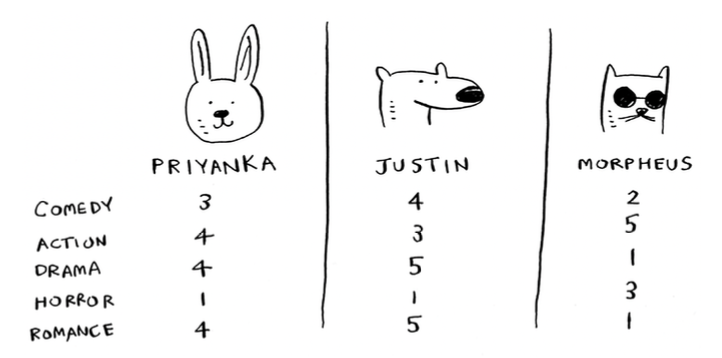

A mathematician would say, instead of calculating the distance in two dimensions, you’re now calculating the distance in five dimensions. But the distance formula remains the same.

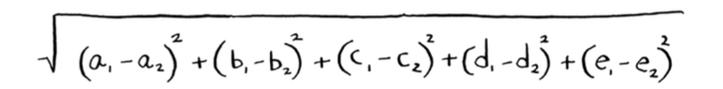

### Regression
Suppose you want to do more than just recommend a movie: you want to guess how Priyanka will rate this movie:
- Take the five people closest to her.

By the way, I keep talking about the closest five people.
Suppose you’re trying to guess a rating for Pitch Perfect. Well, how did Justin, JC, Joey, Lance, and Chris rate it?
```
JUSTINE:    5
JC:         4
JOEY:       4
LANCE:      5
CHRIS:      3
```
You could take the average of their ratings and get 4.2 stars. That’s called ***regression***.

These are the two basic things you’ll do with KNN—classification and regression:
- Classification = categorization into a group
- Regression = predicting a response (like a number)

## Introduction to machine learning


OCR
Use KNN to identify a number:
1. Go through a lot of images of numbers, and extract features of those numbers.
2. When you get a new image, extract the features of that image, and see what its nearest neighbors are!

The first step of OCR, where you go through images of numbers and extract features, is called **training**.


