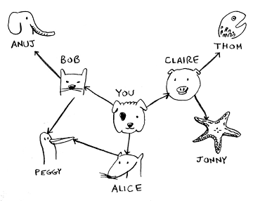
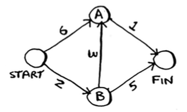
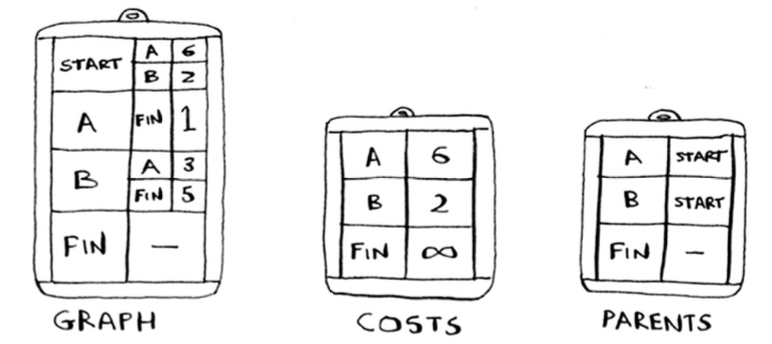
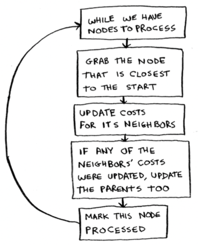

- [Graphs](#graphs)
  - [Breadth-first search](#breadth-first-search)
    - [Implementing Breadth-first search](#implementing-breadth-first-search)
    - [Find out there is a route between two nodes](#find-out-there-is-a-route-between-two-nodes)
    - [Find the shortest path using List](#find-the-shortest-path-using-list)
    - [Find the shortest path using Deque](#find-the-shortest-path-using-deque)
  - [Dijkstra’s algorithm (weighted graph)](#dijkstras-algorithm-weighted-graph)
    - [Implementation of Dijkstra’s algorithm](#implementation-of-dijkstras-algorithm)


# Graphs

What is a graph?
A graph models a set of connections.
Each graph is made up of **node**s and **edges**.
A node can be directly connected to many other nodes. Those nodes are called 
its neighbors.

## Breadth-first search

The algorithm to solve a shortest-path problem is called breadth-first search.

It can help answer two types of questions:
- Question type 1: Is there a path from node A to node B?
- Question type 2: What is the shortest path from node A to node B?

The first-degree connections will be searched before the second-degree connections, so you’ll find the mango seller closest to you. Breadth-first search not only finds a path from A to B, it also finds the shortest path.
So you need to search people in the order that they’re added. There’s a data structure for this: it’s called a **queue**.

The time complexity of BFS is *O(V + E)*, where `V` is the number of nodes and `E` is the number of edges.

### Implementing Breadth-first search

A hash table is used to express the graph relationship, like “you -> bob”.

**Find the specified node**
You will find who is the mango seller in your network, like this.



1. First, construct the graph using a hash table: 

```python
graph = {}
graph[“you”] = [“alice”, “bob”, “claire”] 
graph[“bob”] = [“anuj”, “peggy”] 
graph[“alice”] = [“peggy”]
graph[“claire”] = [“thom”, “jonny”] 
graph[“anuj”] = []
graph[“peggy”] = []
graph[“thom”] = []
graph[“jonny”] = []
```

2. Then define a `person_is_seller` function to tell you when someone is a mango seller: 
```python
def person_is_seller(name):
    return name[-1] == ‘m’
```

3. Before checking a person, it’s important to make sure they haven’t been checked already. To do that, you’ll keep a **list** of people you’ve already checked.

4. The final code for breath-first search:

```python
from collections import deque

# Construct the hash table
graph = {}
graph["you"] = ["alice", "bob", "claire"] 
graph["bob"] = ["anuj", "peggy"] 
graph["alice"] = ["peggy"] 
graph["claire"] = ["thom", "jonny"] 
graph["anuj"] = []
graph["peggy"] = [] 
graph["thom"] = [] 
graph["jonny"] = []

# Define the stop condition
def person_is_seller(name): 
    return name[-1] == 'm'

# Define the BFS algorithm
def search(name):
    # Queue for nodes to be searched
    search_queue = deque()
    search_queue += graph[name]
    # List for nodes searched already
    searched = [] 
    
    while search_queue:
        person = search_queue.popleft() 
        if not person in searched:
        # Only search this person if you haven’t already searched them. 
            if person_is_seller(person):
                print("Find the seller: ", person)
                return True 
            else:
                search_queue += graph[person]
                # Marks this person as searched 
                searched.append(person) 
    return False
    
search("you")
```

5. The time and space complexity

Breadth-first search takes *O(number of people + number of edges)*, and it’s more commonly written as *O(V+E)* (V for number of vertices, E for number of edges).

### Find out there is a route between two nodes

Problem:
Route between ndoes: Given a directed graph, design an algrorithm to find out whether there is a route between two nodes

```python
from collections import deque

graph = {'A': ['B', 'C', 'E'], 
        'B': ['A','D', 'E'],
        'C': ['A', 'F', 'G'], 
        'D': ['B'],
        'E': ['A', 'B','D'], 'F': ['C'],
        'G': ['C']}

# Searched dict
mark = {}

for key in graph.keys():
    mark[key] = False

def search(graph, start, end): 
    if start == end:
        return True
    
    # Search queue
    q = deque() 
    # Searched: start 
    mark[start] = True 
    # Put start into search queue
    q.append(start) 
    while len(q) > 0:
        r = q.popleft() 
        if r is not None:
            for node in graph[r]: 
                if not mark[node]:
                    print(node)
                    if node == end:
                        print("Found: ", node)
                        return True 
                    else:
                        mark[node] = True
                        q.append(node) 
    return False

search(graph, 'A', 'G') 
print("Other search") 
search(graph, 'C', 'G')
```
Result:
```
B
C
E
D
F
G
Found:  G
Other search
G
Found:  G
```

### Find the shortest path using List

```python
from collections import deque

graph = {'A': ['B', 'C', 'E'], 
        'B': ['A','D', 'E'],
        'C': ['A', 'F', 'G'], 
        'D': ['B'],
        'E': ['A', 'B','D'], 'F': ['C'],
        'G': ['C']}

def bfs_shortest_path(graph, start, goal):
    # keep track of explored nodes
    explored = []
    # keep track of all the paths to be checked 
    queue = [[start]]
    # return path if start is goal
    if start == goal:
        return "That was easy! Start = goal"
    # keeps looping until all possible paths have been checked 
    while queue:
        # pop the first path from the queue 
        path = queue.pop(0)
        # get the last node from the path 
        node = path[-1]
        if node not in explored:
            neighbours = graph[node]
            # go through all neighbour nodes, construct a new path and 
            # push it into the queue
            for neighbour in neighbours:
                if neighbour not in explored: 
                    new_path = list(path) 
                    new_path.append(neighbour) 
                    queue.append(new_path)
                    print("new path: ", new_path)
                    print("queue   : ", queue)
                    # return path if neighbour is goal 
                    if neighbour == goal:
                        return new_path
            # mark node as explored
            explored.append(node)
            print("explored: ", explored)

print("The shortest path is: ", bfs_shortest_path(graph, 'A', 'G'))
```
You can know better from the following print result:
```
new path:  ['A', 'B']
queue   :  [['A', 'B']]
new path:  ['A', 'C']
queue   :  [['A', 'B'], ['A', 'C']]
new path:  ['A', 'E']
queue   :  [['A', 'B'], ['A', 'C'], ['A', 'E']]
explored:  ['A']
new path:  ['A', 'B', 'D']
queue   :  [['A', 'C'], ['A', 'E'], ['A', 'B', 'D']]
new path:  ['A', 'B', 'E']
queue   :  [['A', 'C'], ['A', 'E'], ['A', 'B', 'D'], ['A', 'B', 'E']]
explored:  ['A', 'B']
new path:  ['A', 'C', 'F']
queue   :  [['A', 'E'], ['A', 'B', 'D'], ['A', 'B', 'E'], ['A', 'C', 'F']]
new path:  ['A', 'C', 'G']
queue   :  [['A', 'E'], ['A', 'B', 'D'], ['A', 'B', 'E'], ['A', 'C', 'F'], ['A', 'C', 'G']]

The shortest path is:  ['A', 'C', 'G']
```

### Find the shortest path using Deque

```python
from collections import deque

graph = {'A': ['B', 'C', 'E'], 
        'B': ['A','D', 'E'],
        'C': ['A', 'F', 'G'], 
        'D': ['B'],
        'E': ['A', 'B','D'], 'F': ['C'],
        'G': ['C']}
# Visited nodes
mark = {}

for key in graph.keys():
    mark[key] = False

def bsf_shortest_search(graph, start, end): 
    if start == end:
        print("The start is equal to the end!")
        return
    # Keep track of all the nodes 
    node_q = deque()
    # Keep track of all path
    path = deque()
    # Keep track of visited nodes 
    mark[start] = True
    # Put the start into the queue 
    node_q.append(start)
    # Put the first path into the queue 
    path.append([start])
    
    while node_q:
        print("Explored: ", mark)
        print("All node: ", node_q)
        print("Pathin Q: ", path)
        # Get the first node in the queue 
        r = node_q.popleft()
        # Get the first path in the queue 
        node_path = path.popleft()
        if r is not None:
            for node in graph[r]:
                if not mark[node]:
                    # Add current node into current path. Don't use append, it will
                    # change node_path which is supposed be unchangable during for loop 
                    current_path = node_path + list(node)
                    if node == end:
                        print(current_path)
                        # Found the end, and it is the first and shortest path 
                        return current_path
                    else:
                        mark[node] = True 
                        node_q.append(node) 
                        path.append(current_path)

    return False

print("The shortest path: ", bsf_shortest_search(graph, 'D', 'G'))
```
You can know better of the process from the following print result:
```
Explored:  {'A': False, 'B': False, 'C': False, 'D': True, 'E': False, 'F': False, 'G': False}
All node:  deque(['D'])
Pathin Q:  deque([['D']])
Explored:  {'A': False, 'B': True, 'C': False, 'D': True, 'E': False, 'F': False, 'G': False}
All node:  deque(['B'])
Pathin Q:  deque([['D', 'B']])
Explored:  {'A': True, 'B': True, 'C': False, 'D': True, 'E': True, 'F': False, 'G': False}
All node:  deque(['A', 'E'])
Pathin Q:  deque([['D', 'B', 'A'], ['D', 'B', 'E']])
Explored:  {'A': True, 'B': True, 'C': True, 'D': True, 'E': True, 'F': False, 'G': False}
All node:  deque(['E', 'C'])
Pathin Q:  deque([['D', 'B', 'E'], ['D', 'B', 'A', 'C']])
Explored:  {'A': True, 'B': True, 'C': True, 'D': True, 'E': True, 'F': False, 'G': False}
All node:  deque(['C'])
Pathin Q:  deque([['D', 'B', 'A', 'C']])
['D', 'B', 'A', 'C', 'G']
The shortest path:  ['D', 'B', 'A', 'C', 'G']
```

## Dijkstra’s algorithm (weighted graph)


Breadth-first search find the shortest path between two points. Back then, “shortest path” meant the path with the fewest segments. But in Dijkstra’s algorithm, you assign a number or weight to each segment. Then Dijkstra’s algorithm finds the path with the **smallest total weight**.


To recap, Dijkstra’s algorithm has four steps:
1. Find the cheapest node. This is the node you can get to in the least amount of time. 
2. Check whether there’s a cheaper path to the neighbors of this node. If so, update their costs.
3. Repeat until you’ve done this for every node in the graph.
4. Calculate the final path. 

The key idea behind Dijkstra’s algorithm: 
Look at the **cheapest** node on your graph. There is no cheaper way to get to this node!

With an undirected graph, each edge adds another cycle. Dijkstra’s algorithm only works with *directed acyclic graph*, called **DAGs** for short.

You can’t use negative-weight edges with Dijkstra’s algorithm. 

### Implementation of Dijkstra’s algorithm

Here is the graph will be used as an example:



To code this example, you need 3 hash tables:



Here is the algorithm:



```python
# Implement graph as a hash table 
graph = {}
graph["start"] = {} 
graph["start"]["a"] = 6 
graph["start"]["b"] = 2

graph["a"] = {} 
graph["a"]["fin"] = 1

graph["b"] = {} 
graph["b"]["a"] = 3 
graph["b"]["fin"] = 5

graph["fin"] = {}

# Hash table to store the costs for each node
# The cost of a node is how long it takes to get to that node from the start.

infinity = float("inf")

costs = {}
costs["a"] = 6 
costs["b"] = 2 
costs["fin"] = infinity

# Hash table for the parents:
parents = {} 
parents["a"] = "start" 
parents["b"] = "start" 
parents["fin"] = None

# You need an array to keep track of all the nodes you’ve already processed
processed = []

# That’s all the setup. Now let’s look at the algorithm.
# Start the algorithm

def find_lowest_cost_node(costs): 
    lowest_cost = float("inf") 
    lowest_cost_node = None
    for node in costs:  # node here is the key of the dict by default
        cost = costs[node]
        if cost < lowest_cost and node not in processed:
            lowest_cost = cost
            lowest_cost_node = node 
    return lowest_cost_node

node = find_lowest_cost_node(costs) 
while node is not None:
    print("The costs: ", costs)
    print("processed: ", processed)
    print("parents  : ", parents)
    cost = costs[node] 
    neighbors = graph[node] 
    for n in neighbors.keys():
        new_cost = cost + neighbors[n] 
        if costs[n] > new_cost:
            costs[n] = new_cost
            parents[n] = node 
    processed.append(node)
    node = find_lowest_cost_node(costs)

print("shortest : ", processed)
print("all costs: ", costs['fin'])
```
Output:
```
The costs:  {'a': 6, 'b': 2, 'fin': inf}
processed:  []
parents  :  {'a': 'start', 'b': 'start', 'fin': None}
The costs:  {'a': 5, 'b': 2, 'fin': 7}
processed:  ['b']
parents  :  {'a': 'b', 'b': 'start', 'fin': 'b'}
The costs:  {'a': 5, 'b': 2, 'fin': 6}
processed:  ['b', 'a']
parents  :  {'a': 'b', 'b': 'start', 'fin': 'a'}
shortest :  ['b', 'a', 'fin']
allcosts :  6
```
