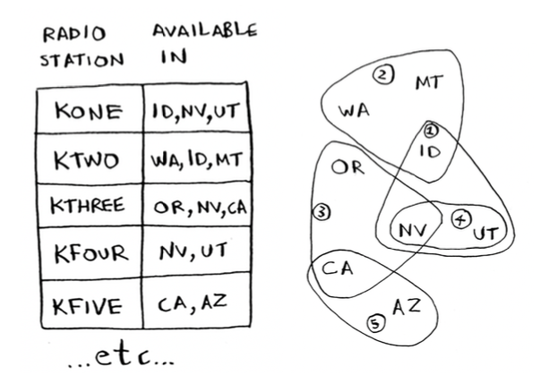
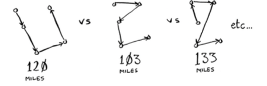

# Greedy algorithm

A greedy algorithm is simple: **at each step, pick the optimal move.** In technical terms: at each step you pick the locally optimal solution, and in the end you are left with the globally optimal solution. Believe it or not, this simple algorithm finds the optimal solution to this scheduling problem.

Obviously, greedy algorithms don’t always work. Sometimes, perfect is the enemy of good. Sometimes all you need is an algorithm that solves the problem pretty well. And that’s where greedy algorithm shine, because they’re simple to write and usually get pretty close. “Pretty good” is good enough.


## 1. The set-covering problem

Suppose you’re starting a radio show. You want to reach listeners in all 50 states. You have to decide what stations to play on to reach all those listeners. It costs money to be on each station, so you’re trying to minimize the number of stations you play on. You have a list of stations.



Usually it takes O(2^n) time if you calculate every possible subset of stations. Approximation algorithms (greedy algorithm):
1. Pick the station that covers the most states that haven’t been covered yet. It’s OK if the
station covers some states that have been covered already.
2. Repeat until all the states are covered.
In this case, the greedy algorithm runs in O(n^2) time, where n is the number of radio stations.

```python
# First. make a list of the states you want to cover
states_needed = set(["mt", "wa", "or", "id", "nv", "ut", "ca", "az"])
# Use a hash for the list of stations that you're choosing from
stations = {}
stations["kone"] = set(["id", "nv", "ut"])
stations["ktwo"] = set(["wa", "id", "mt"])
stations["kthree"] = set(["or", "nv", "ca"])
stations["kfour"] = set(["nv", "ut"])
stations["kfive"] = set(["ca", "az"])
# Finally, you need something to hold the final set of stations you'll use 
final_stations = set()
# Loop until states_needed is empty, meaning all the states get covered 
# Then stop looping
while states_needed:
# Go through every station and pick the one that covers the most uncovered states 
# It's called best_station
    best_station = None
    states_covered = set() # the states covered by the best_station
    for station, states_for_station in stations.items():
        covered = states_needed & states_for_station 
        if len(covered) > len(states_covered):
            best_station = station
            states_covered = covered 
    final_stations.add(best_station) 
    states_needed -= states_covered
# Finally, print final_stations 
print(final_stations)
```

## 2. NP-complete problems

Traveling salesperson problem:



If try every city to find the shortest route, the result would be factorial function of n cities, ie, n! If you have large number n, it is impossible to compute the “correct” solution for the traveling- salesperson problem.
The traveling-salesperson problem and the set-covering problem both have something in common: you calculate every possible solution and pick the smallest/shortest one. Both of these problems are **NP-complete**. (nondeterministic polynomial)

**Approximating (solving NP-compete)**

**Arbitrarily pick a start city**. then, each time the salesperson has to pick the next city to visit, they pick the **closest unvisited city**.
Here’s the short explanation of NP-completeness: some problems are famously hard to solve. The traveling salesperson and the set-covering problem are two examples. A lot of smart people think that it’s not possible to write an algorithm that will solve these problems quickly.


