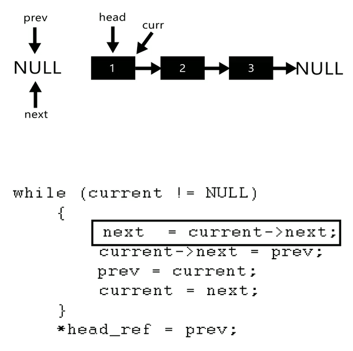

- [Linked List](#linked-list)
  - [Definition](#definition)
  - [Top tips for Linked lists](#top-tips-for-linked-lists)
  - [Operations on Linked List](#operations-on-linked-list)
    - [Definition of a Node](#definition-of-a-node)
    - [Search for a key:](#search-for-a-key)
    - [Insert a new node after a specified node:](#insert-a-new-node-after-a-specified-node)
    - [Delet a node:](#delet-a-node)
    - [Merge two sorted lists](#merge-two-sorted-lists)
    - [Reverse a single sublist???](#reverse-a-single-sublist)
    - [Reverse the whole List](#reverse-the-whole-list)

# Linked List

## Definition

The first node is referred to as the `head` and the last node is referred to as the `tail`; the tail’s next field is `None`.

Singly linked list and doubly linked list

The key differences are that inserting and deleting elements in a linked list has time complexity *O(1)*. On the other hand, obtaining the `kth` element in a list is expensive, having *O(n)* time complexity.

## Top tips for Linked lists

Very often, a problem on lists is conceptually simple, and is more about cleanly coding what’s specified, rather than designing an algorithm.

Consider using a dummy head (sometimes referred to as a sentinel) to avoid having to check for empty lists. This simplifies code, and makes bugs less likely.

It’s easier to forget to update next (and previous for double linked list) for the head and tail.

Algorithm operating on singly linked lists often benefit from using two iterators, one ahead of the other, or on advancing quicker than the other.

Know your linked list libraries


## Operations on Linked List

### Definition of a Node
```python
class ListNode:
    def __init__(self, data=None, next=None, prev=None):
        self.data = data
        self.next = next
        self.prev = prev
```

### Search for a key:
```python
def search_list(L, key):
    while L and L.data != key:
        L = L.next
    # If key was not present in the list, L will have become null 
    return L
```

### Insert a new node after a specified node:

```python
def insert_after(node, new_node):
    new_node.next = node.next 
    node.next = new_node
```

### Delet a node:

```python
# Delete the node past this one. Assume node is not a tail. 
def delete_after(node):
    node.next = node.next.next
```

### Merge two sorted lists

**Problem**:

Write a program that takes two lists, issued to be sorted, and returns their merge. The only field your program can change in a node is its next field.
```python
def merge_two_sorted_lists(L1, L2):
    # Create a placeholder for the result. 
    dummy_head = tail = ListNode() 
    while L1 and L2:
        if L1.data < L2.data:
            tail.next, L1 = L1, L1.next
        else:
            tail.next, L2 = L2, L2.next
        tail = tail.next
    # Appends the remaining nodes of L1 or L2 
    tail.next = L1 or L2
    return dummy_head.next
```
Time complexity *O(m+n)*, space complexity *O(1)*

### Reverse a single sublist???

Write a program which takes a singly lined list` L` and two integers `s` and `f` as arguments, and reverses the order of the nodes from the `sth` node to `fth` node, inclusive. The numbering begins at 1, i.e. the head node is the first node. Do not allocate additional nodes.

```python
def reverse_sublist(L, start, finish):
    dummy_head = sublist_head = ListNode(0, L) 
    for _ in range(1, start):
        sublist_head = sublist_head.next 
    # Reverses sublist.
    sublist_iter = sublist_head.next 
    for _ in range(finish - start):
        temp = sublist_iter.next
        sublist_iter.next, temp.next, sublist_head.next = (temp.next, sublist_head.next, temp)
    
    return dummy_head.next
```

Time complexity *O(f)*

### Reverse the whole List

```python
# Python program to reverse a linked list # Time Complexity : O(n)
# Space Complexity : O(1)
# Node class
class Node:
    # Constructor to initialize the node object def __init__(self, data):
    self.data = data 
    self.next = None

class LinkedList:
    # Function to initialize head 
    def __init__(self):
        self.head = None

    # Function to reverse the linked list 
    def reverse(self):
        prev = None
        current = self.head 
        while (current is not None):
            next = current.next 
            current.next = prev 
            prev = current 
            current = next
        
        self.head = prev
    
    # Function to insert a new node at the beginning 
    def push(self, new_data):
        new_node = Node(new_data) 
        new_node.next = self.head 
        self.head = new_node
    
    # Utility function to print the linked LinkedList 
    def printList(self):
        temp = self.head 
        while(temp):
            print(temp.data) 
            temp = temp.next
```




