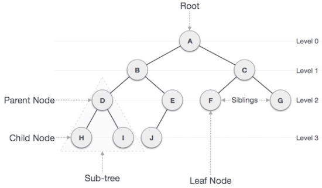
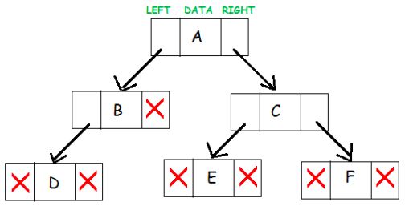
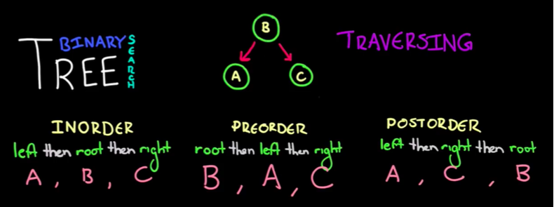

- [Tree](#tree)
  - [Terms](#terms)
  - [Python Lib for Binary Tree](#python-lib-for-binary-tree)
    - [bisect](#bisect)
  - [Binary Tree](#binary-tree)
    - [Binary Tree Implementation and Traversal](#binary-tree-implementation-and-traversal)
    - [Binary Search Tree (BST)](#binary-search-tree-bst)
    - [Search a sorted array for the first occurrence of k](#search-a-sorted-array-for-the-first-occurrence-of-k)
    - [Search entry that equals to its index](#search-entry-that-equals-to-its-index)


# Tree


## Terms

The data elements are stored in `nodes` and pairs of nodes are connected by `edges`.

Following are the important terms with respect to tree.

- **Path** − Path refers to the sequence of `nodes` along the `edges` of a tree.
- **Root** − The node at the top of the tree is called root. 
- **Parent** − Any node except the root node has one edge upward to a node called parent. 
- **Child** − The node below a given node connected by its edge downward is called its child node.
- **Leaf** − The node which does not have any child node is called the leaf node.
- **Visiting** − Visiting refers to checking the value of a node when control is on the node. 
- **Traversing** − Traversing means passing through nodes in a specific order.
- **Levels** − Level of a node represents the generation of a node. If the root node is at level 0, then its next child node is at level 1, its grandchild is at level 2, and so on.
- **Keys** − Key represents a value of a node based on which a search operation is to be carried out for a node.
- **Depth** - The depth of a node is the **number of edges** from the node to the tree's root node. A root node will have a depth of 0. 
- **Height** - The height of a node is the **number of edges** on the **longest path** from the node to a leaf. A leaf node will have a height of 0.


**Properties of a tree:**

The **height** of a tree would be the height of its root node, or equivalently, the depth of its deepest node.
The **diameter** (or width) of a tree is the **number of nodes** on the longest path between any two leaf nodes. The tree below has a diameter of 6 nodes.



## Python Lib for Binary Tree

### bisect

Performing sort operations after every insertion on a long list may be expensive in terms of time consumed by processor. The bisect module ensures that the list remains automatically sorted after insertion. For this purpose, it uses **bisection algorithm**. The module has following functions:

- **bisect_left()**
This method **locates** insertion point for a given element in the list to maintain sorted order. If it is already present in the list, the insertion point will be before (to the left of) any existing entries. The return value can be used as the first parameter to list.insert()

- **bisect_right()**
This method is similar to bisect_left(), but returns an insertion point which comes after (to the right of) any existing entries of x in a.

- **bisect.insort_left()**
This method **inserts** given value in a in sorted order. This is equivalent to `a.insert(bisect.bisect_left(a, x, lo, hi), x)`

- **bisect.insort_right()**
- **bisect.insort()**
Both methods are similar to insort_left(), but inserting given value in the list after any existing entries of same value.

Example
```python
>>> nums = [45,21,34,87,56,12,5,98,30,63]
>>> nums.sort()
>>> nums
[5, 12, 21, 30, 34, 45, 56, 63, 87, 98]
>>> import bisect
>>> p = bisect.bisect_left(nums,50)
>>> p
6
>>> nums.insert(p,50)
>>> nums
[5, 12, 21, 30, 34, 45, 50, 56, 63, 87, 98] >>> bisect.insort(nums, 29)
>>> nums
[5, 12, 21, 29, 30, 34, 45, 50, 56, 63, 87, 98]
```


## Binary Tree

A binary tree is a hierarchical data structure in which each node has **at most** two children generally referred as left child and right child.
Each node contains three components:
1. Pointer to left subtree 
2. Pointer to right subtree 
3. Data element

An empty tree is represented by NULL pointer. 
A representation of binary tree is shown:




**Full binary tree**: It is a tree in which every node in the tree has either 0 or 2 children.
**Perfect binary tree**: It is a binary tree in which all interior nodes have two children and all leaves have the same depth or same level.
**Complete binary tree**: It is a binary tree in which every level, except possibly the last, is completely filled, and all nodes are as far left as possible.
**Balanced binary tree**: A binary tree is height balanced if it satisfies the following constraints:
- The left and right subtrees' heights differ by at most one, AND 
- The left subtree is balanced, AND
- The right subtree is balanced
An empty tree is height balanced.
**Degenerate tree**: It is a tree is where each parent node has only one child node.
- It behaves like a linked list.


### Binary Tree Implementation and Traversal

**Node**
The storage class for creating binary tree nodes.

```python
class _BinTreeNode:
    def __init__( self, data ):
        self.data = data 
        self.left = None 
        self.right = None
```

**Preorder Traversal**

```python
def preorderTrav(subtree): 
    if subtree is not None:
        print(subtree.data) 
        preorderTrav(subtree.left) 
        preorderTrav(subtree.right)
```

**Inorder Traversal**

```python
def inorderTrav(subtree):
    if subtree is not None:
        inorderTrav(subtree.left) 
        print(subtree.data) 
        inorderTrav(subtree.right)
```

Postorder Traversal

```python
def postorderTrav(subtree): 
    if subtree is not None:
        postorderTrav(subtree.left) 
        postorderTrav(subtree.right) 
        print(subtree.data)
```




In BST, we prefer InOrder Traversal, this way, we can print the each node in order.


### Binary Search Tree (BST)

A binary search tree is a useful data structure for fast `addition` and `removal` of data.
For a binary tree to be a binary search tree:
- The data of all the nodes in the **left** sub-tree of the root node should be **less than** the data of the root.
- The data of all the nodes in the **right** subtree of the root node should be **greater than equal** to the data of the root.
- As a result, the leaves on the **farthest left** of the tree have the **lowest values**, whereas the leaves on the far right of the tree have the greatest values.

The implementation of a BST class 

```python
class Node:
    def __init__(self, data, left = None, right = None):
        self.data = data 
        self.left = left 
        self.right = right

    def insert(self, value): 
        if (value <= self.data):
            if (self.left is None): 
                self.left = Node(value)
            else: 
                self.left.insert(value)
        else:
            if (self.right is None):
                self.right = Node(value) 
            else:
                self.right.insert(value)

    def __str__(self):
        return "Root node data: " + str(self.data)

    def contains(self, value): 
        if (value == self.data):
            return True
        elif (value < self.data):
            if (self.left == None): 
                return False
            else:
                return self.left.contains(value)
        else:
            if (self.right == None):
                return False 
            else:
                return self.right.contains(value)

    def printInOrder(self):
        if (self.left is not None):
            self.left.printInOrder() 
        
        print(self.data)
        
        if (self.right is not None):
            self.right.printInOrder()

x = Node(9) 
x.insert(7) 
x.insert(10) 
x.insert(23)
x.insert(15) 
x.insert(4)
print(x)
a = x.contains(8) 
b = x.contains(10) 
x.printInOrder()

# Root node data: 9
# 4
# 7
# 9
# 10
# 15
# 23
```

### Search a sorted array for the first occurrence of k

Binary search + cut right part

```python

array = [-14, -10, 2, 108, 108, 243, 285, 285, 285, 401] 

def search_first_of_k(array, k):
    left, right, result = 0, len(array)-1, -1 
    while left <= right:
        mid = (left + right) // 2 
        if array[mid] < k:
            left = mid + 1 
        elif array[mid] == k:
            result = mid
            right = mid -1 # Nothing to the right of mid could be solution 
        else:
            right = mid -1 
    
    return result
```

### Search entry that equals to its index

```python
A = [-2, 0, 2, 3, 6, 7, 9]

def search_entry_equal_to_its_index(A):
    left, right = 0, len(A) -1 
    while left <= right:
        mid = (left + right) // 2 
        difference = A[mid] - mid 
        if difference == 0:
            return mid
        elif difference > 0:
            right = mid -1
        else: # difference < 0
            left = mid + 1 
    return -1
```

