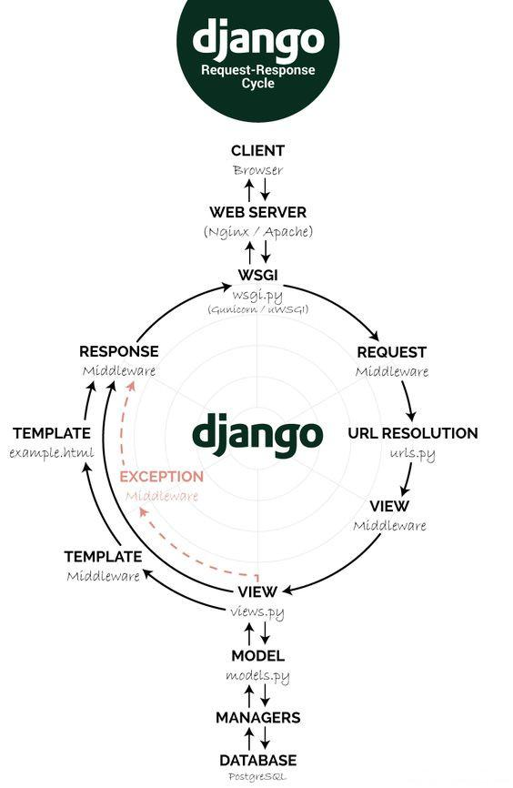

# 设置虚拟开发环境

1.安装Python
```bash
$ python –version #确认安装的版本
```
Python's mirror: http://mirrors.sohu.com/python/

2.确认pip安装好 Windows上，如果pip安装包不不成功，可以采⽤用wheel的方式，尤其是Windows上没有C编译
器器的时候。
```bash
$ pip install --use-wheel -r requirements.txt 3.安装virtualenv
$ pip install virtualenv
$ pip install virtualenvwrapper
```
国内访问美国的pypi⽹网站⽐比较慢，可以使⽤用⼀一下镜像。 
https://pypi.tuna.tsinghua.edu.cn/simple
```bash
$ pip install Django -i https://pypi.tuna.tsinghua.edu.cn/simple 
```
如果在Windows上，可以安装Windows版本的virtualenvwrapper-win 
```bash
$ pip install virtualenvwrapper-win 
```
这样你就可以使⽤用命令mkvirtualenv了。

在Linux上，⽤用以下命令使⽤用virtualenvwrapper:
```bash
$ source virtualenvwrapper.sh #为了了使⽤用mkvirtualenv命令
```

3.1.⽤virtualenv来创建Python虚拟环境
```bash
$ virtualenv env_name –p path_to_python
```

⽐如在Windows安装Python3
```
>virtualenv env3 –p D:/python352/python.exe (或者D:/python27/python.exe，如果安 装Python2.7)。
```
虚拟⽬目录(如env3)会安装在当前⽬目录下，进⼊入`./env/scripts`, 运⾏行行
```
>activate.bat
```
在Linux，运⾏
```bash
$ source ./env/bin/activate 
```
这样就进⼊入了了Python虚拟环境了了，你可以安装你需要的软件，⽽不会跟其他的环境⼲干扰。 直接运⾏行行`$deactivate`退出虚拟环境。

3.2 ⽤用virtualenvwrapper

这个更更简单。创建虚拟环境:
```
$ mkvirtualenv env3 –p D:/python352/python.exe
```
 
使⽤用虚拟环境
```
$ workon env3 
```

不需要进⼊入虚拟⽬目录运⾏行行activate脚本。同样deactivate退出虚拟环境。
为了每次登录root后不不⽤用⼿手动运⾏行行`source virtualenvwrapper.sh`，可以将它加⼊入到 `~/.bashrc`中。

3.3 Use venv 

```bash
$ python3 -m venv /path/to/new/virtual/environment
```
Running this command creates the target directory (`/path/to/new/virtual/environment`) and places a `pyvenv.cfg` file in it with a `home` key pointing to the Python installation from which the command was run (a common name for the target directory is `.venv`). It also creates a `bin` (or `Scripts` on Windows) subdirectory containing a copy/symlink of the Python binary/binaries (as appropriate for the platform or arguments used at environment creation time). It also creates an (initially empty) `lib/pythonX.Y/site-packages` subdirectory (on Windows, this is `Lib\site-packages`). If an existing directory is specified, it will be re-used.


# Django的重要命令

## Django-admin

创建项⽬目:
```bash
$ django-admin createproject project_name
$ django-admin startproject --template=https://github.com/arocks/edge/archive/ master.zip --extension=py,md,html,env my_proj
```

创建应⽤用:
```bash
$ django-admin startapp
```

创建超级⽤用户:
```bash
$ python manage.py createsuperuser 
```
验证模式有效性:任何时候你觉得model有问题，都可以运⾏行行下⾯面命令来检查。
```bash
$ python manage.py check
```

创建数据库表:
```bash
$ python manage.py makemigrations # (当更更改model的字段时，⽐比如增减，需要运⾏行行此命令)
$ python manage.py makemigrations app_name 
# 获得SQL命令:
$ python manage.py sqlmigrate app_name 0001 
# 更更新数据库:
$ python manage.py migrate
```

启动项⽬目:(0.0.0.0表示可以远程访问)
```bash
$ python manage.py runserver 0.0.0.0:8000 # (远程访问需要将settings.py中的ALLOWED_HOST改成[‘*’]) 
# 如何使⽤用定制的settings.py?
$ python manage.py runserver –settings=mysite.settings 
# 进⼊入交互模式，与pyhon交互模式不同在于Django知道使⽤用哪个settings⽂文件。具体地，就是Django通过寻找环境变量量DJANGO_SETTINGS_MODULE来获得settings⽂文件。
$ python manage.py shell
```

Django内部请求-响应的流程图



## Settings.py的配置

ALLOWED_HOSTS: 在debug为True或者在运行测试的时候，ALLOWED_HOSTS是不起作用的。为了在生产环境中运行（从远程访问），你需要将你的网站的域名或IP放进这里。

# View和URLconf

## 什么是View
一个view就是一个接收HttpRequest作为其第一个参数并返回一个HttpResponse实例的函数或者类。
- a view is just a Python function that takes an HttpRequest as its first parameter and returns an instance of HttpResponse

## 什么是URLconf
URLconf就像一个内容列表，包含了一系列URL和和与其相对应的View的函数。

## Django是如何处理一个请求的(此处我们项目的名字叫mysite)

- 首先从settings文件开始。当你运行`python manage.py runserver`时，此脚本首先在内部的mysite目录中寻找叫`settings.py`的文件。其中最重要的设置叫做ROOT_URLCONF。它告诉Django哪个python模块会被用作此网站的URLconf。
```
ROOT_URLCONF = ‘mysite.urls’
```
对应着文件mysite/urls.py

- 然后Django寻找匹配的RUL和view的映射对，成功后就开始调用view的函数，同时将HttpRequest作为第一个参数传入此函数。然后此函数返回一个HttpResponse。接下来Django会将HttpReponse转换为适当的HTTP响应，也就是一个web页面。

## 如何生成动态URL
在URLconf中使用通配符（Regular Express）并且将通配符用大括号括起来，比如
`url(r’^time/plus/(\d+)/$’, hours_ahead)`, 其中`(\d+)`就是动态URL，并且作为参数传入到后面的view函数里。在这里，它作为除了HttpRequest之外的第二个参数。所以，你在定义view函数的时候必须包含两个参数。

## 如何看Django的Traceback页面

1. 第一行显示错误（异常）的主要信息：异常的类型，相关的参数以及引发异常的文件以及相应的行数。
2. 在关键错误信息下面，是整个traceback的路径。就像在标准的python命令行出现异常一样，但是更具有交互性。在每个层级（frame）中，Django显示了对应文件的名字，函数/方法的名字，行数已经那一行的代码。
你可以点击那一行代码（浅灰色），你可以看到出错那行代码前后的代码。这样你可以了解上下文。
点击每个frame下的”Local vars”可以看到在引起异常代码处的所有本地变量以及他们的数值。
3. 在Traceback头下面还有个”Switch to copy-and-past view”的文本。点击此文本，Traceback会切换到另一个版本，易于你拷贝和粘贴。你可以用此将你的异常信息分享给技术支持。
4. 再接下来是一个”Share this traceback on a public Web site”按钮。这个可以将异常提交到`www.dpaste.com`网站，在那里你可以获得一个URL，然后你可以将此URL分享给其他人。
5. 接下来，在“Request Information”栏目里，包含了丰富的信息：如GET和POST信息，cookie的值，meta信息如CGI头。
6. 在”Request information”下面，”Settings”栏目列出了所有次Django实例的配置信息。

一个小的技巧：你可以不再用print来打印调试你的程序。你可以用一个简单的assert False命令，将它放在你的view代码中可以出发错误页。这样你就可以察看本地变量和程序的状态了。这样的效果跟触发一个真正的异常是一样的。

这个traceback是可以交互的，也就是你可以进入python交互命令界面，运行相应的调试命令，比如察看某个对象的状态。
点击Traceback(most recent call last)（黑灰色），可以在交互模式和文本模式间切换。同时在文本模式下，你可以很容易拷贝/粘贴异常信息，同时还可以将错误信息提交到gist。

下面是使用了Werkzeug时的情形
除了跟缺省Django调试器相同的地方，下面是Werkzeug特别的地方。
在这一行的右侧有一个代表python控制台的图标，点击就进入了交互模式。你可以输入任何python命令。其中重要的两个命令如下。
`.dump()` 用来显示当前frame（一个traceback的层级，一般来说是一个异常路径上的python文件）中的所有变量。
`.dump(obj)` 察看此对象的状态信息。
点击Traceback(most recent call last)（黑灰色）可以进入到拷贝粘贴模式。点击”create past”按钮可以将你引导到gist。

## 命名组(Named Groups)

缺省情况下，URLconf使用位置参量给视图传递参数，叫做非命名的正则表达式组。另一种方式是通过关键字方式传递参数。也就是，通过传递关键字和它的值给视图，叫做命名的正则表达式组。如（普通的Python函数关键字参数）
```py
sell(item='Socks', price='$2.50', quantity=6)
```
在Python的正则表达式里，命名的正则表达式语法是：`(?P<name>pattern)`

在URLconf传递的参数都是字符串，所以在视图中处理时需要进行手工的转换。
在视图中可以指定参数的缺省值，这样在URLconf没有传入参数是，可以做缺省处理。

## 给视图传入额外的参数

`django.conf.urls.url()`可以接受可选的第三个参数，这个参数应该是一个字典，用来给视图传递额外的参数，而且这里的优先级高于URL的参数。如果发生同名的情况，取字典里的参数。如：
```py
urlpatterns = [
    url(r'^reviews/(?P<year>[0-9]{4})/$', views.year_archive, {'foo': 'bar'}),
]
```

同理，可以给`include()`传递额外的参数，语法规则同上。

## URL的反解析

也就是通过视图以及传递给它的参数，反过来获得相应的URL。
django有以下方法获得相应的URL：
- 在模板中，使用url模板标记
- 在Python代码中，使用`django.core.urlresolvers.reverse()`函数。视图名为参数。
- 在更高级别上处理Django模式实例的URL时，使用`get_absolute_url()`方法。视图名为参数。

## URL的命名空间(namespace)

URL的命名空间可以让你唯一反解析命名的URL，即便是不同的应用使用了相同的URL名字。
URL命名空间有两个部分：
- 应用的命名空间
应用级别的命名空间，应用的每个实例共享相同的命名空间。
- 实例的命名空间
实例级别的命名空间。每个实例的命名空间在整个项目中应该是唯一的。当然，一个实例的命名空间可以跟它的应用空间相同。这意味着这个实例是这个应用的缺省实例。
有命名空间的URL使用’:’操作符。如admin的index页用`admin:index`表示。


## ForgeinKey和ManyToManyField

访问外键记录
使用`_set`。如果publisher的外键是book，则用下面命令访问外键的记录
```py
>>> p = Publisher.objects.get(name='Apress Publishing')
>>> p.book_set.all()
[<Book: The Django Book>, <Book: Dive Into Python>, ...]
>>> p.book_set.filter(title__icontains='django')
[<Book: The Django Book>, <Book: Pro Django>]
```

访问多对多记录
```py
>>> b = Book.objects.get(id=50)
>>> b.authors.all()
[<Author: Adrian Holovaty>, <Author: Jacob Kaplan-Moss>]
>>> b.authors.filter(first_name='Adrian')
[<Author: Adrian Holovaty>]
```

# 模式(Model)

A model is a Python class that subclasses `django.db.models.Model`, in which each attribute represents a database field. Django will create a table for each model defined in the `models.py` file. When you create a model, Django offers you a practical API to query the
database easily.

The `__str__()` method is the default human-readable representation of the object.

We specify descending order by using the negative prefix.

## Django ORM(Object-relational Mapping)

ORM是基于QuerySet的。一个QuerySet是数据库中的对象的集合，可以设置过滤器来限制包含的结果的大小。获取单个对象的方法：
```py
Post.objects.get()
```
每个Django 模式至少有一个管理器，缺省的管理器就是objects。我们一般通过缺省管理器获取QuerySet对象。下面是获取所有的对象：
```py
>>>all_posts = Post.objects.all()
```
注意：这个语句实际上并没有执行。Django QuerySet有个“懒惰”的特性，只有在你强制它执行的时候才会执行。这样使QuerySet变得非常有效率。但是如果你不将QuerySet赋值给某个变量，而是直接在Python shell中直接运行，则会迫使QuerySet直接运行：
```py
>>> Post.objects.all()
```
注意：`Post.objects.filter()`返回的是一个集合，不论是返回一个记录还是多个记录，如果需要返回单个记录，请使用`get()`.

## 什么时候执行QuerySet操作呢？

你可以先累积很多的操作命令但是并不真的进行实际的数据库操作，直到你需要QuerySet真的被执行为止。那么什么情形下，QuerySet才真正地执行数据库操作呢？以下情形:

- The first time you iterate over them
- When you slice them. for instance: `Post.objects.all()[:3]`
- When you pickle or cache them
- When you call `repr()` or `len()` on them
- When you explicitly call `list()` on them
- When you test it in a statement such as `bool()`, or , `and`, or `if`

## 创建模式管理器

有两种方法可以创建模式管理器，你可以创建额外的管理器或者修改原始管理器。第一种类似于`Post.objects.my_manager()`，第二种类似于`Post.my_manager.all()`
编辑`models.py`文件添加一下管理器：
```py
class PublishedManager(models.Manager):
    def get_queryset(self):
        return super(PublishedManager, self).get_queryset().filter(status='published')

class Post(models.Model):
    # ...
    objects = models.Manager() # The default manager.
    published = PublishedManager() # Our custom manager.
```
现在我们可以用我们自己定义的管理器来查询对象了：
```py
Post.published.filter(title__startswith='Who')
```

## 定制模式管理器(Manager)

给缺省管理器增加额外的方法：
```py
class BookManager(models.Manager):
    def title_count(self, keyword):
        return self.filter(title__icontains=keyword).count()

class Book(models.Model):
    ......
    objects = BookManager() 
```
使用增加的方法：
```py
>>> Book.objects.title_count('django')
4
```

修改初始的管理器的QuerySet
通过重写`Manager.get_queryset()`实现。
```py
#首先，定义管理器子类
class DahlBookManager(models.Manager):
    def get_queryset(self):
        return super(DahlBookManager, self).get_queryset().filter(author='Roald Dahl')

# 然后，将其加入到模式类中
class Book(models.Model):
    # ...
    objects = models.Manager() # 缺省的管理器
dahl_objects = DahlBookManager() # 定制的管理器
Book.objects.all() # 返回所有的book
Book.dahl_objects.all() # 返回定制管理器下的所有book
```
这样，你就可以为同一个模式定制多个管理器。

注意：第一个管理器将是模式的缺省管理器。

## 模式的方法

管理器是作用于”表级“的，而模式方法是作用于”模式实例级“的。你应该总是定义以下两个方法: `__str__()`和`get_absolute_url()`。
重写模式的缺省方法：`save()`和`delete()`

## 执行raw SQL查询

`Manager.raw()`可以用来执行原始的查询

关于`related_name`

例子如下，创建post的comments模式
```py
class Comment(models.Model):
    post = models.ForeignKey(Post, related_name='comments')
    ......
```
related_name可以让我们在被关联的外键中反过来引用回当前的对象（也就是comments）。定义了这个属性，我们就可以通过`comment.post`来获得某个comment的post，同时通过`post.comments.all()`获取某个post的所有comments。如果没有定义related_name，Django将使用带下划线的格式(也就是`__comment_set`)来命名相应的模式管理器来获取对应的数据。


## Migrations

Django comes with a migration system to track the changes you do to your models and propagate them into the database. The migrate command applies migrations for all applications listed in `INSTALLED_APPS`; it synchronizes the database with the current models
and migrations.

First, we need to create a migration for the new model we just created. From the root directory of your project, enter this command:
```bash
$ python manage.py makemigrations blog
```

You should get the following output:
```
Migrations for 'blog':
0001_initial.py:
```

- Create model Post
Django just created a file `0001_initial.py` inside the migrations directory of the blog application. You can open that file to see how a migration looks like.
Let's take a look at the SQL code that Django will execute in the database to create the table for our model. The sqlmigrate command takes migration names and returns their SQL without running it. Run the following command to inspect its output:
```bash
$ django-admin sqlmigrate app_label migration_name
```

Let's sync our database with the new model. Run the following command to apply to existing migrations:
```bash
$ python manage.py migrate
```
After applying migrations, the database reflects the current status of our models.

If you edit your models.py file in order to add, remove, or change fields of existing models, or if you add new models, you will have to make a new migration using the `makemigrations` command. The migration will allow Django to keep track of model changes. Then you will have to apply it with the `migrate` command to keep the database in sync with your models.

'WSGIRequest' object has no attribute 'user' (for Django 1.8.6). No such an issue with 1.10.4
Solution: in setting.py, change MIDDLEWARE to MIDDLEWARE_CLASSES

## ORM

The Django Object-relational Mapper (ORM) is compatible with MySQL, PostgreSQL, SQLite, and Oracle. Remember that you can define the database of your project by editing the DATABASES setting in the settings.py file of your project. Django can work with multiple databases at a time and you can even program database routers that handle the data in any way you like.

What is Django Models Manager?

A Manager is the interface through which database query operations are provided to Django models. At least one Manager exists for every model in a Django application.

Each Django model has at least one manager, and the default manager is called `objects`. You get a `QuerySet` object by using your models manager. To retrieve all objects from a table, you just use the `all()` method on the default objects manager, like this:
```py
>>> all_posts = Post.objects.all()
```

There are two ways to add managers to your models: You can add extra manager methods or modify initial manager QuerySets. The first one turns up something like `Post.objects.my_manager()` and the later like `Post.my_manager.all()`.


# 模板(template)

## Django模板背后的哲学

Django模板不是简单的Python版的内嵌HTML（如PHP等）。Django模板是设计用来表达展示的，不是用来表达程序逻辑的。
`{{ variable }}` 表示变量
``表示模板标记(tag)
`{{ ship_date|date:”F j, Y” }}`: 模板过滤器。Ship_date是被过滤的变量，date是过滤器，”F j, Y”是过滤器的参数。

## 模板系统

一个Djago项目可以配置一个或多个模板引擎，甚至可以不配模板引擎。
缺省引擎叫DTL。
如何在Python代码中使用模板
1 首先，创建一个模板对象。将模板的原始代码作为一个字符串传入，也就是将被处理的带了模板标记的HTML。
2 调用模板对象的render()方法，参数为一组变量的集合（也就是上下文）
这样下来，一个已经渲染好的模板作为字符串被返回，相应的变量集合也根据上下文获得了替换。
```py
>>> from django import template
>>> t = template.Template('My name is {{ name }}.')
>>> c = template.Context({'name': 'Nige'})
>>> print (t.render(c))
My name is Nige.
```

当你创建了一个模板对象时，模板系统将原始模板代码编译为一个内部优化的表单(form)，并准备好进行渲染。
一旦模板创建了，你就可以通过上下文给它传送数据了。所谓上下文(context)简单讲就是一系列的模板变量名和他们相关的值对组成的集合。
上下文在模板模块里是一个context类。它的构造函数接收字典（变量-值对）作为一个可选的参数。上下文跟Python的字典类似，但是提供了附加的功能。
Forloop变量，只存在于``循环里，用于for循环的一些属性，比如循环次数，剩余循环次数，第一个循环，最后一个循环等等。模板通过`forloop.parentloop`来区别一个叫`forloop`的上下文变量，以免与forloop内置变量冲突。
模板还提供``和``来做比较判断。当然可以用`if ==`来代替。
模板的注释用`{# #}`来表示。但不能跨行。如果想跨行，用标记
```


```

## 模板的加载

模板的目录（在settings文件里设置）。项目级别的设置一般如下。
```
’DIRs’: [os.path.join(BASE_DIR, ‘templates’)],
```
应用级别的设置。一般将APP_DIRS设置为True

get_template()工作流程：
- 如果APP_DIRS为TRUE，如果使用的是DTL，将会在当前的模板目录寻找模板。也就是`appname/template/appname`
- 如果没找到，则通过DIRS设置的信息来组合成路径。

Render()方法
Render()是`get_template()`的快捷方式。实际中，会使用render()而不是通过contexthe和HttpResponse进行手工组合操作。如：
```py
return render(request, ‘template.html’, {‘variable’: value})
```

``模板标记
此标记用来包含另一个模板的内容。

## 模板的继承

本质上，模板继承让你创建一个基础模板的骨架，其中包含了网站所有的公共部分同时定义了那些子模板可以覆盖的”代码块”(block)。这样做可以避免大量的重复代码。
使用模板标记 ` `来标示子模板可以覆盖的代码块。
注意，模板继承不会影响模板的上下文。也就是，在继承树中的任意模板都可以访问来自上下文的任何模板变量。
你可以创建任意层级的继承。但是最佳实践是三层法：
创建`base.html`模板用来承载整个网站的整体外观。这个很少变化。
针对每个应用创建各自的`base_SECTION.html`模板，比如`base_accounts.html`。这些模板继承了`base.html`并带有自己特有的风格和设计。
为每个页面创建单独的模板。这些模板继承了应用级别的模板。

## 模板设计指南：

- ``必须是第一个模板标记。
- 一般来讲，基础模板里的``越多越好。
- 如果发现有代码重复，请在父模板里使用``
- 用`{{ block.super }}`取得父模板的内容。
- 避免在同一个模板中使用同名的``。
- ``加载模板的方式跟`get_template()`方法一样。
- 大多数情况下，``的参数是个字符串，但是也可能是变量。

## Admin如何工作的

当服务器启动时，Django从`urls.py`加载URLconf。它执行`admin.autodiscover()`语句。此函数遍历INSTALLED_APPS并在每个安装的应用中去寻找一个叫做`admin.py`文件。如果找到，就会执行文件中的代码。
`Django.contrib.auth`包含自己的`admin.py`，这就是为什么Users和Groups会自动出现在admin中的原因。其他的`django.contrib`应用，比如`django.contrib.redirects`，也是自动将自己添加到admin.

## 定制字段标签

在admin，经常用空格代替表字段的下划线并在页面上显示为字段的标签。但是也可以在字段里指定verbose_name来定制显示的标签。

定制ModelAdmin类

在每个admin.py内部定义一个ModelAdmin类可以用来改变页面那些字段可以改变的列表。
```py
class AuthorAdmin(admin.ModelAdmin):
    list_display = ('first_name', 'last_name', 'email')

admin.site.register(Publisher)
admin.site.register(Author, AuthorAdmin)
admin.site.register(Book)
```

还有其他的定制项目，比如
- `search_field = (‘first_name’, ‘last_name’), ordering = ('-publication_date',)，fields = ('title', 'authors', 'publisher')` 等。
- `date_hierarchy = 'publication_date'`，逐级显示，年，月，日
- `filter_horizontal = ('authors',)`，可以生成一个过滤接口可以让你搜索而不用下拉菜单。这个可以用在多对多的关系。
- `list_filter = ('status', 'created', 'publish', 'author')`
- `prepopulated_fields = {'slug': ('title',)}`
- `raw_id_fields = ('author',)`

## RequestContext和Context处理器

RequestContext是context的子类，并且增加了一些变量，比如HttpRequest对象，或者一些有关当前登录用户的信息。Render()缺省地创建了RequestContext，除非它特别地指定了另一个context。
你可以定义自己的context处理器，跟RequestContext一起将你想要的一些变量添加到RequestContext中。你可以在render()中指定`context_instance=RequestContext()`来实现定制。
Django提供了全局的context处理器。在`settings.py`中的`context_processors`就指定了哪个上下文处理器应该总是应用于RquestContext。
缺省情况下，context_processors设置如下:
```py
'context_processors': [
            'django.template.context_processors.debug',
            'django.template.context_processors.request',
            'django.contrib.auth.context_processors.auth',
            'django.contrib.messages.context_processors.messages',
        ],
```
- auth处理器让RequestContext包含一个User，一个`auth.User`的实例，代表当前的登陆用户以及相应的权限。
- debug处理器让RequestContext包含以下两个变量（如果DEBUG=True，并且请求的IP（`request.META[‘REMOTE_ADDR’]`)在INTERNAL_IPS的设置中)：
  - debug - True。可以用来测试是否在DEBUG模式
  - sql_queries。表示请求中发生的SQL查询
- i18n处理器，包含语言的设置
- media处理器。包含MEDIA_URL的设置
- static处理器，包含STATIC_URL设置。
- csrf处理器，添加模板标记csrf_token需要的令牌。
- request处理器，包含变量request，也就是当前的HttpRequest。

## 模板装载的解析

在settings.py，DIRS选项，用来指定模板的目录。

模板装载器的类型
缺省情况下，Django使用基于文件系统的模板装载器。同时还有其他几种装载器，其中应用装载器最常见。
- 文件系统装载器
```
*class* filesystem. ``Loader
```
- 应用目录装载器
```
*class *app_directories.``Loader
```
装载器在每个出现在INSTALLED_APPS中的app的目录下寻找templates子目录。
INSTALLED_APPS中app的顺序很重要，先出现的app的模板会覆盖后出现的app的模板。比如，你想覆盖缺省的`admin/base_site.html`模板，你的应用的必须放在`django.contrib.admin`的前面。
注意装载器在第一次运行时作了一个优化的动作：将INSTALLED_APPS中出现的有templates的app作了缓存。通过在settings.py将APP_DIRS置为True。

## 扩展模板系统

你可以定义自己的模板标记/过滤器，也就是模板功能。这一般放在应用内部实现。具体步骤如下:
- 在app内创建目录templatetags并在其下创建文件`__init__.py`。
- 可以在目录下创建你的定制模板tag了。你需要重启服务使新的tag起效。比如你定义的模板模块叫`custom-tag.py`。在模板中使用如下命令:
```

```
`custom-tag.py`的格式如下:
```py
from django import template
register = template.Library() #必须注册
```
django的缺省模板过滤器和标签分别在`django/template/defaultfilters.py` 和`django/template/defaulttags.py`里。

要创建你自己的标签和过滤器，你必须创建一个模板库：
- 首先确定哪个应用house模板库。如果你已经通过`manage.py startapp`创建了一个app，你可以将他放到那里。或者你单独为模板库创建一个应用，这样你的定制标签和过滤器就可以用在未来的项目里。
- 接下来，在应用下面创建一个`templatetags`目录。创建两个空文件, `__init__.py`和一个包含定制标签和过滤器的模块文件，比如`custom-tag.py`。
- 如果你的模板库不是跟具体的模式和视图捆绑的话，可以单独创建一个应用来只包含模板包。没有限制一个模板包中可以包含多少个模板模块。

## 定制模板过滤器

定制过滤器实际上就是一个Python函数，带有一个或两个参数：
- 第一个参数是个被过滤得变量值 -- 不一定是字符串
- 第二个参数可选，可以是个缺省值，也可以为空。示例如下：
```py
def cut(value, arg):
    """Removes all values of arg from the given string"""
    return value.replace(arg, '')
```
以下为使用方法：
```
{{ somevariable|cut:"0" }}
```

注册定制的过滤器
写完过滤器，需要在模板库的实例中注册一下才能使用。
```
register.filter('cut', cut)
```
也可以将`register.filter()`作为装饰器使用，比如：
```py
@register.filter(name='cut')
def cut(value, arg):
    return value.replace(arg, '')
@register.filter
def lower(value):
    return value.lower()
```

如果你写的过滤器期望一个字符串作为第一个参数，你应该使用stringfilter作为装饰器。
```py
@register.filter
@stringfilter
def lower(value):
    return value.lower()
```

时区过滤器
```py
@register.filter(expects_localtime=True)
```
此装饰器可以自动装换时区。

## 定制模板标记（。。。）

# 表单

## HttpRequest

HttpRequest的属性和方法:`path, get_host(), get_full_path()`,
Request.META是Python字典，包含了所有已知HTTP Hearders。如RMOTE_ADDRESS, HTTP_USER_AGENT等等。

关于提交数据的信息request.GET/request.POST
这些都是类似字典对象。

## 表单类

在`django.forms`库里。表单类可以放在任何地方，比如`views.py`中，但是推荐放在一个叫`forms.py`的单独文件中，跟`views.py`在同一个目录中。语法有点像model。
```py
from django import forms

class ContactForm(forms.Form):
    subject = forms.CharField()
    email = forms.EmailField(required=False)
    message = forms.CharField()
f = ContactForm()
```

有个多种属性和方法：`f.as_ul(), f.as_p()`。可以打印获得HTML表单`print(f), print(f.as_p()), Pring(f[‘subject’])`

注:`as_ul()`表示打印成ul格式的表单，`as_p()`，表示p格式，`as_table()`表示表格式

当在表单实例中装入数据，说明你创建了一个”bound“的表单。
```py
>>>f.is_bound
True
```
`is_valid()`方法用来检验绑定的表单的数据有效性。当数据有效时，就会获得一个`cleaned_data`属性。这是一个包含提交数据的字典属性，并且是自动将数据转换为合适的Python数据类型。
每个表单实例还有个errors属性。

# Generic Views

最简单的通用视图用法：
```py
# views.py
from django.views.generic import ListView
from books.models import Publisher

class PublisherList(ListView):
    model = Publisher
```

这样就可以将Publisher里的字段以列表的形式显示在页面上了。甚至来模板都不需要。实际上，系统自动生成了一个模板叫做`app_name/publisher_list.html`。
缺省的上下文变量叫`object_list`，它包含了publisher的所有对象。如果你觉得object_list不够友好，你可以通过`context_object_name`改成喜欢的名字：
```py
context_object_name = ‘my_favorite_list’
```

当然你也可以显式地制定模板，就像以前一样，但是保证使用了`context_object_name`中设置的上下文变量或者缺省变量`object_list`

## get_context_data

上面的object_list是缺省的上下文变量。但是你可以通过get_context_data来定制你的上下文变量，包括添加更多的信息。
```py
class PublisherDetail(DetailView):

    model = Publisher

    def get_context_data(self, **kwargs):
        # Call the base implementation first to get a context
        context = super(PublisherDetail, self).get_context_data(**kwargs)
        # Add in a QuerySet of all the books
        context['book_list'] = Book.objects.all()
        return context
```

## queryset和get_queryset

model是缺省的数据。你可以用queryset来取代model获得更多的灵活性。
```py
queryset = Book.objects.filter(publisher__name='Acme Publishing')
```
实际上，model就是queryset的一种特殊例子
```
queryset = Publisher.objects.all()
```
更进一步，我们可以通过重写`get_queryset()`方法代替queryset来增加更多的逻辑。
```py
class PublisherBookList(ListView):

    template_name = 'books/books_by_publisher.html'

    def get_queryset(self):
        self.publisher = get_object_or_404(Publisher, name=self.args[0])
        return Book.objects.filter(publisher=self.publisher)
```

这里的关键是，self里保存了各种有用的信息，还有`self.request`。这里包含着`self.args`和`self.kwargs`参数（kwargs是name based字典）（由URLconf传递进来的）
你可以通过`self.request.user`来获得当前用户的信息。

## get_object()

可以获得单个对象（也就是单个表记录），这样可以做到更细化的控制。
```py
class AuthorDetailView(DetailView):

    queryset = Author.objects.all()

    def get_object(self):
        # Call the superclass
        object = super(AuthorDetailView, self).get_object()
        # Record the last accessed date
        object.last_accessed = timezone.now()
        object.save()
        # Return the object
        return object
```

# Django的用户身份验证

缺省的User包含以下属性：
- username
- password
- email
- first_name
- last_name

创建一个用户：create_user()
```py
>>> from django.contrib.auth.models import User
>>> user = User.objects.create_user('john', 'lennon@thebeatles.com', 'johnpassword')
```

创建超级用户：
```bash
$ python manage.py createsuperuser --username=joe --email=joe@example.com
```

更改用户密码：
```bash
$ manage.py changepassword *username* <changepassword>
```

程序中更改密码：
```py
>>> from django.contrib.auth.models import User
>>> u = User.objects.get(username='john')
>>> u.set_password('new password')
>>> u.save()
```

如果设置了`SessionAuthenticationMiddleware`，更改密码会让用户登出系统。

## 用户验

`authenticate(*credentials*)`用来验证用户。其参数是键-值形式。缺省时username和password。验证通过返回User对象，否则返回None。
```py
from django.contrib.auth import authenticate
user = authenticate(username='john', password='secret')
if user is not None:
    # the password verified for the user
    if user.is_active:
        print("User is valid, active and authenticated")
    else:
        print("The password is valid, but the account has been disabled!")
else:
    # the authentication system was unable to verify the username and password
    print("The username and password were incorrect.")
```

## 权限和授权

通过使用ModelAdmin类的has_add_permission(), has_change_permission() 和 has_delete_permission()方法可以定制权限。

缺省权限
Add, change, delete
用以下方式测试权限：应用名叫foo，模式名叫bar
```
add: user.has_perm('foo.add_bar')
change: user.has_perm('foo.change_bar')
delete: user.has_perm('foo.delete_bar')
```

用户组
django.contrib.auth.models.Group

## 在程序中创建权限：

- 首先，`permission = Permission.objects.create()`
- 然后，`User.user_permissions.add(permission)`， 组 `Group.permissions.add(permission)`

权限可以缓存，每次取得用户信息是刷新缓存，`get_object_or_404()`

## web请求中的用户验证

`request.user`表示当前用户，如果没有登陆，则被设置为`AnonymousUser`。可以通过`is_authenticated()`来验证。
```py
if request.user.is_authenticated():
    # Do something for authenticated users.
else:
    # Do something for anonymous users.
```

## 如何登陆一个用户

在view中，使用login(),它接收HttpRequest和User对象。Login()将用户ID存入session，并使用Django的会话（session）架构。
- Login(request, user)

- 使用login()前必须调用authenticate()以便为用户设置一个属性用来了解是哪个后端验证系统验证了这个用户。
- 用logout()将用户登出, logout(request)，没有返回值。也不会返回错误。

## 如何限制登陆用户的访问

原始方法用request.is_authenticated()
或者用login_required装饰器
语法：
```py
django.contrib.auth.decorators.login_required([redirect_field_name=REDIRECT_FIELD_NAME,login_url=None])
```

```py
from django.contrib.auth.decorators import login_required

@login_required
def my_view(request):
...
```
Login_required做如下事情：
- 如果用户没登陆，则被重定向到LOGIN_URL
- 如果用户登录，执行正常的view操作。view代码可以任意地假设用户是登陆的。
- 缺省情况下，用户被重定向的路径被保存在’next’查询字符串参数里。
  - 如果你想使用不同的名字，可以给login_required传入一个叫`redirect_field_name`的可选参数。你需要同时修改login的模板文件，因为它会模板的上下文中会用到这个参数。
```py
from django.contrib.auth.decorators import login_required

@login_required(redirect_field_name='my_redirect_field')
def my_view(request):
    ...
```

- Login_required还接收叫login_url的可选参数。
```py
@login_required(login_url='/accounts/login/')
```
如果不指定login_url，必须确保LOGIN_URL和你的视图正确地关联。
```py
from django.contrib.auth import views as auth_views
url(r'^accounts/login/$', auth_views.login),
```
注意：login_required不检查用户的is_active标志位。

## 用user_passes_test来限制登陆用户的访问

语法：
```py
django.contrib.auth.decorators.user_passes_test(func[, login_url=None,redirect_field_name=REDIRECT_FIELD_NAME])
```
举例：
```py
from django.contrib.auth.decorators import user_passes_test

def email_check(user):
    return user.email.endswith('@example.com')

@user_passes_test(email_check)
def my_view(request):
...
```

User_passes_test接收至少一个参数：callable，此callable接收一个User对象并在用户被允许浏览页面时返回True。注意，它不检查用户是否为匿名。
- login_url。 指定用户没通过测试所重定向的url。缺省为LOGIN_URL。
- redirect_field_name。跟login_required()里的用法一样。如果指定为None，则表示将其从URL里移出。用来你想将没有通过测试的用户重定向到一个非登陆页面，那里没有”next page”。

## Permission_required 装饰器
```py
django.contrib.auth.decorators.permission_required(perm[, login_url=None, raise_exception=False])
```

跟`has_perm()`方法一样，他接收下面的参数：
```
“<app label>.<permission codename>”
```

比如，
`Reviews.can_vote`表示review应用的model上的权限。
当然，它接收一组权限列表。
同时它还接收叫login_url的参数。如：
```py
@permission_required('reviews.can_vote', login_url='/loginpage/')
def my_view(request):
    ...
```

在通用视图中，装饰View.dispatch方法来应用权限。

**更改密码导致会话失效**

前提是你的AUTH_USER_MODEL继承自AbstractBaseUser或者实现了自己的get_session_auth_hash()方法。
Django的缺省更改密码的视图是`django.contrib.auth.views.password_change()`以及`django.contrib.auth.admin`中的`user_change_password`视图。
使用装饰器`django.contrib.auth.decorators.update_session_auth_hash(request, user)`根据当前用户和请求生成新的会话hash，并更新会话。
由于`get_session_auth_hash()`是基于SECTET_KEY的，所以更新密钥会导致所有会话失效。

## 用户验证视图

### login

```py
django.contrib.auth.views.login(request[, template_name, redirect_field_name, authentication_form,current_app, extra_context])
```

- 如果是通过GET调用，则显示一个使用POST的登陆表单。
- 如果是POST调用，则试图将用户登录。
  - 如果成功，视图就重定向到’next’指定的url。如果没有指定’next’，则指向LOGIN_REDIRECT_URL（缺省为/accounts/profile/）。
  - 如果登陆不成功，重新显示登陆页面。
- 缺省URL：`/login/`
- 可选参数：
  - template_name: 缺省为`registration/login.html`
  - redirect_field_name: 缺省为’next’。GET字段。
  - authentication_form: 一般为一个表单类用来验证用。缺省为`AuthenticationForm`。
  - current_app: 包含当前视图的应用。
  - extra_context: 添加到缺省上下文的上下文数据的字典。

你的责任是提供登陆模板，缺省为registration/login.html。此模板获得四个上下文变量：
- form: 一个表示AuthenticationForm的Form对象。
- next: 成功登陆后的重定向URL。
- site：根据SITE_ID设置，为当前的Site。如果没有安装网站框架，则此设置为一个RequestSite的实例，其从当前的HttpRequest推导出网站的名字和域。
- site_name：`site.name`的别名。如果没有安装网站框架，则设置为`request.META[‘SERVERN_NAME’]`的值。
如果你不想调用模板registration/login.html，你可以通过URLconf来传递template_name参数。如下面就是用`books/login.html`作为模板。
```py
url(r'^accounts/login/$', auth_views.login, {'template_name': 'books/login.html'}),
```

If you have customized authentication you can pass a custom authentication form to the login view via the `authentication_form` parameter. This form must accept a `request` keyword argument in its `__init__` method, and provide a `get_user` method which returns the authenticated user object (this method is only ever called after successful form validation).

### logout

```py
django.contrib.auth.views.logout(request[, next_page, template_name, redirect_field_name, current_app,extra_context])
```

- 缺省URL：`/logout/`
- 可选参数：
  - next_page
  - template_name: 缺省`registration/logged_out.html`
  - redirect_field_name:
  - current_app: 
  - extra_contex: 

### logout_then_login

```py
django.contrib.auth.views.logout_then_login(request[, login_url, current_app, extra_context])
```
登出用户再重定向到登陆界面。

### password_change

```py
django.contrib.auth.views.password_change(request[, template_name, post_change_redirect,password_change_form, current_app, extra_context])
```
允许用户更改密码

Default URL: `/password_change/`
缺省模板`registration/password_change_form.html`.

### password_change_done
```py
django.contrib.auth.views.password_change_done(request[, template_name, current_app, extra_context])
```
用户更改密码后出现此页面

Default URL: `/password_change_done/`
缺省模板`registration/password_change_done.html`

### password_reset
```py
django.contrib.auth.views.password_reset(request[, template_name, email_template_name,password_reset_form, token_generator, post_reset_redirect, from_email, current_app, extra_context,html_email_template_name])
```
生成一次性链接并将链接发送到用户注册的邮箱里去重置密码。
Default URL: `/password_reset/`
缺省模板`registration/password_set_form.html`

## 内置表单

如果你不想使用内置的视图，但是又不想用写表单那么麻烦，验证系统提供了几个内置的表单: django.contrib.auth.forms

AdminPasswordChangeForm
Admin中更改密码的表单。
用户作为第一个位置参数。

AuthenticationForm
登陆表单。
request是第一个位置参数。

还有其他一些有用的验证表单，这里省略。


## 模板中有关验证相关的数据

`{{ user}}` 当前登录用户 `{{ user.username }}`

`{{ perms}}` 当前用户的权限 `{{ perms.foo.can_vote }}`

## Django中的密码管理

Use对象的password属性是字符串格式：
`<algorithm>$<iterations>$<salt>$<hash>`

By default, Django uses the PBKDF2 algorithm with a SHA256 hash, a password stretching mechanism recommended by NIST.

Settings.py中的PASSWORD_HASHERS保存了hash算法

### 手工管理用户密码
```py
django.contrib.auth.hashers.check_password(password, encoded)
```
手工同名文密码比较。
```py
django.contrib.auth.hashers.make_password(password, salt=None, hasher=’default’)
```
生成哈希格式的密码
```py
django.contrib.auth.hashers.is_password_usable(encoded_password)
```
检查给定字符串是否为哈希密码。

Django中定制用户验证

加入第三方验证代码
如LDAP。AUTHENTICATION_BACKENDS指定了验证模块。

编写验证后端

一个验证后端是一个类，实现了连个方法: `get_user(user_id)`和`authenticate(**credentials)`，以及一系列的可选权限方法。

## 扩展已有用户模式(User model)

两种方式，代理模式和一对一继承模式（也叫profile模式）。
为了增加profile模式的字段到admin中的用户页面，需在app的`admin.py`中定义`InlineModelAdmin`（或`StackedInline`）并把它添加到一个UserAdmin类里。
```py
class Employee(models.Model):
    user = models.OneToOneField(User)
    department = models.CharField(max_length=100)

# Define an inline admin descriptor for Employee model
# which acts a bit like a singleton
class EmployeeInline(admin.StackedInline):
    model = Employee
    can_delete = False
    verbose_name_plural = 'employee'

# Define a new User admin
class UserAdmin(UserAdmin):
    inlines = (EmployeeInline, )

# Re-register UserAdmin
admin.site.unregister(User)
admin.site.register(User, UserAdmin)
```
这种方式会带来额外的数据库查询负担。而且，你需要通过`django.db.models.signals.post_save`来保持与缺省用户模式同步，因为profile模式并不会随着一个用户的创建而创建。

## 替换成定制的用户模式

通过将AUTH_USER_MODEL指向定制模式来实现。如
```
AUTH_USER_MODEL = 'books.MyUser'
AUTH_USER_MODEL = 'authtools.User'
```

注意：改变AUTH_USER_MODEL会对数据库结构有重大影响。所以，你应该在第一次运行`manage.py migrate`之前设置它。
makemigrations不支持表创建后改变AUTH_USER_MODEL设置，你不得不手工设置你的表结构，手工将旧的用户表数据导入。同样，要保证AUTH_USER_MODEL引用的模式在第一次migration中创建（也就是0001_initial），否则会有依赖性问题。

### 引用用户模式

你不可以直接使用重新定制了的用户模式，也就是AUTH_USER_MODEL指向了定制的模式。
应该用以下方法：
```py
django.contrib.auth.get_user_model()
```
`django.contrib.auth.get_user_model()`方法返回当前活动的用户模式-定制的用户模式或者User（缺省的）

当你定义一个针对用户模式（缺省的）外键或者多对多的关系，你需要用AUTH_USER_MODEL来指定定制的模式，比如：
```py
class Article(models.Model):
    author = models.ForeignKey(settings.AUTH_USER_MODEL)
```

## 指派一个定制用户模式

模式设计考虑
构建一个兼容性好的定制模式的最简单办法是继承AbstractBaseUser。你必须提供某些实现细节：
*class* models.CustomUser

USERNAME_FIELD

一个作为唯一标识符的字段
```py
class MyUser(AbstractBaseUser):
    identifier = models.CharField(max_length=40, unique=True)
    ...
    USERNAME_FIELD = 'identifier'
```

REQUIRED_FIELDS

一个字段名的列表，在运行createsuperuser时提示输入。如：
```py
class MyUser(AbstractBaseUser):
    ...
    date_of_birth = models.DateField()
    height = models.FloatField()
    ...
    REQUIRED_FIELDS = ['date_of_birth', 'height']
```

You should also define a custom manager for your User model. If your User model defines username, email, is_staff, is_active, is_superuser, last_login, and date_joined fields the same as Django’s default User, you can just install Django’s `UserManager`; however, if your User model defines different fields, you will need to define a custom manager that extends `BaseUserManager` providing two additional methods:

*class* models.CustomUserManager
```py
create_user(username_field, password=None, *other_fields*)
```

The prototype of `create_user()` should accept the username field, plus all required fields as arguments. For example, if your user model uses email as the username field, and has `date_of_birth` as a required field, then create_user should be defined as:
```py
def create_user(self, email, date_of_birth, password=None):
    # create user here
    ...
```

`create_superuser(username_field, password, *other_fields*)`

For example, if your user model uses email as the username field, and has date_of_birth as a required field, then create_superuser should be defined as:
```py
def create_superuser(self, email, date_of_birth, password):
    # create superuser here
```
Unlike `create_user()`, `create_superuser()` must require the caller to provide a password.

## 扩展Django缺省的用户

如果你对Django的用户模式满意而只是希望增加一些附加的profile信息，你可以简单地创建`django.contrib.auth.models.AbstractUser`子类，同时将你的定制化profile信息加入即可。

# 调试

在urls.py文件里，可以加入一行用于显示调试信息
```py
if settings.DEBUG:
    urlpatterns += [url(r'^debuginfo/$', views.debug),]
```

这样，你就可以通过设置DEBUG来显示不显示URL `/debuginfo/`了。

# 各种技巧

## 如何理解__unicode__ (__str__)函数？

这个`__str__`的作用是美化打印出来的结果，使人类更方便查看。看下面例子，如果没有`__st__`方法，打印的结果是`<__main__.Test object at 0x0000022D6D1387B8>`格式，有了`__str__`方法后，打印时会按照`__str__`定义的格式来打印，打印结果为`Name:xiaoming`。
```py
class Test:

    def __init__(self, name, job):
        self.name = name
        self.job = job

    def __str__(self):
        return 'Name:' + self.name
instance = Test('xiaoming', 'Teacher')
print(instance)
```

在Django中，如果用的是Python3的话就只能用`__str__`方法，如果是Python2的话就使用`__unicode__`方法。因为更安全一些。

## Django 中文转化成拼音的工具slug

安装
```bash
$ pip install django-uuslug
```
载入模块
```py
In [1]: from uuslug import slugify

In [2]: txt = "This is a test"

In [3]: slugify(txt)
Out[3]: u'this-is-a-test'

In [4]: txt = "这是一个测试"

In [5]: slugify(txt)
Out[5]: u'zhe-shi-yi-ge-ce-shi'
```
## Ssl.SSLError 错误

https://stackoverflow.com/questions/41691327/ssl-sslerror-ssl-certificate-verify-failed-certificate-verify-failed-ssl-c

Open a terminal and take a look at:

`/Applications/Python 3.6/Install Certificates.command`

Python 3.6 on MacOS uses an embedded version of OpenSSL, which does not use the system certificate store. More details here.
(To be explicit: MacOS users can probably resolve by opening Finder and double clicking `Install Certificates.command`)

## Sorl-thumbnail problems

在使用时，你可能会遇到一下问题：

1. Deprecated `TEMPLATE_DEBUG` setting is required by sorl-thumbnail #476
https://github.com/django-oscar/django-oscar/issues/2420

This is an issue with sorl-thumbnail - not much we can do about it until they cut a new release. See jazzband/sorl-thumbnail#476 .
Until then the easiest fix is just to add the TEMPLATE_DEBUG setting to your settings file.
The TEMPLATE_DEBUG setting which was deprecated in Django 1.8 and 1.9, and is missing from 1.10's docs (so I assume it's now obsolete) is required by sorl-thumbnail.
Without a TEMPLATE_DEBUG setting I get this when I try and use the `` tag in a template:
'Settings' object has no attribute 'TEMPLATE_DEBUG'
You can add `TEMPLATE_DEBUG = True` to your `settings.py` to workaround it.

2. The picture doesn’t show up in thumbnail
You can enable debug for thumbnail to help your fix the problem. Add the following into your `settings.py`:
```
THUMBNAIL_DEBUG = True
```
After debug is enabled, you will get the following error message:
“no such table: thumbnail_kvstore”
It possible cause is you didn’t create thumbnail when doing migration.
Remember, just 
```bash
$ manage.py makemigrations 
```
Doesn’t create any migrations, please try:
```bash
$ manage.py makemigrations thumbnail
$ manage.py migrate
```

That will create migrations for thumbnail and then migrate them. It will solve the problem.

## 用filter 查找满足多个值的记录

```py
user_id = [1, 2, 3, 4, 5, 6, 7]
all_user_courses = UserCourse.objects.filter(user_id__in=user_id)
```
双下划线加in 后边加上数组，即可查出所有满足条件的记录

## Sending e-mails with Django 
Sending e-mails with Django is pretty straightforward. First, you need to have a local SMTP server or add the conguration of an external SMTP server by adding the following settings in the `settings.py` of your project: 
- EMAIL_HOST: The SMTP server host. Default localhost. 
- EMAIL_PORT: The SMTP port Default 25. 
- EMAIL_HOST_USER: Username for the SMTP server. 
- EMAIL_HOST_PASSWORD: Password for the SMTP server. 
- EMAIL_USE_TLS: Whether to use a TLS secure connection. 
- EMAIL_USE_SSL: Whether to use an implicit TLS secure connection. 

If you don't have a local SMTP server, you can probably use the SMTP server of your e-mail provider. The sample conguration below is valid for sending e-mails via Gmail servers using a Google account:    
```
EMAIL_HOST = 'smtp.gmail.com'
EMAIL_HOST_USER = 'your_account@gmail.com'
EMAIL_HOST_PASSWORD = 'your_password'
EMAIL_PORT = 587
EMAIL_USE_TLS = True
```
Run the command `python manage.py shell` to open the Python shell and send an e-mail like this:    
```py
>>> from django.core.mail import send_mail
>>> send_mail('Django mail', 'This e-mail was sent with Django.',
'your_account@gmail.com', ['your_account@gmail.com'], fail_silently=False)
```

## Django (Python)中下划线__使用

包含（in）的关系，如  
```py
user_id = [1, 2, 3, 4, 5, 6, 7]
all_user_courses = UserCourse.objects.filter(user_id__in=user_id)
```

大小比较逻辑，如
```py
created__gte=timezone.now() # gte表示大于等于
```

数据继承关系，如
```py
select_related('user', 'user__profile') # profile继承了user
```

### 将静态页面直接返回

在urls.py配置
```py
from django.views.generic import TemplateView

urlpatterns = [
    url('^$', TemplateView.as_view(template_name="index.html"), name="")
]
```

## 配置自定义验证，使其支持邮箱验证

```py
# settings.py
AUTHENTICATION_BACKENDS = (
    'users.views.CustomBackend'
)

# views.py
from django.db.models import Q
from django.contrib.auth.backends import ModelBackend
class CustomBackend(ModelBackend):
    def authenticate(self, username=None, password=None, **kwargs):
        try:
            user = UserProfile.objects.get(Q(username=username)|Q(email=username))
            if user.check_password(password):
                return user
        except Exception as e:
            return None
```

## 配置使用url和static标签

`` 其中 index 代表在urls.py中配置的name项目
`` 其中 `css/index.css`代表与配置文件中设置的STATIC_URL的相对路径

在使用此标签，必须在页面前边加上`` 

配置静态文件的位置
```py
# settings.py
STATICFILES_DIRS = (
    os.path.join(BASE_DIR, "static")
)
```

## 安装验证码

```bash
$ pip install django-simple-captcha==0.4.6
```

```py
# settings.py
# INSTALLED_APPS 中加入captcha

# urls.py
url(r'^captcha/', include('captcha.urls'))
```
运行manage.py，makemigrations、migrate
在forms.py中加入
```py
from captcha.fields import CaptchaField
captcha = CaptchaField()
```
在views.py 中加入
```py
from .forms import RegisterForm
```
在views.py 中对于的方法中加入
```py
captcha_form = RegisterForm(error_messages={'invalid': u'验证码出错'}) # 括号中error_messages是自定义报错信息的
```
然后将captcha_form 渲染到前端，然后在前端使用`{{ captcha_form.captcha }}`

## 配置使用input 的文件标签来进行上传的文件的保存地址

```py
# settings.py +++
MEDIA_URL = '/media/'
MEDIA_ROOT = os.path.join(BASE_DIR, 'media')
```

配置在模板中使用`{{ MEDIA_URL }}`

The `context_processors` option is a list of callables – called `context processors` – that take a request object as their argument and return a dictionary of items to be merged into the context. In the default generated settings file, the default template engine contains the following context processors:
```py
TEMPLATES = [
    {
        'BACKEND': 'django.template.backends.django.DjangoTemplates',
        'DIRS': [],
        'APP_DIRS': True,
        'OPTIONS': {
            'context_processors': [
                'django.template.context_processors.debug',
                'django.template.context_processors.request',
                'django.contrib.auth.context_processors.auth',
                'django.contrib.messages.context_processors.messages',
            ],
        },
    },
```
修改settings.py +++ 这样在模板中才认识`{{ MEDIA_URL }}`
在TEMPLATES>OPTIONS>context_processors中增加
'django.core.context_processors.media'

Note:
`django.template.context_processors.media`¶
If this processor is enabled, every RequestContext will contain a variable MEDIA_URL, providing the value of the MEDIA_URL setting.


```py
# urls.py
from django.views.static import serve
from mysite.settings import MEDIA_ROOT
url(r'^media/(?P<path>.*)$', serve, {"document_root": MEDIA_ROOT}),
```

## django的分页功能配置

```bash
$ pip install django_pure_pagination

```py
# settings.py +++
INSTALLED_APPS = (
...
'pure_pagination',
)
```
```py
# settings.py +++ 
PAGINATION_SETTINGS = {
'PAGE_RANGE_DISPLAYED': 4,
'MARGIN_PAGES_DISPLAYED': 1,
'SHOW_FIRST_PAGE_WHEN_INVALID': True,
}
```

其他代码参照github上的教程
https://github.com/jamespacileo/django-pure-pagination

## 数据库操作

1. 排序并限制取的个数 all_org.order_by("-click_nums")[:3]

2. django 中orm 操作数据库like查询
```py
all_courses = all_courses.filter(name__icontains=search_keywords) # name字段like查询
```

3. diango中用Q来进行查询

```py
all_courses = all_courses.filter(Q(name__icontains=search_keywords)|Q(detail__icontains=search_keywords) 
```
name字段like查询 或者 detail字段like查询


## 模板操作

1. for 循环中，使用 `{{ forloop.counter }}`或者 `{{ forloop.counter0 }}`来取得for循环的递增数

2. django 模板中如果为空设置默认值

`{{ request.user.mobile | default_if_none: '' }}` 这样如果是在数据库中是None，则在模板中不会显示None


3. 模板中判断是否能被一个数整除

```
{% if forloop.counter | divisibleby:5 &} five 
```

4. 模板中给一个数值加指定值
```
{{ forloop.counter|add:2 }}
```

## 自定义正则验证手机号

```py
# forms.py +++
from django.forms import ModelForm
from operation.models import UserAsk

class UserAskModelForm(forms.ModelForm):
    class Meta:
        model = UserAsk
        fields = ['name', 'mobile', 'course_name']

    def clean_mobile(self):
        mobile = self.cleaned_data['mobile']
        regex_mobile = "^1[358]\d{9}$|^147\d{8}$|^176\d{8}$"
        p = re.compile(regex_mobile)
        if p.match(mobile):
            return mobile
        else:
            raise forms.ValidationError(u"手机号码非法", code="mobile invalid!")
```
```py
# views.py +++
from organization.forms import UserAskModelForm

user_ask_form = UserAskModelForm(request.POST)
if user_ask_form.is_valid():
    user_ask = user_ask_form.save(commit=True)
    return HttpResponse(simplejson.dumps(data, ensure_ascii=False), content_type='application/json')
```
django中使用返回json
```py
return HttpResponse(simplejson.dumps(data, ensure_ascii=False), content_type='application/json')
```

## 在前端显示choices中的字段

在django中前端模板中显示model中的选择性字段，让其显示非数据库中保存的内容。
比如在model中设置的是
```py
COURSE_DEGREE_CHOICES = (('primary', u'初级'), ('middle', u'中级'),('high', u'高级'))
degree = models.CharField(max_length=10, choices=COURSE_DEGREE_CHOICES, verbose_name=u'难度')
```
想要在前端页面显示初级，中级，高级字段，而不是显示primary、middle、high，在模板中使用`{{ course.get_degree_display }}`

## 在model中加入自定义函数来返回外键的数量，然后在模板中调用此函数

```py
def get_lesson_numbers(self): 
    return self.lesson_set.all().count() # 其中lesson类中，此类是lession的外键。
```
模板中使用 `{{ course.get_lesson_numbers }}`来显示

## 在django模板文件中使用请求的链接uri

```
 

```

这个判断如果uri前7位是`/course`的话，就显示代码块中的内容

## django 中异步修改头像这种文件

新建一个modelform
```py
class UploadImageForm(forms.ModelForm):
    class Meta:
        model = UserProfile
        filelds = ['image']
```
在view中使用，其中`instance=request.user`代表要修改的实例，如果不加，则代表新建一个
```py
image_form = UploadImageForm(requets.POST, request.FILES, instance=request.user)
if image_form.is_valid():
    image_form.save()
```

## 登录验证 (class view)

当使用class作为View的逻辑处理，而不是函数时，如何做登录验证，如果用函数是用@login_required
在apps下的utils包中，新建一个文件`mixin_utils.py`
```py
from django.contrib.auth.decorators import login_required
from django.utils.decorators import method_decorator

class LoginRequiredMixin(object):
    @method_decorator(login_required(login_url='/login'))
    def dispatch(self, request, *args, **kwargs):
        return super(LoginRequiredMixin, self).dispatch(request, *args, **kwargs)
```

在需要做是否登录验证的class中，继承
```py
from utils.mixin_utils import LoginRequiredMixin

class CommentsView(LoginRequiredMixin, View):
    pass
```

## 

当debug模式设置为False的时候，以前在使用``的情况就不能继续使用

需配置在settings中
```py
STATIC_ROOT = os.path.join(BASE_DIR, 'static')
```
需配置在url中  
```py
from MxOnline.settings import STATIC_ROOT

url(r'^static/(?P<path>.*)$', serve, {"document_root":STATIC_ROOT}),
```


## 配置全局404和500页面

在任意view.py中加入一个函数
```py
def page_not_found(request):
    from django.shortcuts import render_to_response
    response = render_to_response('404.html',{})
    response.status_code = 404
    return response
```

关闭debug模式，在settings文件中设置`ALLOWED_HOSTS = ['*']` 
在urls.py文件中加入：
```py
handler404 = 'users.views.page_not_fount'   其中users为写入函数所在的app中
```

## 在方法中返回地址重定向

```py
from django.core.urlresolvers import reverse

return HttpResponseRedirect(reverse("index"))
```

## 如何在页面上根据实际数量显示单复数？

```html
<span class="count">
    <span class="total">{{ total_likes }}</span>
    {{ total_like }} like{{ total_likes|pluralize }}
</span>
<span class="count">
    <span class="all">{{ total_views }}</span>
    view{{ total_views|pluralize }}
```

## HOW TO CREATE INITIAL DJANGO MIGRATIONS FOR EXISTING DB SCHEMA.

https://micropyramid.com/blog/how-to-create-initial-django-migrations-for-existing-schema/

If your app already has models and database tables, and doesn’t have migrations yet (for example, you created it against a previous Django version)  or you got your migrations messed up, you’ll need to convert your app to use migrations. Following are the steps to create initial migrations to your app:

Step1: Empty the `django_migrations` table: 

Just go to your corresponding database terminals and delete all the records from you `django_migrations` table with
```
delete from django_migrations;
```

Step2: Remove all the files in `migrations` folders in each and every app of your project.

Go to terminal and run remove all files in migrations folder with 
```bash
rm -rf <app>/migrations/
```

Step3: Reset the migrations for the "built-in" apps:

Reset all the migrations of the Django's built-in apps like admin with the command
```bash
$ python manage.py migrate --fake
```

Step4: Create initial migrations for each and every app:

For each app run:
```bash
$ python manage.py makemigrations <app>
```

Note: Take care of dependencies (models with ForeignKey's should run after their parent model).

Step5: Final step is to create fake initial migrations:

To create initial fake migrations just run 
```bash
$ python manage.py migrate --fake-initial
```

With all the above five steps all the initial migrations will be created for the existing database schema. Now you can use the Django's migrations system normally. To test if the migrations are succeeded or not, just add a new field to any of the models and run `python manage.py make migrations` and then it will create a migration file in the corresponding `migrations` folder of the corresponding app, and then run `python manage.py migrate`. If this succeeds our above steps are the success and you can enjoy the beauty of Django's migrations.


# Django 的 ORM 有多种关系：一对一，多对一，多对多

各自定义的方式为 ：
- 一对一： OneToOneField
- 多对一： ForeignKey
- 多对多： ManyToManyField

上边的描述太过数据而缺乏人性化，我们来更人性化一些：
- 多个属于一个，即 belong to :  ForeignKey，多个属于一个
- 一个有一个，即 has one： OneToOneField
- 一个有很多个，即 has many:  lots of A belong to B 与 B has many A，在建立 ForeignKey 时，另一个表会自动建立对应的关系
- 一个既有很多个，又属于很多个，即 has many and belong to : ManyToManyField，同样只能在一个model类中说明，关联表会自动建立。

多对多的关系：
举例：现有两张表，user表和group表。user表中的字段有用户名，邮箱，年龄等信息。而group表中有组名信息。我们知道一个用户可以属于多个组，一个组中也可以包含多个用户，所以这两张表的关系就是多对多的关系。

mysite/learn/models.py文件代码
```py
#coding:utf8
from django.db import models
 
class Group(models.Model):
    Name = models.CharField(max_length=20)
    def __unicode__(self):
        return self.Name
         
         
class User(models.Model):
    Name = models.CharField(max_length=20)
    Email = models.CharField(max_length=50)
    group = models.ManyToManyField(Group,blank=True)
    def __unicode__(self):
        return self.Name
    def group_list(self):
        return ','.join([i.Name for i in self.group.all()])
```
创建两张表Group和User，Group表中只有组名“Name”这一个字段。而User表中有用户名“Name”，邮箱“Email”，组名“group”三个字段。

在User表中，由于group信息与Group表关联的，所以要在User表中设置ManyToManyField

```py
def group_list(self):
        return ','.join([i.Name for i in self.group.all()])
```
定义group_list函数，是为了在后台页面中显示group_list字段信息。group_list是后台页面显示的字段名称。
```py
i.Name for i in self.group.all()
```
这里Name是Group表中的Name字段，self.group中的group是User表自己的group字段

mysite/admin.py文件中的代码
```py
from django.contrib import admin
from learn.models import *
# Register your models here.
 
class UserAdmin(admin.ModelAdmin):
    list_display = ['id','Name','Email','group_list']
admin.site.register(User,UserAdmin)
 
class GroupAdmin(admin.ModelAdmin):
    list_display = ['id','Name']
admin.site.register(Group,GroupAdmin)
```

访问admin后台管理页面, 会发现一个问题. 
在Group表中只有组名字段，但是看不到每个组中都有哪些用户。而User表中可以看到group_list字段，所以如果希望在Group中显示用户信息，可以仿照User表的做法，

mysite/learn/models.py文件代码
```py
#coding:utf8
from django.db import models
 
class Group(models.Model):
    Name = models.CharField(max_length=20)
    def user_list(self):
        return ','.join([i.Name for i in self.user_set.all()])
    def __unicode__(self):
        return self.Name
class User(models.Model):
    Name = models.CharField(max_length=20)
    Email = models.CharField(max_length=50)
    group = models.ManyToManyField(Group,blank=True)
    def __unicode__(self):
        return self.Name
    def group_list(self):
        return ','.join([i.Name for i in self.group.all()])
```
mysite/admin.py文件中的代码中加上user_list字段
```py
class GroupAdmin(admin.ModelAdmin):
    list_display = ['id','Name']
```
再次访问admin后台管理页面，在group表中可以看到user_list信息了。

## 正向查询和反向查询

正向查询：

上面我们创建了两张表user和group，现在我想查询user表中某个用户的所属组
进入django shell命令行
```bash
$ python manage.py shell
```
```py
>>> from learn.models import *
>>> User.objects.all()
[<User: 老黄>, <User: 老张>, <User: 老王>]
>>> User.objects.all()[0]
<User: 老黄>
>>> User.objects.all()[0].Email
u'laohuang@qq.com'
>>> User.objects.all()[0].group.all()
[<Group: CEO>, <Group: COO>]
>>> User.objects.all()[0].group.all()[0].Name
u'CEO'
>>> User.objects.all()[0].group.all()[0].id
```

mysite/models.py文件中的每一个类都是一个对象，使用`User.objects.all()`
可以获取所有对象，它是一个列表
```
[<User: 老黄>, <User: 老张>, <User: 老王>]
```
获取第一个对象
```py
>>> User.objects.all()[0]
<User: 老黄>
```
获取老黄这个对象的邮箱属性的值
```py
>>> User.objects.all()[0].Email
u'laohuang@qq.com'
```
获取用户所属组的组名，和id
```py
>>> User.objects.all()[0].group.all()[0].Name
u'CEO'
>>> User.objects.all()[0].group.all()[0].id
```

反向查询：

```py
>>> from learn.models import *  ##导入models中所有的类
 
>>> Group.objects.all()   ##查看Group表中所有的对象
[<Group: CEO>, <Group: CTO>, <Group: COO>, <Group: VP>]
 
>>> Group.objects.all()[0]  ##查看Group表中第一个对象CEO
<Group: CEO>
 
>>> Group.objects.all()[0].Name ##查看CEO这个对象的Name属性
u'CEO'
 
>>> Group.objects.all()[0].user_set.all() ##反向查看CEO这个对象的用户名
[<User: 老黄>]
 
>>> Group.objects.all()[0].user_set.all()[0]
<User: 老黄>
 
>>> Group.objects.all()[0].user_set.all()[0].Email ##反向查看CEO这个对象的Email
u'laohuang@qq.com'
 
>>> Group.objects.all()[0].user_set.all()[0].Name  
u'\u8001\u9ec4'
```

# Intermediate model for ManyToMany relationships

Django allows you to specify a intermediate model that will be used to govern the many-to-many relationship. You can then put extra fields on the intermediate model. The intermediate model is associated with the ManyToManyField using the `through` argument to point to the model that will act as an intermediary. For our musician example, the code would look something like this:

```py
from django.db import models

class Person(models.Model):
    name = models.CharField(max_length=128)

    def __str__(self):              # __unicode__ on Python 2
        return self.name

class Group(models.Model):
    name = models.CharField(max_length=128)
    members = models.ManyToManyField(Person, through='Membership')

    def __str__(self):              # __unicode__ on Python 2
        return self.name

class Membership(models.Model):
    person = models.ForeignKey(Person, on_delete=models.CASCADE)
    group = models.ForeignKey(Group, on_delete=models.CASCADE)
    date_joined = models.DateField()
    invite_reason = models.CharField(max_length=64)
```

When you set up the intermediary model, you explicitly specify foreign keys to the models that are involved in the many-to-many relationship. This explicit declaration defines how the two models are related.

There are a few restrictions on the intermediate model:
- Your intermediate model must contain one - and only one - foreign key to the source model (this would be Group in our example), or you must explicitly specify the foreign keys Django should use for the relationship using `ManyToManyField.through_fields`. If you have more than one foreign key and through_fields is not specified, a validation error will be raised. A similar restriction applies to the foreign key to the target model (this would be Person in our example).
- For a model which has a many-to-many relationship to itself through an intermediary model, two foreign keys to the same model are permitted, but they will be treated as the two (different) sides of the many-to-many relationship. If there are more than two foreign keys though, you must also specify through_fields as above, or a validation error will be raised.
- When defining a many-to-many relationship from a model to itself, using an intermediary model, you must use `symmetrical=False` (see the model field reference).

Now that you have set up your ManyToManyField to use your intermediary model (Membership, in this case), you’re ready to start creating some many-to-many relationships. You do this by creating instances of the intermediate model:
```py
>>> ringo = Person.objects.create(name="Ringo Starr")
>>> paul = Person.objects.create(name="Paul McCartney")
>>> beatles = Group.objects.create(name="The Beatles")
>>> m1 = Membership(person=ringo, group=beatles,
...     date_joined=date(1962, 8, 16),
...     invite_reason="Needed a new drummer.")
>>> m1.save()
>>> beatles.members.all()
<QuerySet [<Person: Ringo Starr>]>
>>> ringo.group_set.all()
<QuerySet [<Group: The Beatles>]>
>>> m2 = Membership.objects.create(person=paul, group=beatles,
...     date_joined=date(1960, 8, 1),
...     invite_reason="Wanted to form a band.")
>>> beatles.members.all()
<QuerySet [<Person: Ringo Starr>, <Person: Paul McCartney>]>
```
Unlike normal many-to-many fields, you can’t use add(), create(), or set() to create relationships:
```py
>>> # The following statements will not work
>>> beatles.members.add(john)
>>> beatles.members.create(name="George Harrison")
>>> beatles.members.set([john, paul, ringo, george])
```

Why? You can’t just create a relationship between a Person and a Group - you need to specify all the detail for the relationship required by the Membership model. The simple add, create and assignment calls don’t provide a way to specify this extra detail. As a result, they are disabled for many-to-many relationships that use an intermediate model. The only way to create this type of relationship is to create instances of the intermediate model.

The remove() method is disabled for similar reasons. For example, if the custom through table defined by the intermediate model does not enforce uniqueness on the (model1, model2) pair, a remove() call would not provide enough information as to which intermediate model instance should be deleted:
```py
>>> Membership.objects.create(person=ringo, group=beatles,
...     date_joined=date(1968, 9, 4),
...     invite_reason="You've been gone for a month and we miss you.")
>>> beatles.members.all()
<QuerySet [<Person: Ringo Starr>, <Person: Paul McCartney>, <Person: Ringo Starr>]>
>>> # This will not work because it cannot tell which membership to remove
>>> beatles.members.remove(ringo)
```
However, the clear() method can be used to remove all many-to-many relationships for an instance:
```py
>>> # Beatles have broken up
>>> beatles.members.clear()
>>> # Note that this deletes the intermediate model instances
>>> Membership.objects.all()
<QuerySet []>
```

Once you have established the many-to-many relationships by creating instances of your intermediate model, you can issue queries. Just as with normal many-to-many relationships, you can query using the attributes of the many-to-many-related model:
```py
# Find all the groups with a member whose name starts with 'Paul'
>>> Group.objects.filter(members__name__startswith='Paul')
<QuerySet [<Group: The Beatles>]>
```

As you are using an intermediate model, you can also query on its attributes:
```py
# Find all the members of the Beatles that joined after 1 Jan 1961
>>> Person.objects.filter(
...     group__name='The Beatles',
...     membership__date_joined__gt=date(1961,1,1))
<QuerySet [<Person: Ringo Starr]>
```

If you need to access a membership’s information you may do so by directly querying the Membership model:
```py
>>> ringos_membership = Membership.objects.get(group=beatles, person=ringo)
>>> ringos_membership.date_joined
datetime.date(1962, 8, 16)
>>> ringos_membership.invite_reason
'Needed a new drummer.'
```

Another way to access the same information is by querying the many-to-many reverse relationship from a Person object:
```py
>>> ringos_membership = ringo.membership_set.get(group=beatles)
>>> ringos_membership.date_joined
datetime.date(1962, 8, 16)
>>> ringos_membership.invite_reason
'Needed a new drummer.’
```

# Working With Multiple Settings Modules

Usually, it’s a good idea to avoid multiple configuration files, instead, keep your project setup simple. But that’s not always possible, as a Django project starts to grow, the settings.py module can get fairly complex. In those cases, you also want to avoid using if statements like if not DEBUG: # do something.... For clarity and strict separation of what is development configuration and what is production configuration, you can break down the settings.py module into multiple files.

## Basic Structure

A brand new Django project looks like this:
```
mysite/
 |-- mysite/
 |    |-- __init__.py
 |    |-- settings.py
 |    |-- urls.py
 |    +-- wsgi.py
 +-- manage.py
```

First thing we want to do is to create a folder named `settings`, rename the `settings.py` file to `base.py` and move it inside the newly created `settings` folder. Make sure you also add a `__init__.py` in case you are working with Python 2.x.
```
mysite/
 |-- mysite/
 |    |-- __init__.py
 |    |-- settings/         <--
 |    |    |-- __init__.py  <--
 |    |    +-- base.py      <--
 |    |-- urls.py
 |    +-- wsgi.py
 +-- manage.py
```

As the name suggests, the `base.py` will provide the common settings among all environments (development, production, staging, etc).
Next step now is to create a settings module for each environment. Common use cases are:
- ci.py
- development.py
- production.py
- staging.py

The file structure would look like this:
```
mysite/
 |-- mysite/
 |    |-- __init__.py
 |    |-- settings/
 |    |    |-- __init__.py
 |    |    |-- base.py
 |    |    |-- ci.py
 |    |    |-- development.py
 |    |    |-- production.py
 |    |    +-- staging.py
 |    |-- urls.py
 |    +-- wsgi.py
 +-- manage.py
```

## Configuring a New Settings.py

First, take as example the following base.py module:
```py
# settings/base.py
from decouple import config

SECRET_KEY = config('SECRET_KEY')

INSTALLED_APPS = [
    'django.contrib.auth',
    'django.contrib.contenttypes',
    'django.contrib.sessions',
    'django.contrib.messages',
    'django.contrib.staticfiles',

    'mysite.core',
    'mysite.blog',
]

MIDDLEWARE = [
    'django.middleware.security.SecurityMiddleware',
    'django.contrib.sessions.middleware.SessionMiddleware',
    'django.middleware.common.CommonMiddleware',
    'django.middleware.csrf.CsrfViewMiddleware',
    'django.contrib.auth.middleware.AuthenticationMiddleware',
    'django.contrib.messages.middleware.MessageMiddleware',
    'django.middleware.clickjacking.XFrameOptionsMiddleware',
]

ROOT_URLCONF = 'mysite.urls'

WSGI_APPLICATION = 'mysite.wsgi.application'
```

There are a few default settings missing, which I removed so the example doesn’t get too big.

Now, to create a `development.py` module that “extends” our `base.py` settings module, we can achieve it like this:
```py
# settings/development.py
from .base import *

DEBUG = True

INSTALLED_APPS += [
    'debug_toolbar',
]

MIDDLEWARE += ['debug_toolbar.middleware.DebugToolbarMiddleware', ]

EMAIL_BACKEND = 'django.core.mail.backends.console.EmailBackend'

DEBUG_TOOLBAR_CONFIG = {
    'JQUERY_URL': '',
}
```

And a `production.py` module could be defined like this:
```py
# settings/production.py
from .base import *

DEBUG = False

ALLOWED_HOSTS = ['mysite.com', ]

CACHES = {
    'default': {
        'BACKEND': 'django.core.cache.backends.memcached.MemcachedCache',
        'LOCATION': '127.0.0.1:11211',
    }
}

EMAIL_BACKEND = 'django.core.mail.backends.smtp.EmailBackend'
EMAIL_HOST = 'smtp.mailgun.org'
EMAIL_PORT = 587
EMAIL_HOST_USER = config('EMAIL_HOST_USER')
EMAIL_HOST_PASSWORD = config('EMAIL_HOST_PASSWORD')
EMAIL_USE_TLS = True
```

Two important things to note: 
- avoid using star imports (import *). This is one of the few exceptions. Star imports may put lots of unecessary stuff in the namespace which in some cases can cause issues. 
- Another important thing, even though we are using different files for development and production, you still have to protect sensitive data! Make sure you keep passwords and secret keys in environment variables or use a library like Python-Decouplewhich I highly recommend!

## How to Use It

Since we no longer have a `settings.py` in the project root, running commands like `python manage.py runserver` will no longer work. Instead, you have to pass which `settings.py` module you want to use in the command line:
```bash
$ python manage.py runserver --settings=mysite.settings.development
```
Or
```bash
$ python manage.py migrate --settings=mysite.settings.production
```

The next step is optional, but since we use `manage.py` often during the development process, you can edit it to set the default settings module to your `development.py` module.
To do that, simply edit the `manage.py` file, like this:
```py
# manage.py
#!/usr/bin/env python
import os
import sys

if __name__ == "__main__":
    os.environ.setdefault("DJANGO_SETTINGS_MODULE", "mysite.settings.development")  # <-- Change here!
    try:
        from django.core.management import execute_from_command_line
    except ImportError:
        # The above import may fail for some other reason. Ensure that the
        # issue is really that Django is missing to avoid masking other
        # exceptions on Python 2.
        try:
            import django
        except ImportError:
            raise ImportError(
                "Couldn't import Django. Are you sure it's installed and "
                "available on your PYTHONPATH environment variable? Did you "
                "forget to activate a virtual environment?"
            )
        raise
    execute_from_command_line(sys.argv)
```

So, basically we changed the line from:
```py
os.environ.setdefault("DJANGO_SETTINGS_MODULE", "mysite.settings")
```
To:
```py
os.environ.setdefault("DJANGO_SETTINGS_MODULE", "mysite.settings.development")
```

Now you can run the `manage.py` commands again without using the `--settings` argument. But remember to refer to the correct settings module in production!

## Some Things You Can Do

Since now we have different settings modules, one thing you can do is removing the `AUTH_PASSWORD_VALIDATORS` from the `settings/base.py` and only add it to `settings/production.py` module. This way you use simple passwords like “123” during development but in the production environment it will be protected by the validators.

In your settings/tests.py or settings/ci.py you can override the following configuration so your tests run faster:
```py
DATABASES['default'] = {
    'ENGINE': 'django.db.backends.sqlite3'
}

PASSWORD_HASHERS = (
    'django.contrib.auth.hashers.MD5PasswordHasher',
)
```

# Namespacing URL names¶

The tutorial project has just one app, polls. In real Django projects, there might be five, ten, twenty apps or more. How does Django differentiate the URL names between them? For example, the polls app has a detail view, and so might an app on the same project that is for a blog. How does one make it so that Django knows which app view to create for a url when using the `` template tag?

The answer is to add namespaces to your URLconf. In the `polls/urls.py` file, go ahead and add an `app_name` to set the application namespace:
```py
# polls/urls.py

from django.conf.urls import url

from . import views

app_name = 'polls'
urlpatterns = [
    url(r'^$', views.index, name='index'),
    url(r'^(?P<question_id>[0-9]+)/$', views.detail, name='detail'),
    url(r'^(?P<question_id>[0-9]+)/results/$', views.results, name='results'),
    url(r'^(?P<question_id>[0-9]+)/vote/$', views.vote, name='vote'),
]
```

Now change your `polls/index.html` template from:
polls/templates/polls/index.html
```html
<li><a href="">{{ question.question_text }}</a></li>
```
to point at the namespaced detail view:
polls/templates/polls/index.html
```html
<li><a href="">{{ question.question_text }}</a></li>
```

# Introduction to class-based views¶

Class-based views provide an alternative way to implement views as Python objects instead of functions. They do not replace function-based views, but have certain differences and advantages when compared to function-based views:
- Organization of code related to specific HTTP methods (GET, POST, etc.) can be addressed by separate methods instead of conditional branching.
- Object oriented techniques such as mixins (multiple inheritance) can be used to factor code into reusable components.

At its core, a class-based view allows you to respond to different HTTP request methods with different class instance methods, instead of with conditionally branching code inside a single view function.

So where the code to handle HTTP GET in a view function would look something like:
```py
from django.http import HttpResponse

def my_view(request):
    if request.method == 'GET':
        # <view logic>
        return HttpResponse(‘result')
```

In a class-based view, this would become:
```py
from django.http import HttpResponse
from django.views import View

class MyView(View):
    def get(self, request):
        # <view logic>
        return HttpResponse('result')
```

Because Django’s URL resolver expects to send the request and associated arguments to a **callable function**, not a class, class-based views have an `as_view()` class method which returns a function that can be called when a request arrives for a URL matching the associated pattern. The function creates an instance of the class and calls its `dispatch()` method. `dispatch` looks at the request to determine whether it is a GET, POST, etc, and relays the request to a matching method if one is defined, or raises HttpResponseNotAllowed if not:

```py
# urls.py
from django.conf.urls import url
from myapp.views import MyView

urlpatterns = [
    url(r'^about/$', MyView.as_view()),
]
```


It is worth noting that what your method returns is identical to what you return from a function-based view, namely some form of HttpResponse. This means that http shortcuts or TemplateResponse objects are valid to use inside a class-based view.

While a minimal class-based view does not require any class attributes to perform its job, class attributes are useful in many class-based designs, and there are two ways to configure or set class attributes.

## Subclassing and overriding

The first is the standard Python way of subclassing and overriding attributes and methods in the subclass. So that if your parent class had an attribute greeting like this:
```py
from django.http import HttpResponse
from django.views import View

class GreetingView(View):
    greeting = "Good Day"

    def get(self, request):
        return HttpResponse(self.greeting)
```

You can override that in a subclass:
```py
class MorningGreetingView(GreetingView):
    greeting = "Morning to ya"
```

Another option is to configure class attributes as keyword arguments to the `as_view()` call in the URLconf:
```py
urlpatterns = [
    url(r'^about/$', GreetingView.as_view(greeting="G'day")),
]
```

**Note**

While your class is instantiated for each request dispatched to it, class attributes set through the `as_view()` entry point are configured only once at the time your URLs are imported.

## Using mixins

Mixins are a form of multiple inheritance where behaviors and attributes of multiple parent classes can be combined.

For example, in the generic class-based views there is a mixin called `TemplateResponseMixin` whose primary purpose is to define the method `render_to_response()`. When combined with the behavior of the View base class, the result is a `TemplateView` class that will dispatch requests to the appropriate matching methods (a behavior defined in the View base class), and that has a `render_to_response()` method that uses a `template_name` attribute to return a `TemplateResponse` object (a behavior defined in the `TemplateResponseMixin`).

Mixins are an excellent way of reusing code across multiple classes, but they come with some cost. The more your code is scattered among mixins, the harder it will be to read a child class and know what exactly it is doing, and the harder it will be to know which methods from which mixins to override if you are subclassing something that has a deep inheritance tree.

Note also that you can only inherit from one generic view - that is, only one parent class may inherit from View and the rest (if any) should be mixins.

## Handling forms with class-based views

A basic function-based view that handles forms may look something like this:
```py
from django.http import HttpResponseRedirect
from django.shortcuts import render

from .forms import MyForm

def myview(request):
    if request.method == "POST":
        form = MyForm(request.POST)
        if form.is_valid():
            # <process form cleaned data>
            return HttpResponseRedirect('/success/')
    else:
        form = MyForm(initial={'key': 'value'})

    return render(request, 'form_template.html', {'form': form})
```

A similar class-based view might look like:
```py
from django.http import HttpResponseRedirect
from django.shortcuts import render
from django.views import View

from .forms import MyForm

class MyFormView(View):
    form_class = MyForm
    initial = {'key': 'value'}
    template_name = 'form_template.html'

    def get(self, request, *args, **kwargs):
        form = self.form_class(initial=self.initial)
        return render(request, self.template_name, {'form': form})

    def post(self, request, *args, **kwargs):
        form = self.form_class(request.POST)
        if form.is_valid():
            # <process form cleaned data>
            return HttpResponseRedirect('/success/')

        return render(request, self.template_name, {'form': form})
```

## Decorating class-based views

The extension of class-based views isn’t limited to using mixins. You can also use decorators. Since class-based views aren’t functions, decorating them works differently depending on if you’re using `as_view()` or creating a subclass.

### Decorating in URLconf

The simplest way of decorating class-based views is to decorate the result of the `as_view()` method. The easiest place to do this is in the URLconf where you deploy your view:
```py
from django.contrib.auth.decorators import login_required, permission_required
from django.views.generic import TemplateView

from .views import VoteView

urlpatterns = [
 url(r'^about/$', login_required(TemplateView.as_view(template_name="secret.html"))),
 url(r'^vote/$', permission_required('polls.can_vote')(VoteView.as_view())),
]
```

This approach applies the decorator on a per-instance basis. If you want every instance of a view to be decorated, you need to take a different approach.

### Decorating the class

To decorate every instance of a class-based view, you need to decorate the class definition itself. To do this you apply the decorator to the `dispatch()` method of the class.

A method on a class isn’t quite the same as a standalone function, so you can’t just apply a function decorator to the method – you need to transform it into a **method decorator** first. The `method_decorator` decorator transforms a function decorator into a method decorator so that it can be used on an instance method. For example:
```py
from django.contrib.auth.decorators import login_required
from django.utils.decorators import method_decorator
from django.views.generic import TemplateView

class ProtectedView(TemplateView):
    template_name = 'secret.html'

    @method_decorator(login_required)
    def dispatch(self, *args, **kwargs):
        return super(ProtectedView, self).dispatch(*args, **kwargs)
```

Or, more succinctly, you can decorate the class instead and pass the name of the method to be decorated as the keyword argument name:
```py
@method_decorator(login_required, name='dispatch')
class ProtectedView(TemplateView):
    template_name = ‘secret.html'
```

If you have a set of common decorators used in several places, you can define a list or tuple of decorators and use this instead of invoking `method_decorator()` multiple times. These two classes are equivalent:

```py
decorators = [never_cache, login_required]

@method_decorator(decorators, name='dispatch')
class ProtectedView(TemplateView):
    template_name = 'secret.html'

@method_decorator(never_cache, name='dispatch')
@method_decorator(login_required, name='dispatch')
class ProtectedView(TemplateView):
    template_name = ‘secret.html'
```

The decorators will process a request in the order they are passed to the decorator. In the example, `never_cache()` will process the request before `login_required()`.

In this example, every instance of ProtectedView will have login protection.

**Note**

`method_decorator` passes `*args` and `**kwargs` as parameters to the decorated method on the class. If your method does not accept a compatible set of parameters it will raise a TypeError exception.


# Built-in class-based generic views

## Extending generic views

That said, generic views will have a limit. If you find you’re struggling to implement your view as a subclass of a generic view, then you may find it more effective to write just the code you need, using your own class-based or functional views.

## Generic views of objects

`TemplateView` certainly is useful, but Django’s generic views really shine when it comes to presenting views of your database content. Because it’s such a common task, Django comes with a handful of built-in generic views that make generating list and detail views of objects incredibly easy.

Let’s start by looking at some examples of showing a list of objects or an individual object.
We’ll be using these models:
```py
# models.py
from django.db import models

class Publisher(models.Model):
	#……

class Author(models.Model):
	#……

class Book(models.Model):
	#…..
```

Now we need to define a view:
```py
# views.py
from django.views.generic import ListView
from books.models import Publisher

class PublisherList(ListView):
    model = Publisher
```

Finally hook that view into your urls:
```py
# urls.py
from django.conf.urls import url
from books.views import PublisherList

urlpatterns = [
    url(r'^publishers/$', PublisherList.as_view()),
]
```

That’s all the Python code we need to write. We still need to write a template, however. We could explicitly tell the view which template to use by adding a `template_name` attribute to the view, but in the absence of an explicit template Django will infer one from the object’s name. In this case, the inferred template will be "books/publisher_list.html" – the “books” part comes from the name of the app that defines the model, while the “publisher” bit is just the lowercased version of the model’s name.

**Note**

Thus, when (for example) the APP_DIRS option of a DjangoTemplates backend is set to True in TEMPLATES, a template location could be: `/path/to/project/books/templates/books/publisher_list.html`

This template will be rendered against a context containing a variable called `object_list` that contains all the publisher objects. A very simple template might look like the following:
```html



    <h2>Publishers</h2>
    <ul>
        
            <li>{{ publisher.name }}</li>
        
    </ul>

```

## Making “friendly” template contexts

You might have noticed that our sample publisher list template stores all the publishers in a variable named `object_list`. While this works just fine, it isn’t all that “friendly” to template authors: they have to “just know” that they’re dealing with publishers here.

Well, if you’re dealing with a model object, this is already done for you. When you are dealing with an object or queryset, Django is able to populate the context using **the lower cased version of the model class’ name**. This is provided in addition to the default `object_list` entry, but contains exactly the same data, i.e. `publisher_list`.

If this still isn’t a good match, you can manually set the name of the context variable. The `context_object_name` attribute on a generic view specifies the context variable to use:
```py
# views.py
from django.views.generic import ListView
from books.models import Publisher

class PublisherList(ListView):
    model = Publisher
    context_object_name = ‘my_favorite_publishers'
```

Providing a useful `context_object_name` is always a good idea. Your coworkers who design templates will thank you.

## Adding extra context

Often you simply need to present some extra information beyond that provided by the generic view. For example, think of showing a list of all the books on each publisher detail page. The `DetailView` generic view provides the publisher to the context, but how do we get additional information in that template?

The answer is to **subclass** DetailView and provide your own implementation of the `get_context_data` method. The default implementation simply adds the object being displayed to the template, but you can override it to send more:

```py
from django.views.generic import DetailView
from books.models import Publisher, Book

class PublisherDetail(DetailView):

    model = Publisher

    def get_context_data(self, **kwargs):
        # Call the base implementation first to get a context
        context = super(PublisherDetail, self).get_context_data(**kwargs)
        # Add in a QuerySet of all the books
        context['book_list'] = Book.objects.all()
        return context
```

**Note**

Generally, `get_context_data` will merge the context data of all parent classes with those of the current class. To preserve this behavior in your own classes where you want to alter the context, you should be sure to call `get_context_data` on the super class. When no two classes try to define the same key, this will give the expected results. However if any class attempts to override a key after parent classes have set it (after the call to super), any children of that class will also need to explicitly set it after super if they want to be sure to override all parents. If you’re having trouble, review the method resolution order of your view.

Another consideration is that the context data from class-based generic views will override data provided by context processors; see `get_context_data()` for an example.

## Viewing subsets of objects

Now let’s take a closer look at the model argument we’ve been using all along. The model argument, which specifies the database model that the view will operate upon, is available on all the generic views that operate on a single object or a collection of objects. However, the model argument is not the only way to specify the objects that the view will operate upon – you can also specify the list of objects using the queryset argument:

```py
from django.views.generic import DetailView
from books.models import Publisher

class PublisherDetail(DetailView):

    context_object_name = 'publisher'
    queryset = Publisher.objects.all()
```

Specifying `model = Publisher` is really just shorthand for saying `queryset = Publisher.objects.all()`. 

However, by using queryset to define a filtered list of objects you can be more specific about the objects that will be visible in the view (see Making queries for more information about QuerySet objects, and see the class-based views reference for the complete details).

To pick a simple example, we might want to order a list of books by publication date, with the most recent first:
```py
from django.views.generic import ListView
from books.models import Book

class BookList(ListView):
    queryset = Book.objects.order_by('-publication_date')
    context_object_name = 'book_list'
```

That’s a pretty simple example, but it illustrates the idea nicely. Of course, you’ll usually want to do more than just reorder objects. If you want to present a list of books by a particular publisher, you can use the same technique:
```py
from django.views.generic import ListView
from books.models import Book

class AcmeBookList(ListView):

    context_object_name = 'book_list'
    queryset = Book.objects.filter(publisher__name='ACME Publishing')
    template_name = 'books/acme_list.html'
```

Notice that along with a filtered queryset, we’re also using a **custom template name**. If we didn’t, the generic view would use the same template as the “vanilla” object list, which might not be what we want.

Also notice that this isn’t a very elegant way of doing publisher-specific books. If we want to add another publisher page, we’d need another handful of lines in the URLconf, and more than a few publishers would get unreasonable. We’ll deal with this problem in the next section.

**Note**

If you get a 404 when requesting `/books/acme/`, check to ensure you actually have a Publisher with the name ‘ACME Publishing’. Generic views have an `allow_empty` parameter for this case. See the class-based-views reference for more details.

## Dynamic filtering

Another common need is to filter down the objects given in a list page by some key in the URL. Earlier we hard-coded the publisher’s name in the URLconf, but what if we wanted to write a view that displayed all the books by some arbitrary publisher?

Handily, the `ListView` has a `get_queryset()` method we can override. Previously, it has just been returning the value of the queryset attribute, but now we can add more logic.

The key part to making this work is that when class-based views are called, various useful things are stored on self; as well as the request (`self.request`) this includes the positional (`self.args`) and name-based (`self.kwargs`) arguments captured according to the URLconf.

Here, we have a URLconf with a single captured group:
```py
# urls.py
from django.conf.urls import url
from books.views import PublisherBookList

urlpatterns = [
    url(r'^books/([\w-]+)/$', PublisherBookList.as_view()),
]
```

Next, we’ll write the PublisherBookList view itself:
```py
# views.py
from django.shortcuts import get_object_or_404
from django.views.generic import ListView
from books.models import Book, Publisher

class PublisherBookList(ListView):

    template_name = 'books/books_by_publisher.html'

    def get_queryset(self):
        self.publisher = get_object_or_404(Publisher, name=self.args[0])
        return Book.objects.filter(publisher=self.publisher)
```

As you can see, it’s quite easy to add more logic to the queryset selection; if we wanted, we could use `self.request.user` to filter using the current user, or other more complex logic.

We can also add the publisher into the context at the same time, so we can use it in the template:
```py
# ...

def get_context_data(self, **kwargs):
    # Call the base implementation first to get a context
    context = super(PublisherBookList, self).get_context_data(**kwargs)
    # Add in the publisher
    context['publisher'] = self.publisher
    return context
```

## Performing extra work

The last common pattern we’ll look at involves doing some extra work before or after calling the generic view.

Imagine we had a `last_accessed` field on our Author model that we were using to keep track of the last time anybody looked at that author:
```py
# models.py
from django.db import models

class Author(models.Model):
    salutation = models.CharField(max_length=10)
    name = models.CharField(max_length=200)
    email = models.EmailField()
    headshot = models.ImageField(upload_to='author_headshots')
    last_accessed = models.DateTimeField()
```

The generic DetailView class, of course, wouldn’t know anything about this field, but once again we could easily write a custom view to keep that field updated.

First, we’d need to add an author detail bit in the URLconf to point to a custom view:

```py
from django.conf.urls import url
from books.views import AuthorDetailView

urlpatterns = [
    #...
    url(r'^authors/(?P<pk>[0-9]+)/$', AuthorDetailView.as_view(), name='author-detail'),
]
```

Then we’d write our new view – `get_object` is the method that retrieves the object – so we simply override it and wrap the call:

```py
from django.views.generic import DetailView
from django.utils import timezone
from books.models import Author

class AuthorDetailView(DetailView):

    queryset = Author.objects.all()

    def get_object(self):
        # Call the superclass
        object = super(AuthorDetailView, self).get_object()
        # Record the last accessed date
        object.last_accessed = timezone.now()
        object.save()
        # Return the object
        return object
```

**Note**

The URLconf here uses the named group **pk** - this name is the default name that DetailView uses to find the value of the primary key used to filter the queryset.

If you want to call the group something else, you can set `pk_url_kwarg` on the view. More details can be found in the reference for DetailView

# Built-in class-based views API

https://docs.djangoproject.com/en/1.11/ref/class-based-views/

## Specification

Each request served by a class-based view has an independent state; therefore, it is safe to store state variables on the instance (i.e., `self.foo = 3` is a thread-safe operation).

A class-based view is deployed into a URL pattern using the as_view() classmethod:
```py
urlpatterns = [
    url(r'^view/$', MyView.as_view(size=42)),
]
```

## Thread safety with view arguments

Arguments passed to a view are shared between every instance of a view. This means that you shouldn’t use a list, dictionary, or any other mutable object as an argument to a view. If you do and the shared object is modified, the actions of one user visiting your view could have an effect on subsequent users visiting the same view.

Arguments passed into as_view() will be assigned onto the instance that is used to service a request. Using the previous example, this means that every request on MyView is able to use `self.size`. Arguments must correspond to attributes that already exist on the class (return True on a `hasattr` check).

## Base vs Generic views

Base class-based views can be thought of as parent views, which can be used by themselves or inherited from. They may not provide all the capabilities required for projects, in which case there are Mixins which extend what base views can do.

Django’s generic views are built off of those base views, and were developed as a shortcut for common usage patterns such as displaying the details of an object. They take certain common idioms and patterns found in view development and abstract them so that you can quickly write common views of data without having to repeat yourself.

Most generic views require the `queryset` key, which is a QuerySet instance; see Making queries for more information about QuerySet objects.

# User Model

## Substituting a custom User model

Some kinds of projects may have authentication requirements for which Django’s built-in User model is not always appropriate. For instance, on some sites it makes more sense to use an email address as your identification token instead of a username.

Django allows you to override the default user model by providing a value for the AUTH_USER_MODEL setting that references a custom model:
```py
AUTH_USER_MODEL = 'myapp.MyUser'
```

This dotted pair describes the name of the Django app (which must be in your INSTALLED_APPS), and the name of the Django model that you wish to use as your user model.

Using a custom user model when starting a project

If you’re starting a new project, it’s highly recommended to set up a custom user model, even if the default User model is sufficient for you. This model behaves identically to the default user model, but you’ll be able to customize it in the future if the need arises:
```py
from django.contrib.auth.models import AbstractUser

class User(AbstractUser):
    pass
```

Don’t forget to point AUTH_USER_MODEL to it. Do this before creating any migrations or running manage.py migratefor the first time.

Also, register the model in the app’s admin.py:
```py
from django.contrib import admin
from django.contrib.auth.admin import UserAdmin
from .models import User

admin.site.register(User, UserAdmin)
```

## How to use email as login user

Page 145 of `<<Django by examples>>`

### Building a custom authentication backend 

Django allows you to authenticate against different sources. The `AUTHENTICATION_BACKENDS` setting includes the list of authentication backends for your project. By default, this setting is set to the following: 
```py
   ('django.contrib.auth.backends.ModelBackend',)
```

The default `ModelBackend` authenticates users against the database using the User model of `django.contrib.auth`. This will suit most of your projects. However, you can create custom backends to authenticate your user against other sources like a LDAP directory or any other system. 

You can read more information about customizing authentication at https:// docs.djangoproject.com/en/1.8/topics/auth/customizing/#other-authentication-sources. 

Whenever you use the `authenticate()` function of `django.contrib.auth`, Django tries to authenticate the user against each of the backends defined in `AUTHENTICATION_BACKENDS` one by one, until one of them successfully authenticates the user. Only if all of the backends fail to authenticate the user, he or she will not be authenticated into your site. 

Django provides a simple way to define your own authentication backends. An authentication backend is a class that provides the following two methods: 

- `authenticate()`: Takes user credentials as parameters. Has to return True if the user has been successfully authenticated, or False otherwise. 
- `get_user()`: Takes a user ID parameter and has to return a User object. 

Creating a custom authentication backend is as simple as writing a Python class that implements both methods. We are going to create an authentication backend to let users authenticate in our site using their e-mail address instead of their username. Create a new file inside your account application directory and name it `authentication.py`. Add the following code to it: 

```py
from django.contrib.auth.models import User

class EmailAuthBackend(object):
    """
    Authenticate using e-mail account.
    """
    def authenticate(self, username=None, password=None):
        try:
            user = User.objects.get(email=username)
            if user.check_password(password):                   				
                return user
            return None	           			
        except User.DoesNotExist:
            return None
    
    def get_user(self, user_id):
        try:             		
            return User.objects.get(pk=user_id)
        
        except User.DoesNotExist:
            return None 
```

This is a simple authentication backend. The `authenticate()` method receives the username and password optional parameters. We could use different parameters, but we use username and password to make our backend work with the authentication framework views straightaway. The preceding code works as follows: 

- `authenticate()`: We try to retrieve a user with the given e-mail address and check the password using the built-in `check_password()` method of the User model. This method handles the password hashing to compare the given password against the password stored in the database. 
- `get_user()`: We get a user by the ID set in the user_id parameter. Django uses the backend that authenticated the user to retrieve the User object for the duration of the user session. 

Edit the `settings.py` of your project and add the following setting: 
```py
   AUTHENTICATION_BACKENDS = (
       'django.contrib.auth.backends.ModelBackend',
       'account.authentication.EmailAuthBackend',
) 
```

We keep the default ModelBackend that is used to authenticate with username and password, and we include our own email-based authentication backend. Now, open http://127.0.0.1:8000/account/login/ in your browser. Remember that Django will try to authenticate the user against each of the backends, so now you should be able to log in using your username or e-mail account seamlessly. 

The order of the backends listed in the AUTHENTICATION_ BACKENDS setting matters. If the same credentials are valid for multiple backends, Django will stop at the first backend that successfully authenticates the user. 

## Extending the existing User model

There are two ways to extend the default User model without substituting your own model. If the changes you need are purely behavioral, and don’t require any change to what is stored in the database, you can create a **proxy model** based on User. This allows for any of the features offered by proxy models including default ordering, custom managers, or custom model methods.

If you wish to store information related to User, you can use a `OneToOneField` to a model containing the fields for additional information. This one-to-one model is often called a **profile model**, as it might store non-auth related information about a site user. For example you might create an Employee model:
```py
from django.contrib.auth.models import User

class Employee(models.Model):
    user = models.OneToOneField(User, on_delete=models.CASCADE)
    department = models.CharField(max_length=100)
```

Assuming an existing Employee Fred Smith who has both a User and Employee model, you can access the related information using Django’s standard related model conventions:
```py
>>> u = User.objects.get(username='fsmith')
>>> freds_department = u.employee.department
```

### Add profile to the user page in the admin

To add a profile model’s fields to the user page in the admin, define an InlineModelAdmin (for this example, we’ll use a StackedInline) in your app’s admin.py and add it to a UserAdmin class which is registered with the User class:

```py
from django.contrib import admin
from django.contrib.auth.admin import UserAdmin as BaseUserAdmin
from django.contrib.auth.models import User

from my_user_profile_app.models import Employee

# Define an inline admin descriptor for Employee model
# which acts a bit like a singleton
class EmployeeInline(admin.StackedInline):
    model = Employee
    can_delete = False
    verbose_name_plural = 'employee'

# Define a new User admin
class UserAdmin(BaseUserAdmin):
    inlines = (EmployeeInline, )

# Re-register UserAdmin
admin.site.unregister(User)
admin.site.register(User, UserAdmin)
```

These profile models are not special in any way - they are just Django models that happen to have a one-to-one link with a user model. As such, they aren’t auto created when a user is created, but a `django.db.models.signals.post_save` could be used to create or update related models as appropriate.

Using related models results in additional queries or joins to retrieve the related data. Depending on your needs, a custom user model that includes the related fields may be your better option, however, existing relations to the default user model within your project’s apps may justify the extra database load.

## get_user_model(): Referencing the User model

If you reference User directly (for example, by referring to it in a foreign key), your code will not work in projects where the AUTH_USER_MODEL setting has been changed to a different user model.

get_user_model()

Instead of referring to User directly, you should reference the user model using `django.contrib.auth.get_user_model()`. This method will return the currently active user model – the custom user model if one is specified, or User otherwise.

When you define a foreign key or many-to-many relations to the user model, you should specify the custom model using the AUTH_USER_MODEL setting. For example:
```py
from django.conf import settings
from django.db import models

class Article(models.Model):
    author = models.ForeignKey(
        settings.AUTH_USER_MODEL,
        on_delete=models.CASCADE,
    )
```

When connecting to signals sent by the user model, you should specify the custom model using the AUTH_USER_MODEL setting. For example:
```py
from django.conf import settings
from django.db.models.signals import post_save

def post_save_receiver(sender, instance, created, **kwargs):
    pass

post_save.connect(post_save_receiver, sender=settings.AUTH_USER_MODEL)
```

Generally speaking, it’s easiest to refer to the user model with the AUTH_USER_MODEL setting in code that’s executed at import time, however, it’s also possible to call `get_user_model()` while Django is importing models, so you could use models.ForeignKey(get_user_model(), ...).

An example for how to use get_user_model():

```py
from django.views import generic
from django.contrib.auth import get_user_model
from django.contrib import auth
from django.contrib import messages
from authtools import views as authviews
from braces import views as bracesviews
from django.conf import settings
from . import forms

User = get_user_model()

class SignUpView(bracesviews.AnonymousRequiredMixin,
                 bracesviews.FormValidMessageMixin,
                 generic.CreateView):
    form_class = forms.SignupForm
    model = User
    template_name = 'accounts/signup.html'
    # changed 'home' to 'shop:prodcut_list' in order to shop by customers.
    success_url = reverse_lazy('shop:product_list')
    form_valid_message = "You're signed up!"

    def form_valid(self, form):
        r = super(SignUpView, self).form_valid(form)
        username = form.cleaned_data["email"]
        password = form.cleaned_data["password1"]
        user = auth.authenticate(email=username, password=password)
        auth.login(self.request, user)
        return r
```

## Add save_m2m() to profile edit view

When I tested edit profile function, I found the interest of the user is not saved. It is a manytomany field of User to Interest table. After checking on the internet, I realized that a `save_m2m()` is needed after the `profile.save()` because the `commit=false` when get form data. 
https://docs.djangoproject.com/en/dev/topics/forms/modelforms/#the-save-method

Another side effect of using `commit=False` is seen when your model has a many-to-many relation with another model. If your model has a many-to-many relation and you specify commit=False when you save a form, Django cannot immediately save the form data for the many-to-many relation. This is because it isn’t possible to save many-to-many data for an instance until the instance exists in the database.

To work around this problem, every time you save a form using `commit=False`, Django adds a `save_m2m()` method to your `ModelForm` subclass. After you’ve manually saved the instance produced by the form, you can invoke `save_m2m()` to save the many-to-many form data. For example:

```py
# Create a form instance with POST data.
>>> f = AuthorForm(request.POST)

# Create, but don't save the new author instance.
>>> new_author = f.save(commit=False)

# Modify the author in some way.
>>> new_author.some_field = 'some_value'

# Save the new instance.
>>> new_author.save()

# Now, save the many-to-many data for the form.
>>> f.save_m2m()
```

Calling `save_m2m()` is only required if you use `save(commit=False)`. When you use a simple save() on a form, all data – including many-to-many data – is saved without the need for any additional method calls.

Therefore, I added profile_form.save_m2m() after profile.save() like so:(in EditProfileView of `profiles/views.py`)
```py
    def post(self, request, *args, **kwargs):
        user = self.request.user
        user_form = forms.UserForm(request.POST, instance=user)
        profile_form = forms.ProfileForm(request.POST,
                                         request.FILES,
                                         instance=user.profile)
        if not (user_form.is_valid() and profile_form.is_valid()):
            messages.error(request, "There was a problem with the form. "
                           "Please check the details.")
            user_form = forms.UserForm(instance=user)
            profile_form = forms.ProfileForm(instance=user.profile)
            return super(EditProfileView, self).get(request,
                                                user_form=user_form,
                                                profile_form=profile_form)
        # Both forms are fine. Time to save!
        user_form.save()
        profile = profile_form.save(commit=False)
        profile.user = user
        profile.save()
        profile_form.save_m2m()
        messages.success(request, "Profile details saved!")
        return redirect(“profiles:show_profile")
```


# Notes from Django By Example:

A model is a Python class that subclasses `django.db.models.Model`, in which each attribute represents a database field. Django will create a table for each model defined in the `models.py` file. When you create a model, Django offers you a practical API to query the database easily.

The `__str__()` method is the default human-readable representation of the object.

We specify descending order by using the negative prefix.

Django comes with a migration system to track the changes you do to your models and propagate them into the database. The migrate command applies migrations for all applications listed in `INSTALLED_APPS`; it synchronizes the database with the current models
and migrations.

First, we need to create a migration for the new model we just created. From the root directory of your project, enter this command:
```bash
$ python manage.py makemigrations blog
```

You should get the following output:
Migrations for 'blog':
0001_initial.py:
- Create model Post

Django just created a file 0001_initial.py inside the migrations directory of the blog application. You can open that file to see how a migration looks like.

Let's take a look at the SQL code that Django will execute in the database to create the table for our model. The sqlmigrate command takes migration names and returns their SQL without running it. Run the following command to inspect its output:

Let's sync our database with the new model. Run the following command to apply existing migrations:
```bash
$ python manage.py migrate
```

After applying migrations, the database reflects the current status of our models.

If you edit your `models.py` file in order to add, remove, or change fields of existing models, or if you add new models, you will have to make a new migration using the makemigrations command. The migration will allow Django to keep track of model changes. Then you will have to apply it with the migrate command to keep the database in sync with your models.

'WSGIRequest' object has no attribute 'user' (for Django 18.6). No such an issue with 1.10.4
Solution: in setting.py, change MIDDLEWARE to MIDDLEWARE_CLASSES

Each Django model has at least one manager, and the default manager is called `objects`. You get a QuerySet object by using your models manager. To retrieve all objects from a table, you just use the all() method on the default objects manager, like this:
```py
>>> all_posts = Post.objects.all()
```

We are building queries with field lookup methods using two underscores (publish__year), but we are also accessing fields of related models using two underscores (author__username).

There are two ways to add managers to your models: You can add extra manager methods or modify initial manager QuerySets. The first one turns up something like `Post.objects.my_manager()` and the later like `Post.my_manager.all()`.

# Tutorial from official website of Django.

1. Install Python3.5.2 from Python.org. on Windows.
Used mirrored website due to the slow connection to python.org.

2. Install Django from pypi.python.org.

Used mirroed site due to slow connection to pypi.python.org.
```bash
$ pip install Django -i https://pypi.tuna.tsinghua.edu.cn/simple
```
check the version of Django:
```bash
$ django-admin --version
```

3. Install bootstrap as frontend framework.

```bash
$ pip install django-bootstrap-toolkit
```
check what packages you have installed by pip
```bash
$ pip list
```

4. write the first Django app:
check the versio of Django:
```bash
$ python -m django --version
```

5. Creating a project:

a Django project – a collection of settings for an instance of Django, including database configuration, Django-specific options and application-specific settings.

cd into the directory where you would like to store your code and run the following command:
```bash
$ django-admin startproject mysite
```

This will create a `mysite` directory in your current directory. 

These files are:

- The outer `mysite/` root directory is just a container for your project. Its name doesn’t matter to Django; you can rename it to anything you like.
- `manage.py`: A command-line utility that lets you interact with this Django project in various ways. It is a thin wrapper around the `django-admin.py` tool.
- The inner `mysite/` directory is the actual Python package for your project. Its name is the Python package name you’ll need to use to import anything inside it (e.g. `mysite.urls`).
- `mysite/__init__.py`: An empty file that tells Python that this directory should be considered a Python package. 
- `mysite/settings.py`: Settings/configuration for this Django project. Contains initial default settings.
- `mysite/urls.py`: The URL declarations for this Django project; a “table of contents” of your Django-powered site. Each URL defined here is mapped to a view.
- `mysite/wsgi.py`: Configuration to run your project as a WSGI application.

To verify the project works. cd into the outer mysite directory.Then run:
```bash
$ python manage.py runserver
```

Use the following command to change the port.
```bash
$ python manage.py runserver 8080.
```

If you want to change the server’s IP, pass it along with the port. So to listen on all public IPs (useful if you want to show off your work on other computers on your network), use:
```bash
$ python manage.py runserver 0.0.0.0:8000
```

6. Creating the Polls app:

Projects vs. apps

An app is a Web application that does something – e.g., a Weblog system, a database of public records or a simple poll app. A project is a collection of configuration and apps for a particular website. A project can contain multiple apps. An app can be in multiple projects.
Your apps can live anywhere on your Python path. In this tutorial, we’ll create our poll app right next to your manage.py file so that it can be imported as its own top-level module, rather than a submodule of mysite.

To create your app, make sure you’re in the same directory as `manage.py` and type this command:
```bash
$ python manage.py startapp polls
```
Write your first view:(edit `polls/views.py`):
```py
from django.http import HttpResponse

def index(request):
    return HttpResponse("Hello, world. You're at the polls index.")
```

To call the view, we need to map it to a URL- for this, we need a URLconf.
To create a URLconf in the polls directory. It's called `urls.py`.
In the `polls/urls.py` file include the following code:

```py
# polls/urls.py

from django.conf.urls import url

from . import views

urlpatterns = [
    url(r'^$', views.index, name='index'),
]
```

The next step is to point the root URLconf at the `polls.urls` module. In `mysite/urls.py`, add an import for `django.conf.urls`.include and insert an `include()` in the urlpatterns list, so you have:

```py
# mysite/urls.py

from django.conf.urls import include, url
from django.contrib import admin

urlpatterns = [
    url(r'^polls/', include('polls.urls')),
    url(r'^admin/', admin.site.urls),
]
```

The `include()` function allows referencing other URLconfs. Whenever Django encounters `include()`, it chops off whatever part of the URL matched up to that point and sends the remaining string to the included URLconf for further processing.

The idea behind include() is to make it easy to plug-and-play URLs. Since polls are in their own URLconf (`polls/urls.py`), they can be placed under “/polls/”, or under “/fun_polls/”, or under “/content/polls/”, or any other path root, and the app will still work.

7. Database setup

```bash
$ python manage.py migrate
```

The migrate command looks at the INSTALLED_APPS setting and creates any necessary database tables according to the database settings in your `mysite/settings.py` file

8. Creating models

**Philosophy**

A model is the single, definitive source of truth about your data. It contains the essential fields and behaviors of the data you’re storing.

Django apps are “pluggable”: You can use an app in multiple projects, and you can distribute apps, because they don’t have to be tied to a given Django installation.

To include the app in our project, we need to add a reference to its configuration class in the INSTALLED_APPS setting. The `PollsConfig` class is in the `polls/apps.py` file, so its dotted path is ’polls.apps.PollsConfig’. Edit the `mysite/settings.py` file and add that dotted path to the INSTALLED_APPS setting.

Now Django knows to include the polls app. Let’s run another command:
```bash
$ python manage.py makemigrations polls
```

By running `makemigrations`, you’re telling Django that you’ve made some changes to your models (in this case,
you’ve made new ones) and that you’d like the changes to be stored as a migration.

Migrations are how Django stores changes to your models (and thus your database schema) - they’re just files on disk.
You can read the migration for your new model if you like; it’s the file `polls/migrations/0001_initial.py`.

The `sqlmigrate` command takes migration names and returns their SQL:
```bash
$ python manage.py sqlmigrate polls 0001
```

If you’re interested, you can also run `python manage.py check`; this checks for any problems in your project
without making migrations or touching the database.

Now, run migrate again to create those model tables in your database:
```bash
$ python manage.py migrate
```

The migrate command takes all the migrations that haven’t been applied (Django tracks which ones are applied using
a special table in your database called django_migrations) and runs them against your database - essentially,
synchronizing the changes you made to your models with the schema in the database.

Remember the three-step guide to making model changes:
- Change your models (in `models.py`).
- Run `python manage.py makemigrations` to create migrations for those changes
- Run `python manage.py migrate` to apply those changes to the database.

The reason that there are separate commands to make and apply migrations is because you’ll commit migrations to
your version control system and ship them with your app; they not only make your development easier, they’re also
useable by other developers and in production.

9. Playing with the API

you need to `import datetime` to use `datetime.timedelta`.

Now, let’s hop into the interactive Python shell and play around with the free API Django gives you. To invoke the
Python shell, use this command:
```bash
$ python manage.py shell
```

Bypassing manage.py
If you’d rather not use `manage.py`, no problem. Just set the DJANGO_SETTINGS_MODULE environment variable
to `mysite.settings`, start a plain Python shell, and set up Django:
```py
>>> import django
>>> django.setup()

# objects.all() displays all the questions in the database.
>>> Question.objects.all()
<QuerySet [<Question: Question object>]>
```

Wait a minute. `<Question: Question object>` is, utterly, an unhelpful representation of this object. Let’s
fix that by editing the Question model (in the polls/models.py file) and adding a `__str__()` method to
both Question and Choice:
```py
# polls/models.py
from django.db import models
from django.utils.encoding import python_2_unicode_compatible

@python_2_unicode_compatible # only if you need to support Python 2
class Question(models.Model):
    # ...
    def __str__(self):
        return self.question_text

@python_2_unicode_compatible # only if you need to support Python 2
class Choice(models.Model):
    # ...
    def __str__(self):
        return self.choice_text
```

It’s important to add `__str__()` methods to your models, not only for your own convenience when dealing with the
interactive prompt, but also because objects’ representations are used throughout Django’s automatically-generated
admin.

Delete a record in django:
```py
>> Question.objects.filter(id=2).delete()
```

What is **choice_set**?

Django's ORM follows the relationship backwards from Question too, automatically generating a field on each instance called `foo_set` where Foo is the model with a ForeignKey field to that model.

`choice_set` is a `RelatedManager` which can create querysets of Choice objects which relate to the Question instance, e.g. `q.choice_set.all()`

- The API automatically follows relationships as far as you need.
- Use double underscores to separate relationships.
- This works as many levels deep as you want; there's no limit.
- Find all Choices for any question whose pub_date is in this year
- (reusing the 'current_year' variable we created above).

```py
>>> Choice.objects.filter(question__pub_date__year=current_year)
```

10. Django Admin

Creating an admin user

First we’ll need to create a user who can login to the admin site. Run the following command:
```bash
$ python manage.py createsuperuser
```

Make the poll app modifiable in the admin
But where’s our poll app? It’s not displayed on the admin index page.

Just one thing to do: we need to tell the admin that Question objects have an admin interface. To do this, open the
`polls/admin.py` file, and edit it to look like this:
```py
# polls/admin.py
from django.contrib import admin
from .models import Question

admin.site.register(Question)
```

11. Views

A view is a “type” of Web page in your Django application that generally serves a specific function and has a specific
template.

In our poll application, we’ll have the following four views:
- Question “index” page – displays the latest few questions.
- Question “detail” page – displays a question text, with no results but with a form to vote.
- Question “results” page – displays results for a particular question.
- Vote action – handles voting for a particular choice in a particular question.

In Django, web pages and other content are delivered by views. Each view is represented by a simple Python function
(or method, in the case of class-based views). Django will choose a view by examining the URL that’s requested (to
be precise, the part of the URL after the domain name).

A URL pattern is simply the general form of a URL - for example: `/newsarchive/<year>/<month>/`.
To get from a URL to a view, Django uses what are known as ‘URLconfs’. A URLconf maps URL patterns (described
as regular expressions) to views.

12. Template

- Your project’s TEMPLATES setting describes how Django will load and render templates. 
- The default settings file configures a DjangoTemplates backend whose APP_DIRS option is set to True. 
- By convention DjangoTemplates looks for a “templates” subdirectory in each of the INSTALLED_APPS.

Within the templates directory you have just created, create another directory called `polls`,
and within that create a file called `index.html`. In other words, your template should be at
`polls/templates/polls/index.html`. Because of how the `app_directories` template loader
works as described above, you can refer to this template within Django simply as `polls/index.html`.

**Template namespacing**

Now we might be able to get away with putting our templates directly in `polls/templates` (rather than creating
another polls subdirectory), but it would actually be a bad idea. Django will choose the first template it finds whose
name matches, and if you had a template with the same name in a different application, Django would be unable to
distinguish between them. 

We need to be able to point Django at the right one, and the easiest way to ensure this is by
namespacing them. That is, by putting those templates inside another directory named for the application itself.


