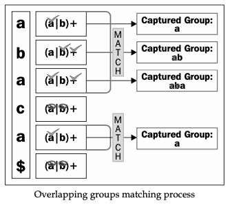

- [Concepts](#concepts)
  - [Literals](#literals)
  - [Metacharacters](#metacharacters)
  - [Boundary Matchers](#boundary-matchers)
  - [Predefined character classes](#predefined-character-classes)
  - [Backslash in string literals](#backslash-in-string-literals)
  - [Alternation](#alternation)
  - [Quantifiers](#quantifiers)
  - [Greedy and reluctant quantifiers](#greedy-and-reluctant-quantifiers)
- [Regular Expressions with Python](#regular-expressions-with-python)
  - [RegexObject](#regexobject)
  - [MatchObject](#matchobject)
    - [Compilation flags](#compilation-flags)
- [Grouping](#grouping)
  - [Backreferences](#backreferences)
  - [Named groups](#named-groups)
  - [Non-capturing groups](#non-capturing-groups)
  - [Special cases with groups](#special-cases-with-groups)
    - [Flags per group](#flags-per-group)
    - [yes-pattern|no-pattern](#yes-patternno-pattern)
  - [Overlapping groups](#overlapping-groups)
- [Look Around???](#look-around)
- [Performance of Regular Expression???](#performance-of-regular-expression)

**Mastering Python Regular Expressions**

# Concepts

## Literals

Literals are the simplest form of pattern matching in regular expressions. They will simply succeed whenever that literal is found.

## Metacharacters

In regular expressions, there are twelve metacharacters that should be escaped if they are to be used with their literal meaning:
• Backslash \
• Caret ^
• Dollar sign $
• Dot.
• Pipe symbol |
• Question mark ?
• Asterisk *
• Plus sign +
• Opening parenthesis (
• Closing parenthesis )
• Opening square bracket [
• The opening curly brace {


## Boundary Matchers

Matcher Description
```
^       Matches at the beginning of a line
$       Matches at the end of a line
\b      Matches a word boundary
\B      Matches the opposite of \b. Anything that is not a word boundary 
\A      Matches the beginning of the input
\Z      Matches the end of the input
```

## Predefined character classes

```
Element Description (for regex with default flags)
.   This element matches any character except newline \n
\d  This matches any decimal digit; this is equivalent to the class [0-9]
\D  This matches any non-digit character; this is equivalent to the class [^0-9]
\s  This matches any whitespace character; this is equivalent to the class [⇢\t\n\r\f\v]
\S  This matches any non-whitespace character; this is equivalent to the class [^ \t\n\r\f\v]
\w  This matches any alphanumeric character; this is equivalent to the class [a-zA-Z0-9_]
\W  This matches any non-alphanumeric character; this is equivalent to the class [^a-zA-Z0-9_]
```

## Backslash in string literals
The backslash character \ has a special meaning in Python. So, if we need to use the \ character, we'll have to escape it: \\. This will give the string literal meaning to the backslash. However, in order to match inside a regular expression, we should escape the backslashes, effectively writing four back slashes: \\\\.
Just as an example, let's write a regular expression to match \:
```python
   >>> pattern = re.compile("\\\\")
   >>> pattern.match("\\author")
   <_sre.SRE_Match at 0x104a88e68>
```
It works different as 
```python
re.match(pattern, string)
```

## Alternation

```
/yes|no/
```

## Quantifiers

```
Symbol      Name            Quantification of previous character
?           Question mark   Optional (0 or 1 repetitions)
*           Asterisk        Zero or more times
+           Plus sign       One or more times
{n,m}       Curly braces    Between n and m times
```


## Greedy and reluctant quantifiers

• The greedy behavior of the quantifiers is applied by default in the quantifiers. A greedy quantifier will try to match as much as possible to have the biggest match result possible.
• The non-greedy behavior can be requested by adding an extra question mark to the quantifier; for example, `??, *? or +?`. A quantifier marked as reluctant will behave like the exact opposite of the greedy ones. They will try to have the smallest match possible.

#  Regular Expressions with Python

## RegexObject

It is also known as Pattern Object. It represents a compiled regular expression

**MatchObject**: It represents the matched pattern

If we want to re-use the regular expression, we can use the following code:
```
   >>> pattern = re.compile(r'<HTML>')
   >>> pattern.match("<HTML>")
```
On the other hand, we can directly perform the operation on the module using the following line of code:
```
>>> re.match(r'<HTML>', "<HTML>")
```
The re module provides a wrapper for every operation in the RegexObject.
You can see them as shortcuts.

**match(string[, pos[, endpos]])**

This method tries to match the compiled pattern only **at the beginning of the string**. If there is a match, then it returns a MatchObject.

The optional `pos` parameter specifies where to start searching, as shown in the following code:
```python
>>> pattern = re.compile(r'<HTML>') 
>>> pattern.match("⇢ ⇢ <HTML>")
None
>>> pattern.match("⇢ ⇢ <HTML>", 2)
<_sre.SRE_Match at 0x1043bc850>
```

**search(string[, pos[, endpos]])**
It tries to match the pattern at any location of the string and not just at the beginning. If there is a match, it returns a MatchObject.

**findall(string[, pos[, endpos]])**

The previous operations worked with one match at a time. On the contrary, in this case it returns a list with all the non-overlapping occurrences of a pattern and not the MatchObject like `search` and `match` do.

Keep in mind that empty matches are a part of the result:
```python
   >>> pattern = re.compile(r'a*')
   >>> pattern.findall("aba")
       ['a', '', 'a', '']
```

I bet you're wondering what's happening here? The trick comes from the * quantifier, which allows 0 or more repetitions of the preceding regex;
the same had happened with the ? quantifier.
```python
   >>> pattern = re.compile(r'a?')
   >>> pattern.findall("aba")
       ['a', '', 'a', '']
```
Basically, both of them match the expression even though the preceding regex is not found:
```
a   a*  match a
b   a*  match ''
a   a*  match a
$   a*  match ''
```
As we've mentioned before, even though you can't see `$`, it's a valid character for the regex engine.

In case there are groups in the pattern, they are returned as tuples.

```python
>>> pattern = re.compile(r"(\w+) (\w+)")
>>> pattern.findall("Hello⇢world⇢hola⇢mundo")
    [('Hello', 'world'), ('hola', 'mundo')]
```

**finditer(string[, pos[, endpos]])**

Its working is essentially the same as findall, but it returns an iterator in which each element is a MatchObject, so we can use the operations provided by this object.

```python
>>> pattern = re.compile(r"(\w+) (\w+)")
>>> it = pattern.finditer("Hello⇢world⇢hola⇢mundo") >>> match = it.next()
>>> match.groups()
       ('Hello', 'world')
>>> match.span()
(0, 11)
>>> match = it.next()
>>> match.groups()
    ('hola', 'mundo')
>>> match.span()
(12, 22)
>>> match = it.next()
   Traceback (most recent call last):
    File "<stdin>", line 1, in <module>
   StopIteration
```

Modifying a string

split(string, maxsplit=0)

```python
>>> pattern = re.compile(r"\W") 
>>> pattern.split("hello⇢world") 
'Hello', 'world']
```
Compare to `findall`:

```python
>>> pattern = re.compile(r"\W") 
>>> pattern.findall("hello⇢world") 
['⇢']
```

Return the captured patterns:

Have you realized that the pattern matched is not included? Take a look at every example in this section. What can we do if we want to capture the pattern too?
The answer is to use groups:
```python
   >>> pattern = re.compile(r"(-)")
   >>> pattern.split("hello-word")
   ['hello', '-', 'word']
```
This happens because the split operation always returns the captured groups.

**sub(repl, string, count=0)**

This operation returns the resulting string after replacing the matched pattern in the original string with the replacement. If the pattern is not found, the original string is returned. 

The `repl` argument can also be a function, in which case it receives a MatchObject as an argument and the string returned is the replacement. For example, imagine you have a legacy system in which there are two kinds of orders. Some start with a dash and the others start with a letter:
```
• -1234
• A193, B123, C124
```
You must change it to the following:
```
• A1234
• B193, B123, B124
```
In short, the ones starting with a dash should start with an A and the rest should start with a B.
```python
 >>>def normalize_orders(matchobj):
       if matchobj.group(1) == '-': 
           return "A"
       else: 
           return "B"

>>> re.sub('([-|A-Z])', normalize_orders '-1234⇢A193⇢ B123') 
'A1234⇢B193⇢B123'
```
As mentioned previously, for each matched pattern the `normalize_orders` function is called. 

**Backreferences**

a powerful feature is also provided by sub.
the `\g<group>` notation.
```python
>>> text = "imagine⇢a⇢new⇢*world*,⇢a⇢magic⇢*world*" >>> pattern = re.compile(r'\*(.*?)\*')
>>> pattern.sub(r"<b>\g<1><\\b>", text) 'imagine⇢a⇢new⇢<b>world<\\b>,⇢a⇢magic⇢<b>world<\\b>'
```
`\g<1>` is the backreference to the matched pattern group `(.*?)`.

Another thing to keep in mind with sub is that every backslash that escapes in the replacement string will be processed. As you can see in `<\\b>`, you need to escape them if you want to avoid it.

**subn(repl, string, count=0)**

It is basically the same operation as sub, you can think of it as a utility above sub. It returns a tuple with the new string and the number of substitutions made.
Let us see the working by using the same example as before:
```python
>>> text = "imagine⇢a⇢new⇢*world*,⇢a⇢magic⇢*world*"
>>> pattern = re.compile(r'\*(.*?)\*')
>>> pattern.subn(r"<b>\g<1><\\b>", text) ('imagine⇢a⇢new⇢<b>world<\\b>,⇢a⇢magic⇢<b>world<\\b>', 2)
```

## MatchObject

This object represents the matched pattern

**group([group1, ...])**

The `group` operation gives you the subgroups of the match. If it's invoked with no arguments or zero, it will return the entire match; while if one or more group identifiers are passed, the corresponding groups' matches will be returned.
Let's see them with an example:
```python
>>> pattern = re.compile(r"(\w+) (\w+)") 
>>> match = pattern.search("Hello⇢world")
>>> match.group() 
'Hello⇢world'
>>> match.group(0) 
'Hello⇢world'
>>> match.group(1)
'Hello'
>>> match.group(2)
'world'
>>> match.group(3)
   ...
   IndexError: no such group
>>> match.group(0, 2) 
('Hello⇢world', 'world')
```
Groups can be named,

```python
>>> pattern = re.compile(r"(?P<first>\w+) (?P<second>\w+)")
>>> match = pattern.search("Hello⇢world") 
>>> match.group('first')
'Hello'
>>> match.group(1)
'Hello'
>>> match.group(0, 'first', 2) 
('Hello⇢world', 'Hello', 'world')
```

**groups([default])**

It returns a tuple with all the subgroups in the match instead of giving you one or some of the groups.
```python
>>> match.groups()
      ('Hello', 'World')
```

In case there are groups that don't match, the default argument is returned. If the default argument is not specified then `None` is used, for example:
```python
>>> pattern = re.compile("(\w+) (\w+)?") 
>>> match = pattern.search("Hello⇢")
>>> match.groups("mundo")
('Hello', 'mundo') 
>>> match.groups() 
('Hello', None)
```

**groupdict([default])**

The `groupdict` method is used in the cases where named groups have been used. It will return a dictionary with all the groups that were found:
```python
>>> pattern = re.compile(r"(?P<first>\w+) (?P<second>\w+)") 
>>> pattern.search("Hello⇢world").groupdict()
{'first': 'Hello', 'second': 'world'}
```

**start([group])**

Sometimes, it is useful to know the index where the pattern matched. As with all the operations related to groups, if the argument group is zero, then the operation works with the whole string matched:
```python
>>> pattern = re.compile(r"(?P<first>\w+) (?P<second>\w+)?") 
>>> match = pattern.search("Hello⇢")
>>> match.start(1)
0
```

If there are groups that don't match, then -1 is returned:
```python
>>> math = pattern.search("Hello⇢") 
>>> match..start(2)
-1
```

**end([group])**

The end operation behaves exactly the same as start, except that it returns the end of the substring matched by the group:
```python
>>> pattern = re.compile(r"(?P<first>\w+) (?P<second>\w+)?") 
>>> match = pattern.search("Hello⇢")
>>> match.end (1)
5
```


**span([group])**

It's an operation that gives you a tuple with the values from start and end. This operation is often used in text editors to locate and highlight a search. The following code is an example of this operation:
```python
>>> pattern = re.compile(r"(?P<first>\w+) (?P<second>\w+)?") 
>>> match = pattern.search("Hello⇢")
>>> match.span(1)
(0, 5)
```

**expand(template)**

This operation returns the string after replacing it with backreferences in the template string. It's similar to `sub`.
```python
>>> text = "imagine⇢a⇢new⇢*world*,⇢a⇢magic⇢*world*" 
>>> match = re.search(r'\*(.*?)\*', text)
>>> match.expand(r"<b>\g<1><\\b>")
     '<b>world<\\b>'
```

Module operations
Let's see two useful operations from the module.

**escape()**

It escapes the literals that may appear in the expressions.
```python
   >>> re.findall(re.escape("^"), "^like^")
   ['^', '^']
```

**purge()**

It purges the regular expressions cache. We've already talked about this; you need to use this in order to release memory when you're using the operations through the module. Keep in mind that there is a tradeoff with the performance; once you release the cache, every pattern has to be compiled and cached again.

### Compilation flags
```
re.I        The pattern will match lower case and upper case.
re.M        Match multiple lines
re.S        The metacharacter "." will match any character even the newline.
```

#  Grouping

## Backreferences

using the captured group inside the regex or other operations.
```python
>>>pattern = re.compile(r"(\d+)-(\w+)") 
>>>pattern.sub(r"\2-\1", "1-a\n20-baer\n34-afcr") 
'a-1\nbaer-20\nafcr-34'
```

## Named groups

```
Use                                             Syntax
Inside a pattern                                (?P=name)
In the repl string of the sub operation         \g<name>
In any of the operations of the MatchObject     match.group('name')
```

## Non-capturing groups

There are cases when we want to use groups, but we're not interested in extracting the information

Find the difference:

```python
>>> re.findall("Españ[a|ol]", "Español")
['Españo']
>>> re.findall("Españ(a|ol)", "Español")
['ol']
>>> re.search("Españ(a|ol)", "Español").group()
'Español'
re.search("Españ(a|ol)", "Español").group(0)
'Español'
>>> re.search("Españ(a|ol)", "Español").group(1)
'ol'
>>> re.search("Españ(a|ol)", "Español").groups()
('ol',)

```

Also,
You can see that we've captured a group even though we're not interested in the content of the group. So, let's try it without capturing, but first we have to know the syntax, which is almost the same as in normal groups, **(?:pattern)**. As you can see, we've only added **?:**. Let's see the following example:
```python
>>>re.search("Españ(?:a|ol)", "Español")
<_sre.SRE_Match at 0x10e912648>
>>>re.search("Españ(?:a|ol)", "Español").groups()
()
>>> re.search("Españ(?:a|ol)", "Español").groups(0)
()
>>> re.search("Españ(?:a|ol)", "Español").group(0)
'Español'
>>> re.search("Españ(?:a|ol)", "Español").group(1)
Traceback (most recent call last):
  File "<stdin>", line 1, in <module>
IndexError: no such group
```

## Special cases with groups

### Flags per group

`(?iLmsux)`

```
Letter  Flag
i       re.IGNORECASE L re.LOCALE
m       re.MULTILINE
s       re.DOTALL
u       re.UNICODE 
x       re.VERBOSE
```

### yes-pattern|no-pattern

This is a very useful case of groups. It tries to match a pattern in case a previous one was found. On the other hand, it doesn't try to match a pattern in case a previous group was not found. In short, it's like an if-else statement. The syntax for this operation is as follows:
```   
(?(id/name)yes-pattern|no-pattern)
```
This expression means: 
- if the group with this ID has already been matched, 
- then at this point of the string, the yes-pattern pattern has to match. 
- If the group hasn't been matched, 
- then the no-pattern pattern has to match.

```python
>>>pattern = re.compile(r"(\d\d-)?(\w{3,4})(?(1)(-\d\d))")
>>>pattern.match("34-erte-22")
<_sre.SRE_Match at 0x10f68b7a0>
>>>pattern.search("erte")
<_sre.SRE_Match at 0x10f68b828>
>>>pattern.match("34-erte")
None
```

## Overlapping groups

```python
 >>>re.findall(r'(a|b)+', 'abaca')
   ['a', 'a']
```
Why does the following expression give us 'a' and 'a' instead of 'aba' and 'a'?



As we can see in the preceding figure, the characters aba are matched, but the captured group is only formed by a. This is because even though our regex is grouping every character, it stays with the last a.

we're requesting the regex engine to capture all the groups made up of a or b, but just for one of the characters


So, how can you capture the groups made of several 'a' or 'b' in any order? The following expression does the trick:
```python
   >>>re.findall(r'((?:a|b)+)', 'abbaca')
      ['abba', 'a']
```

**We're asking the regex engine to capture every group made up of the subexpression (a|b) and not to group just one character.**

One last thing on this— if we would want to obtain every group made of a or b with findall, we could write this simple expression:
```python
   >>>re.findall(r'(a|b)', 'abaca')
      ['a', 'b', 'a', 'a']
```
In this case, we're asking the regex engine to capture a group made of a or b. As we're using findall, we get every pattern matched, so we get four groups.

# Look Around???

# Performance of Regular Expression???


