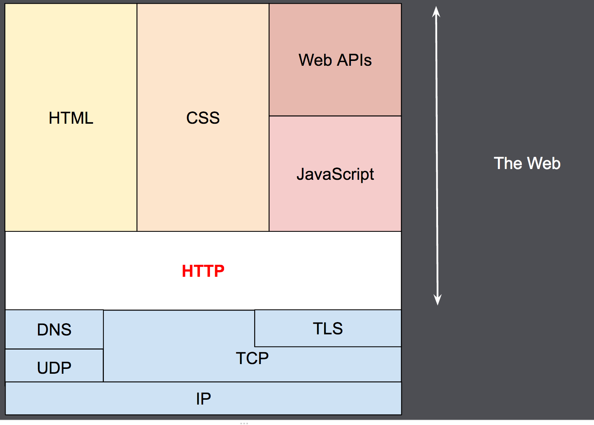

# An overview of HTTP

https://developer.mozilla.org/en-US/docs/Web/HTTP/Overview

A complete document is reconstructed from the different sub-documents fetched, for instance, text, layout description, images, videos, scripts, and more.

Clients and servers communicate by exchanging individual messages (as opposed to a stream of data). The messages sent by the client, usually a Web browser, are called requests and the messages sent by the server as an answer are called responses.

## Components of HTTP-based systems

HTTP is a client-server protocol: requests are sent by one entity, the user-agent (or a proxy on behalf of it). Most of the time the user-agent is a Web browser, but it can be anything, for example, a robot that crawls the Web to populate and maintain a search engine index.

Each individual request is sent to a server, which handles it and provides an answer called the response. Between the client and the server there are numerous entities, collectively called proxies, which perform different operations and act as gateways or caches, for example.

### Client: the user-agent

The **user-agent** is any tool that acts on behalf of the user. This role is primarily performed by the Web browser, but it may also be performed by programs used by engineers and Web developers to debug their applications.

