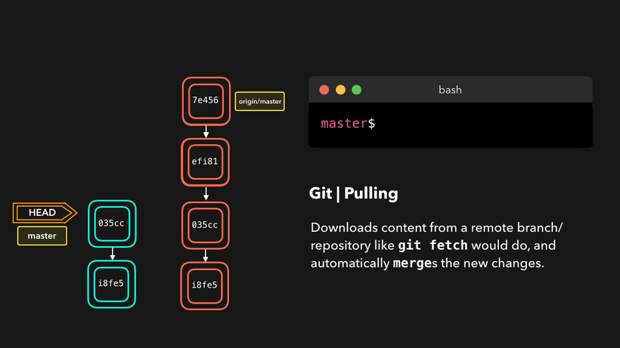
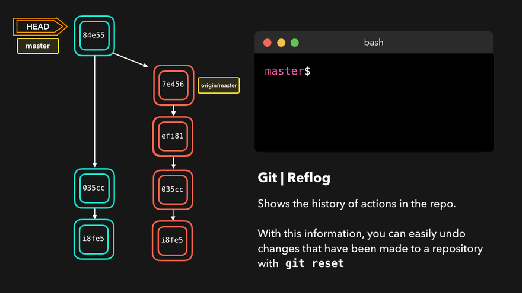

- [CS Visualized: Useful Git Commands](#cs-visualized-useful-git-commands)
- [Merging](#merging)
  - [Fast-forward (--ff)](#fast-forward---ff)
  - [No-fast-foward (--no-ff)](#no-fast-foward---no-ff)
  - [Merge Conflicts](#merge-conflicts)
- [Rebasing](#rebasing)
  - [Interactive Rebase](#interactive-rebase)
- [Resetting](#resetting)
  - [Soft reset](#soft-reset)
  - [Hard reset](#hard-reset)
- [Reverting](#reverting)
- [Cherry-picking](#cherry-picking)
- [Fetching](#fetching)
- [Pulling](#pulling)
- [Reflog](#reflog)


# CS Visualized: Useful Git Commands

https://dev.to/lydiahallie/cs-visualized-useful-git-commands-37p1


# Merging

Having multiple branches is extremely convenient to keep new changes separated from each other, and to make sure you don't accidentally push unapproved or broken changes to production. Once the changes have been approved, we want to get these changes in our production branch!

One way to get the changes from one branch to another is by performing a git merge! There are two types of merges Git can perform: a fast-forward, or a no-fast-forward 🐢

## Fast-forward (--ff)

A **fast-forward merge** can happen when the current branch has no extra commits compared to the branch we’re merging. Git is... lazy and will first try to perform the easiest option: the fast-forward! This type of merge doesn’t create a new commit, but rather merges the commit(s) on the branch we’re merging right in the current branch 🥳


Perfect! We now have all the changes that were made on the dev branch available on the master branch. So, what's the **no-fast-forward** all about?

## No-fast-foward (--no-ff)

It's great if your current branch doesn't have any extra commits compared to the branch that you want to merge, but unfortunately that's rarely the case! If we committed changes on the current branch that the branch we want to merge doesn't have, git will perform a no-fast-forward merge.

With a no-fast-forward merge, Git creates a new merging commit on the active branch. The commit's parent commits point to both the active branch and the branch that we want to merge!


No big deal, a perfect merge! 🎉 The master branch now contains all the changes that we've made on the dev branch.

## Merge Conflicts

Although Git is good at deciding how to merge branches and add changes to files, it cannot always make this decision all by itself 🙂 This can happen when the two branches we're trying to merge have changes on the same line in the same file, or if one branch deleted a file that another branch modified, and so on.

In that case, Git will ask you to help decide which of the two options we want to keep! Let's say that on both branches, we edited the first line in the README.md.


If we want to merge dev into master, this will end up in a merge conflict: would you like the title to be Hello! or Hey!?

When trying to merge the branches, Git will show you where the conflict happens. We can manually remove the changes we don't want to keep, save the changes, add the changed file again, and commit the changes 🥳


# Rebasing

We just saw how we could apply changes from one branch to another by performing a `git merge`. Another way of adding changes from one branch to another is by performing a `git rebase`.

A `git rebase` copies the commits from the current branch, and puts these copied commits on top of the specified branch.


Perfect, we now have all the changes that were made on the master branch available on the dev branch! 🎊

A big difference compared to merging, is that Git won't try to find out which files to keep and not keep. The branch that we're rebasing always has the latest changes that we want to keep! You won't run into any merging conflicts this way, and keeps a nice linear Git history.

This example shows rebasing on the master branch. In bigger projects, however, you usually don't want to do that. A git rebase changes the history of the project as new hashes are created for the copied commits!

Rebasing is great whenever you're working on a feature branch, and the master branch has been updated. You can get all the updates on your branch, which would prevent future merging conflicts! 😄

## Interactive Rebase

Before rebasing the commits, we can modify them! 😃 We can do so with an interactive rebase. An interactive rebase can also be useful on the branch you're currently working on, and want to modify some commits.

There are 6 actions we can perform on the commits we're rebasing:

- `reword`: Change the commit message
- `edit`: Amend this commit
- `squash`: Meld commit into the previous commit
- `fixup`: Meld commit into the previous commit, without keeping the commit's log message
- `exec`: Run a command on each commit we want to rebase
- `drop`: Remove the commit

Awesome! This way, we can have full control over our commits. If we want to remove a commit, we can just drop it.


Or if we want to squash multiple commits together to get a cleaner history, no problem!


Interactive rebasing gives you a lot of control over the commits you're trying to rebase, even on the current active branch!

# Resetting

It can happen that we committed changes that we didn't want later on. Maybe it's a WIP commit, or maybe a commit that introduced bugs! 🐛 In that case, we can perform a `git reset`.

A `git reset` gets rid of all the current staged files and gives us control over where `HEAD` should point to.

## Soft reset

A *soft* reset moves `HEAD` to the specified commit (or the index of the commit compared to HEAD), without getting rid of the changes that were introduced on the commits afterward!

Let's say that we don't want to keep the commit `9e78i` which added a `style.css` file, and we also don't want to keep the commit `035cc` which added an `index.js` file. However, we do want to keep the newly added `style.css` and `index.js` file! A perfect use case for a soft reset.


When typing `git status`, you'll see that we still have access to all the changes that were made on the previous commits. This is great, as this means that we can fix the contents of these files and commit them again later on!

## Hard reset

Sometimes, we don't want to keep the changes that were introduced by certain commits. Unlike a soft reset, we shouldn't need to have access to them any more. Git should simply reset its state back to where it was on the specified commit: this even includes the changes in your working directory and staged files! 💣


Git has discarded the changes that were introduced on `9e78i` and `035cc`, and reset its state to where it was on commit `ec5be`.

# Reverting

Another way of undoing changes is by performing a `git revert`. By reverting a certain commit, we create a **new commit** that contains the reverted changes!

Let's say that `ec5be` added an `index.js` file. Later on, we actually realize we didn't want this change introduced by this commit anymore! Let's revert the `ec5be` commit.


Perfect! Commit `9e78i` reverted the changes that were introduced by the `ec5be` commit. Performing a git revert is very useful in order to undo a certain commit, without modifying the history of the branch.

# Cherry-picking

When a certain branch contains a commit that introduced changes we need on our active branch, we can `cherry-pick` that command! By `cherry-picking` a commit, we create a new commit on our active branch that contains the changes that were introduced by the `cherry-picked` commit.

Say that commit `76d12` on the `dev` branch added a change to the `index.js` file that we want in our `master` branch. We don't want the entire we just care about this one single commit!


Cool, the master branch now contains the changes that `76d12` introduced!

# Fetching

f we have a remote Git branch, for example a branch on Github, it can happen that the remote branch has commits that the current branch doesn't have! Maybe another branch got merged, your colleague pushed a quick fix, and so on.

We can get these changes locally, by performing a `git fetch` on the remote branch! It doesn't affect your local branch in any way: a `fetch` simply downloads new data.


We can now see all the changes that have been made since we last pushed! We can decide what we want to do with the new data now that we have it locally.

# Pulling

Although a `git fetch` is very useful in order to get the remote information of a branch, we can also perform a `git pull`. A `git pull` is actually **two commands in one**: a `git fetch`, and a `git merge`. When we're pulling changes from the origin, we're first fetching all the data like we did with a `git fetch`, after which the latest changes are automatically merged into the **local branch**.



Awesome, we're now perfectly in sync with the remote branch and have all the latest changes! 🤩

# Reflog

Everyone makes mistakes, and that's totally okay! Sometimes it may feel like you've screwed up your git repo so badly that you just want to delete it entirely.

`git reflog` is a very useful command in order to show a log of all the actions that have been taken! This includes merges, resets, reverts: basically any alteration to your branch.



If you made a mistake, you can easily redo this by resetting `HEAD` based on the information that `reflog` gives us!

Say that we actually didn't want to merge the origin branch. When we execute the `git reflog` command, we see that the state of the repo before the merge is at `HEAD@{1}`. Let's perform a `git reset` to point `HEAD` back to where it was on `HEAD@{1}`!


We can see that the latest action has been pushed to the reflog!

It's interesting there's a few different syntaxes for selecting a previous commit:

```
HEAD~2          // previous two commits from head
HEAD~~         // previous two commits from head
HEAD@{2}     // reflog order
18fe5              // previous commit hash
```


