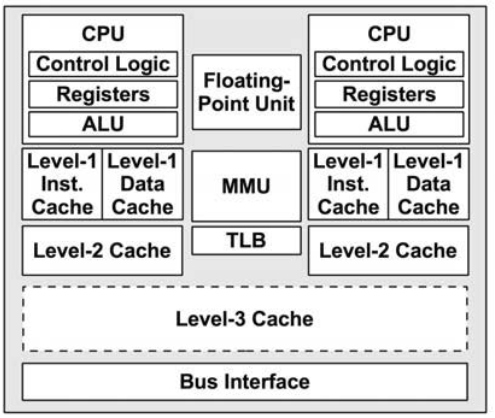
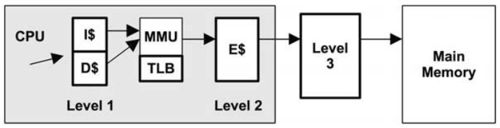
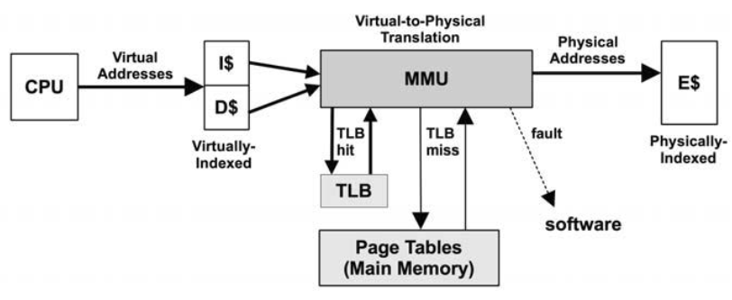
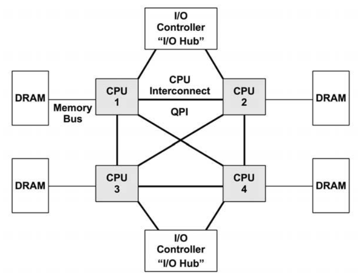
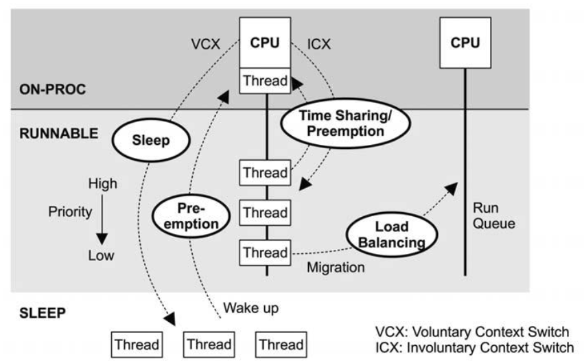
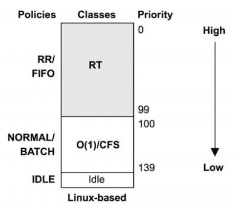

- [CPU](#cpu)
  - [Terminology](#terminology)
  - [CPU Run Queues](#cpu-run-queues)
  - [Concepts](#concepts)
    - [Clock Rate](#clock-rate)
    - [Instruction](#instruction)
    - [Instruction Pipeline](#instruction-pipeline)
    - [Instruction Width](#instruction-width)
    - [CPI, IPC](#cpi-ipc)
    - [Utilization](#utilization)
    - [User-Time/Kernel-Time](#user-timekernel-time)
    - [Saturation](#saturation)
    - [Preemption](#preemption)
    - [Priority Inversion](#priority-inversion)
    - [Word Size](#word-size)
    - [Compiler Optimization](#compiler-optimization)
  - [Architecture](#architecture)
    - [Hardware](#hardware)
      - [Processor](#processor)
      - [CPU Caches](#cpu-caches)
      - [Interconnects](#interconnects)
      - [CPU Performance Counters](#cpu-performance-counters)
    - [Software](#software)
      - [Scheduler](#scheduler)
  - [Methodology](#methodology)
    - [Tools Method](#tools-method)
    - [USE Method](#use-method)
    - [Workload Characterization](#workload-characterization)
    - [Profiling](#profiling)
    - [Cycle Analysis](#cycle-analysis)
    - [Performance Monitoring](#performance-monitoring)
    - [Static Performance Tuning](#static-performance-tuning)
    - [Priority Tuning](#priority-tuning)
    - [Resource Controls](#resource-controls)
    - [CPU Binding](#cpu-binding)
    - [Micro-Benchmarking](#micro-benchmarking)
    - [Scaling](#scaling)
  - [Analysis](#analysis)
    - [uptime](#uptime)
    - [vmstat](#vmstat)
    - [mpstat](#mpstat)
    - [sar](#sar)
    - [ps](#ps)
    - [top](#top)
    - [pidstat](#pidstat)
    - [time](#time)
    - [DTrace](#dtrace)

# CPU

- At a high level, CPU usage by process, thread, or task can be examined. 
- At a lower level, the code path within applications and the kernel can be profiled and studied. 
- At the lowest level, CPU instruction execution and cycle behavior can be studied.

## Terminology

- **Processor**: the physical chip that plugs into a socket on the system or processor board and contains one or more CPUs implemented as cores or hardware threads.
- **Core**: an independent CPU instance on a multicore processor. The use of cores is a way to scale processors, called chip-level multiprocessing (CMP).
- **Hardware thread**: a CPU architecture that supports executing multiple threads in parallel on a single core (including Intel’s Hyper-Threading Technology), where each thread is an independent CPU instance. One name for this scaling approach is **multithreading**.
- **CPU instruction**: a single CPU operation, from its instruction set. There are instructions for arithmetic operations, memory I/O, and control logic.
- **Logical CPU**: also called a virtual processor, an operating system CPU instance (a schedulable CPU entity). This may be implemented by the processor as a hardware thread (in which case it may also be called a virtual core), a core, or a single-core processor.
    - It is also sometimes called a virtual CPU; however, that term is more commonly used to refer to virtual CPU instances provided by a virtualization technology. 
- Scheduler: the kernel subsystem that assigns threads to run on CPUs.
- Run queue: a queue of runnable threads that are waiting to be serviced by CPUs. For Solaris, itis often called a dispatcher queue.
- **NUMA**: Non-Uniform Memory Access is a computer memory design used in multiprocessing, where the memory access time depends on the memory location relative to the processor. Under NUMA, a processor can access its own local memory faster than non-local memory.
- 
## CPU Run Queues

The number of software threads that are queued and ready to run is an impor- tant performance metric indicating CPU saturation.
The time spent waiting on a CPU run queue is sometimes called run-queue latency or dispatcher-queue latency.
For multiprocessor systems, the kernel typically provides a run queue for each CPU and aims to keep threads on the same run queue. This means that threads are more likely to keep running on the same CPUs, where the CPU caches have cached their data. (These caches are described as having cache warmth, and the approach to favor CPUs is called CPU affinity.) On NUMA systems, memory locality may also be improved, which also improves performance 

## Concepts

### Clock Rate

Some processors are able to vary their clock rate, increasing it to improve per- formance or decreasing it to reduce power consumption. 

Even if the CPU in your system appears to be fully uti- lized (a bottleneck), a faster clock rate may not speed up performance—it depends on what those fast CPU cycles are actually doing.

### Instruction

1. Instruction fetch
2. Instruction decode
3. Execute
4. Memory access
5. Register write-back

The last two steps are optional, depending on the instruction.

### Instruction Pipeline

The instruction pipeline is a CPU architecture that can execute multiple instruc- tions in parallel, by executing different components of different instructions at the same time.

Note:
Here the pipeline is parallel.

### Instruction Width

The instruction width describes the target number of instructions to process in parallel. Modern processors are 3-wide or 4-wide, meaning they can complete up to three or four instructions per cycle. 

### CPI, IPC

Cycles per instruction (CPI) is an important high-level metric for describing where a CPU is spending its clock cycles and for understanding the nature of CPU utili- zation. This metric may also be expressed as instructions per cycle (IPC), the inverse of CPI.

A high CPI indicates that CPUs are often stalled, typically for memory access. 

It should be noted that CPI shows the efficiency of instruction processing, but not of the instructions themselves. Consider a software change that added an inef- ficient software loop, which operates mostly on CPU registers (no stall cycles): such a change may result in a lower overall CPI, but higher CPU usage and utilization.

### Utilization

CPU utilization is measured by the time a CPU instance is busy performing work during an interval, expressed as a percentage.

CPU Utilization = (1 - (Idle time/busy time)) * 100%

High CPU utilization may not necessarily be a problem, but rather a sign that the system is doing work. 

CPU utilization is often split into separate kernel- and user-time metrics.

### User-Time/Kernel-Time

When measured across the entire system, the user- time/kernel-time ratio indicates the type of workload performed.

Applications that are computation-intensive may spend almost all their time executing user-level code and have a user/kernel ratio approaching 99/1. Exam- ples include image processing, genomics, and data analysis.
Applications that are I/O-intensive have a high rate of system calls, which exe- cute kernel code to perform the I/O. For example, a web server performing net- work I/O may have a user/kernel ratio of around 70/30.

### Saturation

A CPU at 100% utilization is saturated, and threads will encounter scheduler latency as they wait to run on-CPU, decreasing overall performance. 

A CPU running at saturation is less of a problem than other resource types, as higher-priority work can preempt the current thread.

### Preemption

Preemption allows a higher-priority thread to preempt (suspend) the currently running thread and begin its own execution instead. This eliminates the run-queue latency for higher-priority work, improving its performance.

### Priority Inversion

Priority inversion occurs when a lower-priority thread holds a resource and blocks a higher-priority thread from running. This reduces the performance of the higher-priority work, as it is blocked waiting.

On Linux both the multiprocess and multithread models may be used, and both are implemented by tasks.

With all the advantages shown in the table, multithreading is generally consid- ered superior, although more complicated for the developer to implement.

### Word Size


Processors are designed around a maximum word size—32-bit or 64-bit—which is the integer size and register size. 

Larger sizes can mean better performance, although it’s not as simple as it sounds. Larger sizes may cause memory overheads for unused bits in some data types. 

64-bit applications will more likely be faster than their 32-bit versions.

Processors and operating systems can support multiple word sizes and can run applications compiled for different word sizes simultaneously. 

### Compiler Optimization

Sometimes application performance can be significantly improved simply by using a newer compiler.

## Architecture

### Hardware

#### Processor


This example processor depicts a shared floating-point unit and (optional) shared Level 3 cache. Other performance-related components that may be present include the following:
- **P-cache**: prefetch cache (per CPU)
- **W-cache**: write cache (per CPU)
- **Clock**: signal generator for the CPU clock (or provided externally)
- **Timestamp counter**: for high-resolution time, incremented by the clock
- **Microcode ROM**: quickly converts instructions to circuit signals
- **Temperature sensors**: for thermal monitoring
- **Network interfaces**: if present on-chip (for high performance)

#### CPU Caches
Various hardware caches are usually included in the processor (referred to as on- chip, on-die, embedded, or integrated) or with the processor (external).


**Translation lookaside buffer (TLB)**
The E in E$ originally stood for external cache, but with the integration of Level 2 caches it has since been cleverly referred to as embedded cache.
For multicore and multithreading processors, some of these caches may be shared between cores and threads.

Apart from the increasing number and sizes of CPU caches, there is also a trend toward providing these on-chip, where access latency can be minimized, instead of providing them externally to the processor.

***Latency***
The access time for the Level 1 cache is typically a few CPU clock cycles, and for the larger Level 2 cache around a dozen clock cycles. Main memory can take around 60 ns (around 240 cycles, for a 4 GHz processor), and address translation by the MMU also adds latency.

***Associativity***
Associativity is a cache characteristic describing a constraint for locating new entries in the cache. Types are
- **Fully associative**: The cache can locate new entries anywhere. For example, an LRU algorithm could evict the least recently used entry in the entire cache.
- **Direct mapped**: Each entry has only one valid location in the cache, for example, a hash of the memory address, using a subset of the address bits to form an address in the cache.
- **Set associativ**e: A subset of the cache is identified by mapping (e.g., hashing), from within which another algorithm (e.g., LRU) may be performed. It is described in terms of the subset size; for example, four-way set associative maps an address to four possible locations, and then picks the best from those four.

CPU caches often use set associativity as a balance between fully associative (which is expensive to perform) and direct mapped (which has poor hit rates).

***Cache Line***
This is a range of bytes that are stored and transferred as a unit, improving memory throughput. A typical cache line size for x86 processors is 64 bytes. Compilers take this into account when optimizing for performance. Programmers sometimes do as well.

***Cache Coherency***
Memory may be cached in multiple CPU caches on different processors at the same time. When one CPU modifies memory, all caches need to be aware that their cached copy is now stale and should be discarded, so that any future reads will retrieve the newly modified copy. This process, called cache coherency, ensures that CPUs are always accessing the correct state of memory. It is also one of the greatest challenges when designing scalable multiprocessor systems, as memory can be modified rapidly.

***MMU***
The MMU is responsible for virtual-to-physical address translation. This MMU uses an on-chip TLB to cache address translations. Cache misses are satisfied by transla- tion tables in main memory (DRAM), called page tables, which are read directly by the MMU (hardware).



Some (older) processors handle TLB misses using software to walk the page tables, and then populate the TLB with the requested mappings. Such software may maintain its own, larger, in-memory cache of translations, called the translation storage buffer (TSB). Newer processors can service TLB misses in hardware, greatly reducing their cost.

#### Interconnects

For multiprocessor architectures, processors are connected using either a shared system bus or a dedicated interconnect. This is related to the memory architecture of the system, uniform memory access (UMA) or NUMA.
A shared system bus, called the **front-side bus**, used by earlier Intel processors.
The use of a system bus has scalability problems when the processor count is increased, due to contention for the shared bus resource. Modern servers are typically multiprocessor, NUMA, and use a CPU interconnect instead.


Interconnects can connect components other than processors, such as I/O controllers. Example interconnects include Intel’s Quick Path Interconnect (QPI) and AMD’s HyperTransport (HT). An example Intel QPI architecture for a four-processor sys- tem is shown here.


QPI is double-pumped, performing a data transfer on both edges of the clock, doubling the data transfer rate.
Apart from external interconnects, processors have internal interconnects for core communication. 
Interconnects are typically designed for high bandwidth, so that they do not become a systemic bottleneck. If they do, performance will degrade as CPU instructions encounter stall cycles for operations that involve the interconnect, such as remote memory I/O. A key indicator for this is a rise in CPI.

#### CPU Performance Counters

CPU performance counters (CPCs) go by many names, including performance instrumentation counters (PICs), performance monitoring unit (PMU), hardware events, and performance monitoring events. They are **processor registers** that can be programmed to count low-level CPU activity. They typically include counters for the following:
- **CPU cycles**: including stall cycles and types of stall cycles
- **CPU instructions**: retired (executed)
- **Level 1, 2, 3 cache accesses**: hits, misses
- **Floating-point unit**: operations
- **Memory I/O**: reads, writes, stall cycles
- **Resource I/O**: reads, writes, stall cycles

Since performance counters vary among manufacturers, a standard has been developed to provide a consistent interface across them. This is the **Processor Application Programmers Interface (PAPI)**.

### Software

#### Scheduler



On Linux, time sharing is driven by the system timer interrupt by calling `scheduler_tick()`, which calls scheduler class functions to manage priorities and the expiry of units of CPU time called time slices. Preemption is triggered when threads become runnable and the scheduler class `check_preempt_curr()` function is called. Switching of threads is managed by `__schedule()`, which selects the highest-priority thread via `pick_next_task()` for running. Load balancing is performed by the `load_balance()` function.

**Scheduling Classes**
Scheduling classes manage the behavior of runnable threads, specifically their pri- orities, whether their on-CPU time is time-sliced, and the duration of those time slices (also known as time quantum). There are also additional controls via sched- uling policies, which may be selected within a scheduling class and can control scheduling between threads of the same priority.
The priority of user-level threads is affected by a user-defined nice value, which can be set to lower the priority of unimportant work. In Linux, the nice value sets the static priority of the thread, which is separate from the dynamic priority that the scheduler calculates.


- **RT**: provides fixed and high priorities for real-time workloads. The kernel supports both user- and kernel-level preemption, allowing RT tasks to be dis- patched with low latency. The priority range is 0–99 (MAX_RT_PRIO–1).
- **O(1)**: The O(1) scheduler was introduced in Linux 2.6 as the default time- sharing scheduler for **user processes**. The prior scheduler contained routines that iterated over all tasks, making it O(n), which became a scalability issue. The O(1) scheduler dynamically improves the priority of I/O-bound over CPU-bound workloads, to reduce latency of interactive and I/O workloads.
- **CFS**: Completely fair scheduling was added to the Linux 2.6.23 kernel as the default time-sharing scheduler for user processes. The scheduler manages tasks on a red-black tree instead of traditional run queues, which is keyed from the task CPU time. This allows low CPU consumers to be easily found and executed in preference to CPU-bound workloads, improving the performance of interactive and I/O-bound workloads.

The scheduling class behavior can be adjusted by user-level processes by calling `sched_setscheduler()` to set the scheduler policy. The RT class supports the SCHED_RR and SCHED_FIFO policies, and the CFS class supports SCHED_ NORMAL and SCHED_BATCH.

Scheduler policies are as follows:
- **RR**: SCHED_RR is round-robin scheduling. Once a thread has used its time quantum, it is moved to the end of the run queue for that priority level, allowing others of the same priority to run.
- **FIFO**: SCHED_FIFO is first-in first-out scheduling, which continues running the thread at the head of the run queue until it voluntarily leaves, or until a higher-priority thread arrives. The thread continues to run, even if other threads of the same priority are on the run queue.
- **NORMAL**: SCHED_NORMAL (previously known as SCHED_OTHER) is time-sharing scheduling and is the default for user processes. The scheduler dynamically adjusts priority based on the scheduling class. For O(1), the time slice duration is set based on the static priority: longer durations for higher- priority work. For CFS, the time slice is dynamic.
- **BATCH**: SCHED_BATCH is similar to SCHED_NORMAL, but with the expectation that the thread will be CPU-bound and should not be scheduled to interrupt other I/O-bound interactive work.
Other classes and policies may be added over time. Scheduling algorithms have been researched that are hyperthreading-aware and temperature-aware, which optimize performance by accounting for additional processor factors.

When there is no thread to run, a special idle task (also called `idle thread`) is executed as a placeholder until another thread is runnable.


**Idle Thread**
The kernel “idle” thread (or idle task) runs on-CPU when there is no other runnable thread and has the lowest possible priority. It is usually programmed to inform the processor that CPU execution may either be halted (halt instruction) or throttled down to conserve power. The CPU will wake up on the next hardware interrupt.

**NUMA Grouping**
Performance on NUMA systems can be significantly improved by making the kernel NUMA-aware, so that it can make better scheduling and memory placement decisions. This can automatically detect and create groups of localized CPU and memory resources and organize them in a topology to reflect the NUMA architecture. This topology allows the cost of any memory access to be estimated.
On Linux systems, these are called **scheduling domains**, which are in a topology beginning with the root domain.

**Processor Resource-Aware**
Other than for NUMA, the CPU resource topology can be understood by the kernel so that it can make better scheduling decisions for power management and load balancing. 

## Methodology

Methodology                     |   Types
--------------------------------|--------------------------------------------
Tools method                    |   observational analysis
USE method                      |   observational analysis
Workload characterization       |   observational analysis, capacity planning
Profiling                       |   observational analysis
Cycle analysis                  |   observational analysis
Performance monitoring          |   observational analysis, capacity planning
Static performance tuning       |   observational analysis, capacity planning
Priority tuning                 |   tuning
Resource controls               |   tuning
CPU binding                     |   tuning
Micro-benchmarking              |   experimental analysis
Scaling                         |   capacity planning, tuning

My suggestion is to use the following, in this order: performance monitoring, the USE method, profiling, micro-benchmarking, and static analysis.

### Tools Method

The tools method is a process of iterating over available tools, examining key metrics they provide.

- **uptime**: Check `load averages` to see if CPU load is increasing or decreasing over time. `A load average over the number of CPUs in the system usually indicates saturation.`
- `vmstat`: Run vmstat per second, and check the `idle columns` to see how much headroom there is. `Less than 10% can be a problem.`
- **mpstat**: Check for `individual hot (busy) CPUs`, identifying a possible thread scalability problem.
- **top/prstat**: See which processes and users are the top CPU consumers.
- **pidstat/prstat**: Break down the top CPU consumers into user- and
system-time.
- **perf/dtrace/stap/oprofile**: Profile CPU usage stack traces for either user- or kernel-time, to identify why the CPUs are in use.
- **perf/cpustat**: Measure CPI.

### USE Method

The USE method is for identifying `bottlenecks` and `errors` across all components, early in a performance investigation, before deeper and more time-consuming strategies are followed.

- **Utilization**: the time the CPU was busy (not in the idle thread)
- **Saturation**: the degree to which runnable threads are queued waiting their turn on-CPU
- **Errors**: CPU errors, including correctable errors

**Errors** may be checked first since they are typically quick to check and the easi- est to interpret.
Checking that all CPUs are still online (Some offline due to failure)

**Utilization** is usually readily available from operating system tools as *percent busy*. This metric should be examined `per CPU`, to check for **scalability** issues. It can also be examined `per core`, for cases where a core’s resources are heavily utilized, preventing idle hardware threads from executing. High CPU and core utilization can be understood by using `profiling and cycle analysis`.

**Saturation** metrics are commonly provided **system-wide**, including as part of load averages. This metric quantifies the degree to which the CPUs are over-loaded, or a CPU quota, if present, is used up.

### Workload Characterization

Characterizing the load applied is important in `capacity planning, benchmarking, and simulating workloads`. It can also lead to some of the largest performance gains by identifying unnecessary work that can be eliminated.
Basic attributes for characterizing CPU workload are:
- Load averages (utilization + saturation)
  - Reflects the CPU load requested, regardless of the delivered performance
- User-time to system-time ratio
  - Shows the type of load applied
  - High user-time rates imply high user computate. 
- Syscall rate
- Voluntary context switch rate
- Interrupt rate

The intent is to characterize the applied load, not the delivered performance.
I/O-bound workloads have higher system-time, sys- calls, and also voluntary context switches as threads block waiting for I/O.

**Advanced Workload Characterization/Checklist**
- What is the CPU utilization system-wide? Per CPU?
- How parallel is the CPU load? Is it single-threaded? How many threads?
- Which applications or users are using the CPUs? How much?
- Which kernel threads are using the CPUs? How much?
- What is the CPU usage of interrupts?
- What is the CPU interconnect utilization?
- Why are the CPUs being used (user- and kernel-level call paths)?
- What types of stall cycles are encountered?

### Profiling

Profiling builds a picture of the target for study. 
1. **Select** the type of profile data to capture, and the rate.
2. **Begin** sampling at a timed interval.
3. **Wait** while the activity of interest occurs.
4. **End** sampling and collect sample data.
5. **Process** the data.

Some profiling tools, including DTrace, allow real-time processing of the captured data, which can be analyzed while sampling is still occurring.

The types of CPU profile data are based on the following factors:
- User level, kernel level, or both
- Function and offset (program-counter-based), function only, partial stack trace, or full stack trace

Capturing only user or kernel, partial stacks (e.g., five levels deep), or even just the executing function name may prove sufficient for identifying CPU usage from much less data.

DTrace one-liner could be used to sample the user-level function.

For the usage of specific CPU resources, such as caches and interconnects, pro- filing can use `CPC-based` event triggers instead of timed intervals.

### Cycle Analysis

By using the **CPU performance counters (CPCs)**, CPU utilization can be under- stood at the cycle level. This may reveal that cycles are spent stalled on Level 1, 2, or 3 cache misses, memory I/O, or resource I/O, or spent on floating-point operations or other activity. This information may lead to performance wins by adjust- ing compiler options or changing the code.

Begin cycle analysis by measuring CPI. 
-   If CPI is high, continue to investigate types of stall cycles. 
-   If CPI is low, look for ways in the code to reduce instructions performed. 

The values for “high” or “low” CPI depend on your processor: 
- low could be less than one, and high could be greater than ten. 
- You can get a sense of these values by performing known workloads that are either `memory-I/O-intensive` or `instruction-intensiv`e and measuring the resulting CPI for each.

Apart from measuring counter values, CPC can be configured to interrupt the kernel on the overflow of a given value. For example, at every 10,000 Level 2 cache misses, the kernel could be interrupted to gather a stack backtrace. Over time, the kernel builds a profile of the code paths that are causing Level 2 cache misses, without the prohibitive overhead of measuring every single miss. This is typically used by integrated developer environment (IDE) software, to annotate code with the locations that are causing memory I/O and stall cycles. Similar observability is possible using DTrace and the cpc provider.

### Performance Monitoring
Key metrics for CPUs are
- **Utilization**: percent busy
- **Saturation:** either run-queue length, inferred from load average, or as a measure of thread scheduler latency

Utilization should be monitored on a per-CPU basis to identify thread scalabil- ity issues. 
A challenge when monitoring CPU usage is choosing an interval to measure and archive. Some monitoring tools use 5 minutes, which can hide the existence of shorter bursts of CPU utilization. Per-second measurements are preferable, but you should be aware that there can be bursts even within a second. These can be identified from saturation.

### Static Performance Tuning
Static performance tuning focuses on issues of the configured environment. 

- How many CPUs are available for use? Are they cores? Hardware threads?
- Is the CPU architecture single- or multiprocessor?
- What is the size of the CPU caches? Are they shared?
- What is the CPU clock speed? Is it dynamic (e.g., Intel Turbo Boost and SpeedStep)? Are those dynamic features enabled in the BIOS?
- What other CPU-related features are enabled or disabled in the BIOS?
- Are there performance issues (bugs) with this processor model? Are they listed in the processor errata sheet?
- Are there performance issues (bugs) with this BIOS firmware version?
- Are there software-imposed CPU usage limits (resource controls) present? What are they?


### Priority Tuning

Your task is to identify low-priority work, which may include monitoring agents and scheduled backups, that can be modified to start with a nice value. Analysis may also be performed to check that the tuning is effective, and that the scheduler latency remains low for high-priority work.

Beyond nice, the operating system may provide more advanced controls for process priority such as changing the scheduler class or scheduler policy, or changing the tuning of the class. The real-time scheduling class, which can allow processes to preempt all other work.
If the real-time application encounters a bug where multiple threads enter an infinite loop, it can cause all CPUs to become unavailable for all other work—including the administrative shell required to manually fix the problem. This particular scenario is usually solved only by rebooting the system (oops!).

### Resource Controls

The operating system may provide fine-grained controls for allocating CPU cycles to processes or groups of processes. 

### CPU Binding

Another way to tune CPU performance involves binding processes and threads to individual CPUs, or collections of CPUs. This can increase CPU cache warmth for the process, improving its memory I/O performance. For NUMA systems it also improves memory locality, also improving performance.
There are generally two ways this is performed:

- **Process binding**: configuring a process to run only on a single CPU, or only on one CPU from a defined set.
- **Exclusive CPU sets**: partitioning a set of CPUs that can be used only by the process(es) assigned to them. This can improve CPU cache further, as when the process is idle other processes cannot use the CPUs, leaving the caches warm.

On Linux-based systems, the exclusive CPU sets approach can be implemented using `cpusets`.

### Micro-Benchmarking
Measure the time taken to perform a simple operation many times. The operation may be based on the following:
- **CPU instructions**: integer arithmetic, floating-point operations, memory loads and stores, branch and other instructions
- **Memory access**: to investigate latency of different CPU caches and main memory throughput
- **Higher-level languages**: similar to CPU instruction testing, but written in a higher-level interpreted or compiled language
- **Operating system operations**: testing system library and system call functions that are CPU-bound, such as `getpid()` and process creation

### Scaling
Here is a simple scaling method, based on capacity planning of resources:
1. Determine the target user population or application request rate.
2. Express CPU usage per user or per request. For existing systems, CPU usage can be monitored with the current user count or request rate. For future systems, load generation tools can simulate users so that CPU usage can be measured.
3. Extrapolate users or requests when the CPU resources reach 100% utilization. This provides the theoretical limit for the system.

## Analysis

CPU Analysis Tools


Tool        |   Description
------------|----------------------------------------------------
uptime      |   load averages 
vmstat      |   includes system-wide CPU averages
mpstat      |   per-CPU statistics
sar         |   historical statistics
ps          |   process status
top         |   monitor per-process/thread CPU usage
pidstat     |   per-process/thread CPU breakdowns
time        |   time a command, with CPU breakdowns
DTrace, perf|   CPU profiling and tracing 
perf        |   CPU performance counter analysis

### uptime

The last three numbers are the 1-, 5-, and 15-minute load averages. By comparing the three numbers, you can determine if the load is increasing, decreasing, or steady during the last 15 minutes (or so).

**Load Averages**
The load average indicates the demand for CPU resources and is calculated by summing the number of threads running (utilization) and the number that are queued waiting to run (saturation). A newer method for calculating load averages uses utilization plus the sum of thread scheduler latency, rather than sampling the queue length, which improves accuracy.

To interpret the value, if the load average is higher than the CPU count, there are not enough CPUs to service the threads, and some are waiting. If the load average is lower than the CPU count, it (probably) means that there is headroom, and the threads could run on-CPU when they wanted.

As a modern example, a system with 64 CPUs has a load average of 128. This means that on average there is always one thread running on each CPU, and one thread waiting for each CPU. 

**Linux Load Averages**
Linux currently adds tasks performing disk I/O in the uninterruptable state to the load averages. This means that the load average can no longer be interpreted to mean CPU headroom or saturation only, since it is unknown from the value alone to what degree it reflects CPU or disk load. Comparisons of the three load average numbers are also difficult, as the load may have varied among CPUs and disks over time.

A different way to incorporate other resource load is to use separate load aver- ages for each resource type. It is best to use other metrics to understand CPU load on Linux, such as those provided by vmstat(1) and mpstat(1).

### vmstat
The virtual memory statistics command, vmstat(8), prints system-wide CPU averages in the last few columns, and a count of runnable threads in the first column. 

~# vmstat 1
```
procs -----------memory---------- ---swap-- -----io---- -system-- ------cpu-----
 r  b   swpd   free   buff  cache   si   so    bi    bo   in   cs us sy id wa st
 5  0      0 119048  27244 737624    0    0    16    19    0    0  3  2 94  0  0
 0  0      0 119412  27244 737792    0    0   128    32 6006 13852  8  5 85  2  0
 0  0      0 118752  27412 738660    0    0   948   200 6148 14098 11  5 82  2  0
 0  1      0 116856  27552 741032    0    0  2588    72 5625 12803  7  5 77 12  0
```

The first line of output is the summary-since-boot, with the exception of r on Linux—which begins by showing current values. The columns are
- r: run-queue length—the total number of runnable threads (see below)
- us: user-time
- sy: system-time (kernel)
- id: idle
- wa: wait I/O, which measures CPU idle when threads are blocked on disk I/O
- st: stolen (not shown in the output), which for virtualized environments
shows CPU time spent servicing other tenants

On Linux, the r column is the total number of tasks waiting plus those running. 

### mpstat
The multiprocessor statistics tool, mpstat, can report statistics per CPU.
```
~# mpstat -P ALL 1
Linux 4.15.0-34-generic (huimian-test) 	11/22/2020 	_x86_64_	(2 CPU)

10:12:47 AM  CPU    %usr   %nice    %sys %iowait    %irq   %soft  %steal  %guest  %gnice   %idle
10:12:48 AM  all   77.55    0.00   18.37    0.00    0.00    2.04    0.00    0.00    0.00    2.04
10:12:48 AM    0   72.00    0.00   28.00    0.00    0.00    0.00    0.00    0.00    0.00    0.00
10:12:48 AM    1   86.96    0.00   13.04    0.00    0.00    0.00    0.00    0.00    0.00    0.00

10:12:48 AM  CPU    %usr   %nice    %sys %iowait    %irq   %soft  %steal  %guest  %gnice   %idle
10:12:49 AM  all    9.52    0.00   21.43    0.00    0.00    1.59    0.00    0.00    0.00   67.46
10:12:49 AM    0    8.08    0.00    5.05    0.00    0.00    1.01    0.00    0.00    0.00   85.86
10:12:49 AM    1   11.11    0.00   81.48    0.00    0.00    7.41    0.00    0.00    0.00    0.00
```

The -P ALL option was used to print the per-CPU report. By default, mpstat(1) prints only the system-wide summary line (all). The columns are
- CPU: logical CPU ID, or all for summary
- %usr: user-time
- %nice: user-time for processes with a nice’d priority
- %sys: system-time (kernel)
- %iowait: I/O wait
- %irq: hardware interrupt CPU usage
- %soft: software interrupt CPU usage
- %steal: time spent servicing other tenants
- %guest: CPU time spent in guest virtual machines
- %idle: idle

Key columns are %usr, %sys, and %idle. These identify CPU usage per CPU and show the user-time/kernel-time ratio. This can also identify “hot” CPUs—those running at 100% `utilization (%usr + %sys)` while others are not—which can be caused by single-threaded application workloads or device interrupt mapping.

### sar
The system activity reporter, sar(1), can be used to observe current activity and can be configured to archive and report historical statistics. 
The Linux version provides the following options:
- -P ALL: same as mpstat -P ALL
- -u: same as mpstat(1)’s default output: system-wide average only
- -q: includes run-queue size as runq-sz (waiting plus running, the same as vmstat’s r) and load averages

### ps

$ ps aux    (BSD style)

These list all users (a), with extended user-oriented details (u), and include processes without a terminal (x).

$ ps -ef (SRV4 style)

This lists every process (-e) with full details (-f).

Key columns for CPU usage are `TIME` and `%CPU`.
The TIME column shows the total CPU time consumed by the process (user + system) since it was created, in `hours:minutes:seconds`.
The %CPU column shows the CPU usage during the previous second as the sum across all CPUs. A single-threaded CPU-bound process will report 100%. A two-thread CPU-bound process will report 200%.

### top

A system-wide summary is at the top and a process/task listing at the bottom, sorted by the top CPU consumer by default. The system-wide summary includes the load averages and CPU states: %us, %sy, %ni, %id, %wa, %hi, %si, %st. These states are equivalent to those printed by mpstat(1), and are averaged across all CPUs.
CPU usage is shown by the TIME and %CPU columns same as in ps(1).
TIME+ column, the same as in ps, but at a resolution of hundredths of a second. For example, “1:36.53” means 1 minute and 36.53 seconds of on-CPU time in total.
The %CPU column by default is not normalized by CPU count.
Though top(1) is often a tool for beginning performance analysts, you should be aware that the CPU usage of top(1) itself can become significant and place top(1) as the top CPU-consuming process! This has been due to the available sys- tem calls—open(), read(), close()—and their cost when iterating over /proc entries for many processes.

A variant of top(1) for Linux, called atop(1), uses process accounting to catch the presence of short-lived processes, which it includes in its display.

### pidstat
The Linux pidstat(1) tool prints CPU usage by process or thread, including user- and system-time breakdowns. By default, a rolling output is printed of only active processes.
```
~# pidstat 1
Linux 4.15.0-34-generic (huimian-test) 	11/22/2020 	_x86_64_	(2 CPU)

01:07:59 PM   UID       PID    %usr %system  %guest   %wait    %CPU   CPU  Command
01:08:00 PM     0         8    0.00    0.99    0.00    0.00    0.99     1  rcu_sched
01:08:00 PM     0      1741    0.00    0.99    0.00    0.00    0.99     1  containerd
01:08:00 PM     0      3390   21.78    2.97    0.00    0.00   24.75     0  dockerd
01:08:00 PM     0      5310    2.97    1.98    0.00    0.00    4.95     1  AliYunDun
01:08:00 PM     0      7259    0.00    0.99    0.00    0.00    0.99     0  rancher
01:08:00 PM     0      7269    0.99    0.00    0.00    0.00    0.99     1  etcd
01:08:00 PM     0      7303    3.96    0.00    0.00    0.00    3.96     0  k3s-server
01:08:00 PM     0     10296    0.00    1.98    0.00    0.00    1.98     0  etcd
01:08:00 PM     0     10524    1.98    0.99    0.00    0.00    2.97     1  kube-apiserver
01:08:00 PM     0     10755    0.99    0.00    0.00    0.00    0.99     1  kube-controller
01:08:00 PM     0     11211    0.99    1.98    0.00    0.00    2.97     0  kubelet
01:08:00 PM     0     22968    0.00    0.99    0.00    0.00    0.99     0  pidstat
01:08:00 PM     0     24250    0.99    0.00    0.00    0.00    0.99     0  containerd-shim
01:08:00 PM     0     24680    0.99    0.00    0.00    0.00    0.99     0  calico-node
01:08:00 PM   108     26681    0.00    0.99    0.00    0.00    0.99     0  ntpd

```

The -p ALL option can be used to print all processes, including those that are idle. -t prints per-thread statistics.

### time
The time(1) command can be used to run programs and report CPU usage.
```
~# time top
real	0m4.164s
user	0m0.004s
sys	0m0.026s
```
user: user mode, sys: system time-syste calls
There is a missing 3.9 s (4.164 - 0.004 - 0.26), which is likely time spent blocked on disk I/O reads, as this file was only partially cached.

the /usr/bin/time version supports verbose details:
/usr/bin/time -v 
The -v option is not typically provided in the shell built-in version.

### DTrace

DTrace can be used to profile CPU usage for both user- and kernel-level code, and to trace the execution of functions, CPU cross calls, interrupts, and the kernel scheduler. These abilities support workload characterization, profiling, drill-down analysis, and latency analysis.