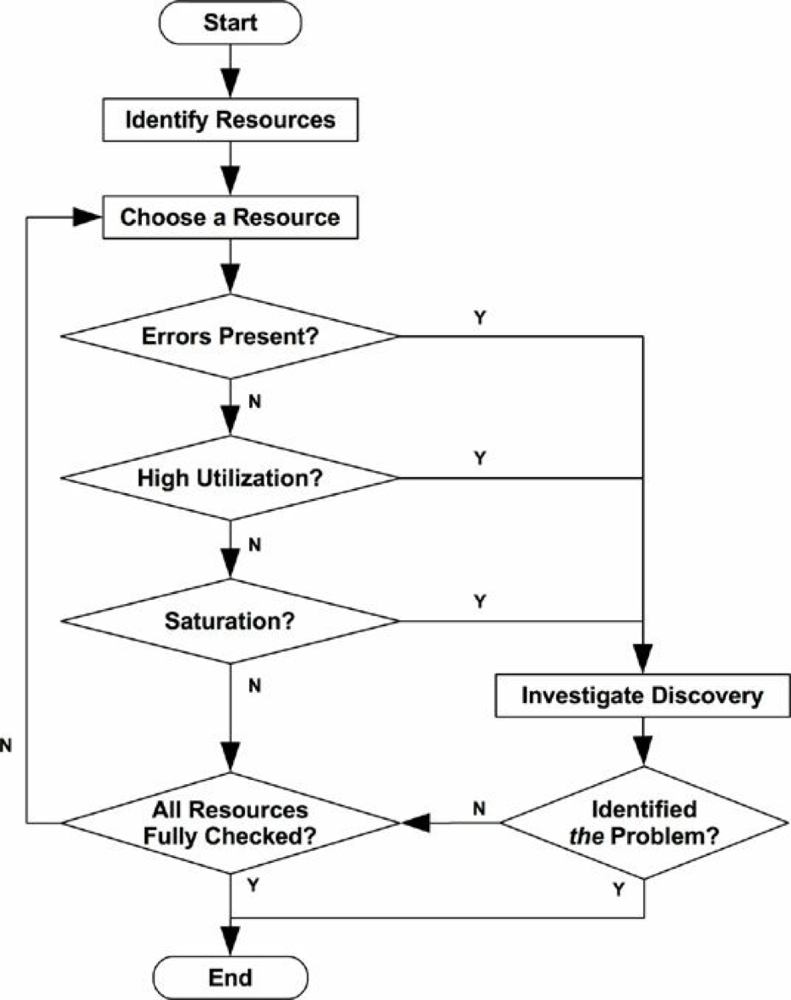

# Methodoloty

## Why Methodologies
Methodologies can help the performance analyst approach complex systems by showing where to start and what steps to take to locate and analyze performance issues. For beginners, methodologies show where to begin and provide enumerated steps for how to proceed. For casual users or experts, they can serve as checklists to ensure that details are not missed. They include methods to quantify and confirm the findings, identifying the performance issues that matter the most.

## Terminology

**IOPS**: Input/output operations per second is a measure of the rate of data transfer operations. For disk I/O, IOPS refers to reads and writes per second.
**Throughput**: the rate of work performed. Especially in communications, the term is used to refer to the data rate (bytes per second or bits per second). In some contexts (e.g., databases), throughput can refer to the operation rate (operations per second or transactions per second).
**Response time**: the time for an operation to complete. This includes any time spent waiting and time spent being serviced (service time), including the time to transfer the result.
**Latency**: Latency is a measure of time an operation spends waiting to be serviced. In some contexts, it can refer to the entire time for an operation, equivalent to response time.
**Utilization**: For resources that service requests, utilization is a measure of how busy a resource is, based on how much time in a given interval it was actively performing work. For resources that provide storage, utilization may refer to the capacity that is consumed (e.g., memory utilization).
**Saturation**: the degree to which a resource has queued work it cannot service.
**Bottleneck**: In system performance, a bottleneck is a resource that limits the performance of the system. Identifying and removing systemic bottlenecks is a key activity of systems performance.
**Workload**: The input to the system or the load applied is the workload. For a database, the workload consists of the database queries and commands sent by the clients.
**Cache**: a fast storage area that can duplicate or buffer a limited amount of data, to avoid communicating directly with a slower tier of storage, thereby improving performance. For economic reasons, a cache is smaller than the slower tier.

## Concepts

### Latency

The latency is the time spent waiting before an operation is performed.

As latency is a time-based metric, various calculations are possible. Performance issues can be quantified using latency and then ranked because they are expressed using the same units (time). Predicted speedup can also be calculated, by considering when latency can be reduced or removed. Neither of these can be accurately performed using an IOPS metric, for example.

When possible, other metric types can be converted to latency or time so that they can be compared.

### Time Scales

 System components operate over vastly different time scales (orders of magnitude), to the extent that it can be difficult to grasp just how big those differences are. Thus, a standardized time scale are critical to compare latencies among different components.

### Trade-offs

A common trade-off in performance tuning is that between CPU and memory, as memory can be used to cache results, reducing CPU usage. On modern systems with an abundance of CPU, the trade may work the other way: CPU may be spent to compress data to reduce memory usage.

Tunable parameters often come with trade-offs. Here are a couple of examples:
- File system record size (or block size): Small record sizes, close to the application I/O size, will perform better for random I/O workloads and make more efficient use of the file system cache while the application is running. Large record sizes will improve streaming workloads, including file system backups.

- Network buffer size: Small buffer sizes will reduce the memory overhead per connection, helping the system scale. Large sizes will improve network throughput.


### Tuning Efforts

Performance tuning is most effective when done closest to where the work is performed. For workloads driven by applications, this means within the application itself.
It's like the opposite of the process of software development. In softwware development, the earlier you find the bugs, the less the efforts to correct the bugs.

Example Targets of Tuning

Layer       | Tuning Targets
-----       | --------------
Application | database queries performed
Database    | database table layout, indexs, buffering
System call | memory-mapped or read/write, sync or async I/O flags
File system | record size, cache size, file system tunable
Storage     | RAID level, number and type of disks, storage tunable


While the application can be the most effective level to tune, it isn’t necessarily the most effective level from which to base observation.
Remember that operating system performance analysis can also identify application- level issues, not just OS-level issues, in some cases more easily than from the application alone.

### Level of Appropriateness

Different organizations and environments have different requirements for performance. 

### Point-in-Time Recommendations

The performance characteristics of environments change over time. Performance recommendations, especially the values of tunable parameters, are valid only at a specific point in time. 

### Load versus Architecture

An application can perform badly due to an issue with the software configuration and hardware on which it is running: its architecture. However, an application can also perform badly simply due to too much load applied, resulting in queueing and long latencies.

### Scalability

The performance of the system under increasing load is its scalability.
For some period, linear scalability is observed. A point is then reached, marked with a dotted line, where contention for a resource begins to affect performance. This point can be described as a knee point, as it is the boundary between two profiles. Beyond this point, the throughput profile departs from linear scalability, as contention for the resource increases. Eventually the overheads for increased contention and coherency cause less work to be completed and throughput to decrease.

This point may occur when a component reaches 100% utilization: the saturation point. It may also occur when a component approaches 100% utilization, and queueing begins to be frequent and significant.


Linear scalability of response time could occur if the application begins to return errors when resources are unavailable, instead of queueing work. For example, a web server may return 503 “Service Unavailable” instead of adding requests to a queue, so that those requests that are served can be performed with a consistent response time.

### Known-Unknowns

- **Known-knowns**: These are things you know. You know you should be checking a performance metric, and you know its current value. 

- **Known-unknown**s: These are things you know that you do not know. You know you can check a metric or the existence of a subsystem, but you haven’t yet observed it. 

- **Unknown-unknowns**: These are things you do not know you do not know. For example, you may not know that device interrupts can become heavy CPU consumers, so you are not checking them.

### Metrics

For usage of performance metrics depends on the contexts they are in, and definitions can vary.

Overhead
Performance metrics are not free; at some point, CPU cycles must be spent to gather and store them. This causes overhead, which can negatively affect the performance of the target of measurement. This is called the observer effect. 


### Utilization


Time-Based
Time-based utilization is formally defined in queueing theory.
For example: the average amount of time the server or resource was busy
along with the ratio 
U = B/T
where U = utilization, B = total time the system was busy during T, the observation period.

This utilization metric tells us how busy a component is: when a component approaches 100% utilization, performance can seriously degrade when there is contention for the resource. Other metrics can be checked to confirm and to see if the component has therefore become a system bottleneck.

Some components can service multiple operations in parallel. 
A disk that is 100% busy may also be able to accept and process more work, for example, by buffering writes in the on-disk cache to be completed later. Storage arrays frequently run at 100% utilization because some disk is busy 100% of the time, but the array has plenty of idle disks and can accept much more work.

Capacity-Based

This defines utilization in terms of capacity instead of time. It implies that a disk at 100% utilization cannot accept any more work. With the time-based definition, 100% utilization only means it is busy 100% of the time.
100% busy does not mean 100% capacity.

In this book, utilization usually refers to the time-based version.

### Saturation

The degree to which more work is requested of a resource than it can process is saturation. Saturation begins to occur at 100% utilization (capacity-based), as extra work cannot be processed and begins to queue. 

Any degree of saturation is a performance issue, as time is spent waiting (latency). For time-based utilization (percent busy), queueing and therefore saturation may not begin at the 100% utilization mark, depending on the degree to which the resource can operate on work in parallel.

### Profiling

Profiling builds a picture of a target that can be studied and understood. In the field of computing performance, profiling is typically performed by sampling the state of the system at timed intervals, and then studying the set of samples.

### Caching

Caching is frequently used to improve performance. A cache stores results from a slower storage tier in a faster storage tier for reference. An example is caching disk blocks in main memory (RAM).

One metric for understanding cache performance is each cache’s *hit ratio* — the number of times the needed data was found in the cache (hits) versus the number of times it was not (misses):
```
hit ratio = hits/total accesses (hits + misses)
```
Another metric for understanding cache performance is the *cache miss rate*, in terms of misses per second. This is proportional (linear) to the performance penalty of each miss and can be easier to interpret.

The total runtime for each workload can be calculated as
```
runtime = (hit rate x hit latency) + (miss rate x miss latency)
```
This calculation uses the average hit and miss latencies and assumes the work is serialized.

Algorithms

Most recently used (MRU) refers to a cache retention policy.
Least recently used (LRU) can refer to an equivalent cache eviction policy.
There are also most frequently used (MFU) and least frequently used (LFU) policies.
You may encounter not frequently used (NFU), which may be an inexpensive but less thorough version of LRU.

**Hot, Cold, and Warm Caches**
These words are commonly used to describe the state of the cache:
**Cold**: A cold cache is empty, or populated with unwanted data. The hit ratio for a cold cache is zero (or near zero as it begins to warm up).
**Hot**: A hot cache is populated with commonly requested data and has a high hit ratio, for example, over 99%.
**Warm**: A warm cache is one that is populated with useful data but doesn’t have a high enough hit ratio to be considered hot.
**Warmth**: Cache warmth describes how hot or cold a cache is. An activity that improves cache warmth is one that aims to improve the cache hit ratio.

## Perspectives

There are two common perspectives for performance analysis, each with different audiences, metrics, and approaches. They are workload analysis and resource analysis. They can be thought of as either top-down or bottom-up analysis of the operating system software stack

### Resource Analysis

Resource analysis begins with analysis of the system resources: CPUs, memory, disks, network interfaces, busses, and interconnects.
This perspective focuses on utilization, to identify when resources are at or approaching their limit.

Metrics best suited for resource analysis include 
- IOPS
- Throughput 
- Utilization 
- Saturation

### Workload Analysis


Workload analysis examines the performance of the applications: the workload applied and how the application is responding.

The targets for workload analysis are
- Requests: the workload applied
- Latency: the response time of the application 
- Completion: looking for errors

Studying workload requests typically involves checking and summarizing their attributes: the process of ***workload characterization***. For databases, these attributes may include the client host, database name, tables, and query string. 

Metrics best suited for workload analysis include 
- Throughput (transactions per second)
- Latency

These measure the rate of requests and the resulting performance.

## Methodology


**Generic System Performance Methodologies**

Methodology     | Type
-----------     | ------
Steetlight anti-method  | observational anlysis
Random change anti-method   | experimental analysis
Blame-someone-else anti-method  | hypothetical analysis
Ad hoc checklist method     | observational and experimental anlysis
Problem statement   | information gathering
Scientific method   | observational analysis
Daignosis cycle     | analysis life cycle
Tools method    | observational analysis
USE method      | observational analysis
Workload characterization  | observational analysis, capacity planning
Drill-down analysis | observational analysis
Latency analysis    | observational analysis
Mehtod R    | observational analysis
Event tracing   | observational analysis
Baseline statistics | observational analysis
Performance monitoring  | observational analysis, capacity planning
Queueing theory | statistical analysis, capacity planning
Static performance tuning   | observational analysis, capacity planning
Cache tuning    | observational analysis, tuning
Micro-benchmarking  | experimental analysis
Capacity planning   | capacity planning, tuning


### Streetlight Anti-Method

trial-and-error fashion

This method is actually the absence of a deliberate methodology. The user analyzes performance by choosing observability tools that are familiar, found on the Internet, or just at random to see if anything obvious shows up. This approach is hit or miss and can overlook many types of issues.

### Random Change Anti-Method

This is an experimental anti-methodology. The user randomly guesses where the problem may be and then changes things until it goes away. 

The approach is as follows:
1. Pick a random item to change (e.g., a tunable parameter). 
2. Change it in one direction.
3. Measure performance.
4. Change it in the other direction.
5. Measure performance.
6. Were the results in step 3 or step 5 better than the baseline? If so, keep the change and go back to step 1.

### Blame-Someone-Else Anti-Method

1. Find a system or environment component for which you are not responsible. 
2. Hypothesize that the issue is with that component.
3. Redirect the issue to the team responsible for that component.
4. When proven wrong, go back to step 1.

To avoid becoming a victim of blame-someone-else, ask the accuser for screen shots showing which tools were run and how the output was interpreted. 

### Ad Hoc Checklist Method

Stepping through a canned checklist is a common methodology used by support professionals when asked to check and tune a system, often in a short time frame.


While these checklists can provide the most value in the shortest time frame, they are point-in-time recommendations and need to be frequently refreshed to stay current.

### Problem Statement

It’s done by asking the customer the following questions:
1. What makes you think there is a performance problem?
2. Has this system ever performed well?
3. What changed recently? Software? Hardware? Load?
4. Can the problem be expressed in terms of latency or runtime?
5. Does the problem affect other people or applications (or is it just you)?
6. What is the environment? What software and hardware are used? Versions? Configuration?
Just asking and answering these questions often points to an immediate cause and solution. 

### Scientific Method

The scientific method studies the unknown by making hypotheses and then testing them. It can be summarized in the following steps:
1. Question (performance problem statement.)
2. Hypothesis 
3. Prediction 
4. Test
5. Analysis

### Diagnosis Cycle


Similar to the scientific method is the diagnosis cycle: 
```
hypothesis → instrumentation → data → hypothesis
```

### Tools Method

A tools-oriented approach is as follows:
1. List available performance tools (optionally, install or purchase more). 
2. For each tool, list useful metrics it provides.
3. For each metric, list possible rules for interpretation.

The result of this is a prescriptive checklist showing which tool to run, which metrics to read, and how to interpret them. 

In practice, the tools method does identify certain resource bottlenecks, errors, and other types of problems, though often not efficiently.
When a large number of tools and metrics are available, it can be time-consuming to iterate through
them. The situation gets worse when multiple tools appear to have the same functionality, and you
spend additional time trying to understand the pros and cons of each.


### The USE Method

(USE) method should be used early in a performance investigation, to identify systemic bottlenecks

These terms are defined as follows:
- **Resource**: all physical server functional components (CPUs, busses, . . .). Some software resources can also be examined, provided the metrics make sense.
- **Utilization**: for a set time interval, the percentage of time that the resource was busy servicing work. While busy, the resource may still be able to accept more work; the degree to which it cannot do so is identified by saturation.
- **Saturation**: the degree to which the resource has extra work that it can’t service, often waiting on a queue.
- **Errors**: the count of error events.


In contrast with the tools method, the USE method involves iterating over system resources instead of tools. This helps you create a complete list of questions to ask, and only then do you search for tools to answer them.

The USE method also directs analysis to a limited number of key metrics, so that all system resources are checked as quickly as possible. After this, if no issues have been found, other methodologies can be used.

##### Procedure



##### Expressing Metrics

The USE method metrics are usually expressed as follows:
- **Utilization**: as a percent over a time interval (e.g., “One CPU is running at 90% utilization”) 
- **Saturation**: as a wait-queue length (e.g., “The CPUs have an average run-queue length of four”) 
- **Errors**: number of errors reported (e.g., “This network interface has had 50 late collisions”)

##### Resource List

Try to be as complete as possible.
Here is a generic list of server hardware resources, along with specific examples:
- CPUs: sockets, cores, hardware threads (virtual CPUs) 
- Main memory: DRAM
- Network interfaces: Ethernet ports
- Storage devices: disks
- Controllers: storage, network
- Interconnects: CPU, memory, I/O

##### Functional Block Diagram

Such a diagram also shows relationships, which can be very useful when looking for bottlenecks in the flow of data.

##### Metrics

Example USE Method Metrics

Resource    | Type  | Metic
-----       | ----  | -----
CPU     | utilization   | CPU utilizatin (either per CPU or a system-wode average)
CPU | satuaration   | dispatcher-queue length (aka run-queue length)
Memory  | utilization   | available free memory (system-wide)
Memory  | saturation    | anonymous paging or thread swapping (page scnning is another indicator), or out-of-memory events
Network Interface   | utilization   | receive throughput/max bandwidth, transmit througput/max bandwidth
Storage device I/O | utilization    | device busy percent
Storage device I/O  | saturation    | wait-queue length
Storage device I/O  | errors    | device erros ("soft", "hard")

Some software resources can be similarly examined. This usually applies to smaller components of software, not entire applications, for example:
- **Mutex locks**: Utilization may be defined as the time the lock was held, saturation by those threads queued waiting on the lock.
- **Thread pools**: Utilization may be defined as the time threads were busy processing work, saturation by the number of requests waiting to be serviced by the thread pool.
- **Process/thread capacity**: The system may have a limited number of processes or threads, whose current usage may be defined as utilization; waiting on allocation may be saturation; and errors are when the allocation failed (e.g., “cannot fork”).
- **File descriptor capacity**: similar to process/thread capacity, but for file descriptors.

##### Suggested Interpretations

Here are some general suggestions for interpreting the metric types:
- **Utilization**: 
    - Utilization at 100% is usually a sign of a bottleneck (check saturation and its effect to confirm). 
    - Utilization beyond 60% can be a problem for a couple of reasons: depending on the interval, it can hide short bursts of 100% utilization. Also, some resources such as hard disks (but not CPUs) usually cannot be interrupted during an operation, even for higher-priority work. As utilization increases, queueing delays become more frequent and noticeable. 
    
- **Saturation**: Any degree of saturation can be a problem (nonzero). It may be measured as the length of a wait queue, or as time spent waiting on the queue.
- **Errors**: Nonzero error counters are worth investigating, especially if they are increasing while performance is poor.

### Workload Characterization

It focuses on the input to the system, rather than the resulting performance.

Workloads can be characterized by answering the following questions:
- **Who** is causing the load? Process ID, user ID, remote IP address?
- **Why** is the load being called? Code path, stack trace?
- **What** are the load characteristics? IOPS, throughput, direction (read/write), type? Include variance (standard deviation) where appropriate.
- **How** is the load changing over time? Is there a daily pattern?

The best performance wins are the result of eliminating unnecessary work.

The specific tools and metrics for performing workload characterization depend on the target. Some applications record detailed logs of client activity, which can be the source for statistical analysis. They may also already provide daily or monthly reports of client usage, which can be mined for details.

### Drill-Down Analysis

A drill-down analysis methodology for system performance is provided in Solaris Performance and Tools and has three stages:
1. **Monitoring**: This is used for continually recording high-level statistics over time, and identifying or alerting if a problem may be present.
2. **Identification**: Given a suspected problem, this narrows the investigation to particular resources or areas of interest, identifying possible bottlenecks.
3. **Analysis**: Further examination of particular system areas is done to attempt to root-cause and quantify the issue.

Five Whys

### Latency Analysis

Latency analysis examines the time taken to complete an operation, then breaks it into smaller components, continuing to subdivide the components with the highest latency so that the root cause can be identified and quantified.

### Method R


Method R is a performance analysis methodology developed for Oracle databases that focuses on finding the origin of latency, based on Oracle trace events.

### Event Tracing

When performing event tracing, look for the following information:
- **Input**: all attributes of an event request: type, direction, size, and so on 
- **Times**: start time, end time, latency (difference)
- **Result**: error status, result of event (size)

### Baseline Statistics

A baseline may be collected before and after system or application changes, so that performance changes can be analyzed.

### Static Performance Tuning

Static performance tuning focuses on issues of the configured architecture. Other methodologies focus on the performance of the applied load: the dynamic performance.

### Cache Tuning

Here is a general strategy for tuning each cache level:
1. Aim to cache as high in the stack as possible, closer to where the work is performed, reducing the operational overhead of cache hits.
2. Check that the cache is enabled and working.
3. Check the cache hit/miss ratios and miss rate.
4. If the cache size is dynamic, check its current size.
5. Tune the cache for the workload. This task depends on available cache tunable parameters.
6. Tune the workload for the cache. Doing this includes reducing unnecessary consumers of the cache, which frees up more space for the target workload.

### Micro-Benchmarking

Micro-benchmarking tests the performance of simple and artificial workloads. 
Some example targets of micro-benchmarks, including a second dimension for the tests, are 
- **Syscall time**: for fork(), exec(), open(), read(), close()
- **File system reads**: from a cached file, varying the read size from 1 byte to 1 Mbyte
- **Network throughput**: transferring data between TCP endpoints, for varying socket buffer sizes

Micro-benchmarking typically conducts the target operation as quickly as possible and measures the time for a large number of these operations to complete. The average time can then be calculated 
`(average time = runtime/operation count)`.