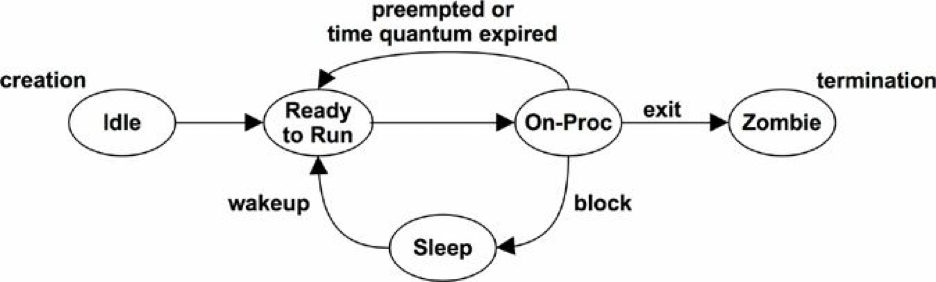
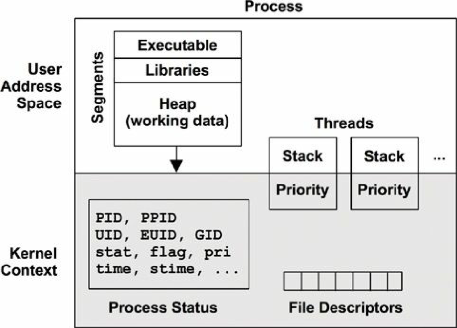
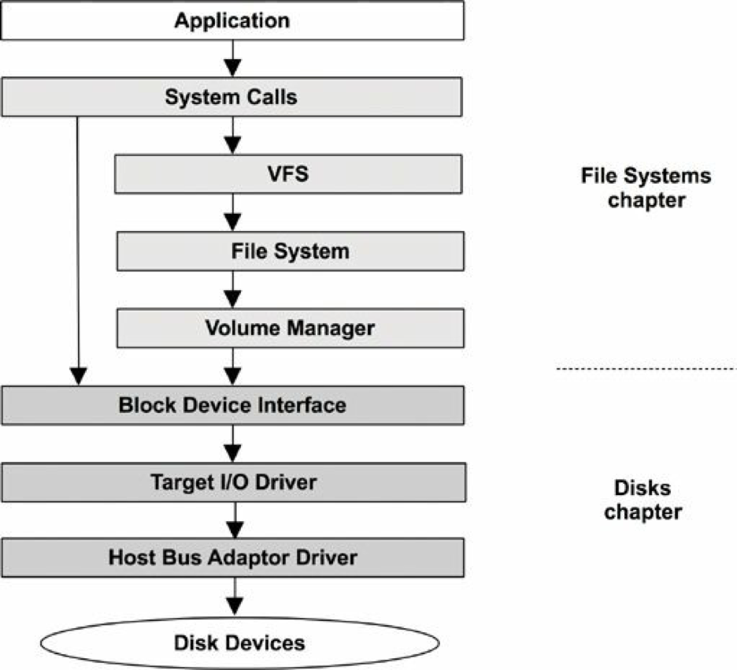

- [Operating Systems](#operating-systems)
  - [Terminology](#terminology)
    - [Kernel Mode, User Mode and Contex Switch](#kernel-mode-user-mode-and-contex-switch)
    - [Stacks](#stacks)
      - [User and Kernel Stacks](#user-and-kernel-stacks)
    - [Interrupts and Interrupt Threads](#interrupts-and-interrupt-threads)
    - [Processes](#processes)
      - [Process Creation](#process-creation)
      - [Process Life Cycle](#process-life-cycle)
      - [Process Environment](#process-environment)
    - [System Calls](#system-calls)
    - [Virtual Memory](#virtual-memory)
    - [Memory Management](#memory-management)
    - [Schedulers](#schedulers)
    - [File Systems](#file-systems)
      - [VFS](#vfs)
      - [I/O Stack](#io-stack)
    - [Caching](#caching)
    - [Networking](#networking)
    - [Device Drivers](#device-drivers)
    - [Multiprocessor](#multiprocessor)
      - [CPU Cross Calls](#cpu-cross-calls)
    - [Preemption](#preemption)
    - [Resource Management](#resource-management)
  - [Kernels](#kernels)

# Operating Systems

## Terminology

- Operating system: This refers to the software and files that are installed on a system so that it can boot and execute programs. It includes the kernel, administration tools, and system libraries.
- Kernel: The kernel is the program that manages the system, including devices (hardware), memory, and CPU scheduling. It runs in a privileged CPU mode that allows direct access to hardware, called kernel mode.
- Process: an OS abstraction and environment for executing a program. The program normally runs in user mode, with access to kernel mode (e.g., for performing device I/O) via system calls or traps.
- Thread: an executable context that can be scheduled to run on a CPU. The kernel has multiple threads, and a process contains one or more.
- Task: a Linux runnable entity, which can refer to a process (with a single thread), a thread from a multithreaded process, or kernel threads.
- Kernel-space: the memory address space for the kernel.
- User-space: the memory address space for processes.
- User-land: user-level programs and libraries (/usr/bin, /usr/lib, . . .).
- Context switch: a kernel routine that switches a CPU to operate in a different address space (context).
- System call (syscall): a well-defined protocol for user programs to request the kernel to perform privileged operations, including device I/O.
- Processor: Not to be confused with process, a processor is a physical chip containing one or more CPUs.
- Trap: a signal sent to the kernel, requesting a system routine (privileged action). Trap types include system calls, processor exceptions, and interrupts.
- Interrupt: a signal sent by physical devices to the kernel, usually to request servicing of I/O. An interrupt is a type of trap.

### Kernel Mode, User Mode and Contex Switch

The kernel is the only program running in a special CPU mode called kernel mode, allowing full access to devices and the execution of privileged instructions. 

User programs (processes) run in user mode, where they request privileged operations from the kernel via system calls, such as for I/O. To perform a system call, execution will ***context-switch*** from user to kernel mode, and then execute with the higher privilege level.

Each mode has its own software execution context, including a stack and registers. The execution of privileged instructions in user mode causes exceptions, which are then properly handled by the kernel.

The context switch between these modes takes time (CPU cycles), which adds a small amount of overhead for each I/O. Some services, such as NFS, have been implemented as kernel-mode software (instead of a user-mode daemon), so that they can perform I/O from and to devices without needing to context-switch to user mode.
Context switches can also occur directly between different processes, such as for CPU scheduling.

### Stacks

A stack contains the execution ancestry for a thread in terms of functions and registers. Stacks are used by CPUs for efficient processing of function execution in native software.

When a function is called, the current set of CPU registers (which store the state of the CPU) is saved to the stack, and a new stack frame is added to the top for the current execution of the thread. Functions end execution by calling a “return” CPU instruction, which removes the current stack and returns execution to the previous one, restoring its state.

Stack inspection is an invaluable tool for debugging and performance analysis. Stacks show the call path to current execution, which often answers why something is executing.

By reading down the stack, the full ancestry can be seen: function, parent, grandparent, and so on. Or, by reading bottom- up, you can follow the path of execution to the current function: how we got here.

#### User and Kernel Stacks

While executing a system call, a process thread has two stacks: a user-level stack and a kernel-level stack. 

### Interrupts and Interrupt Threads

An ***interrupt service routine*** is registered to process the device interrupt. Such routines are designed to operate as quickly as possible, to reduce the effects of interrupting active threads. If an interrupt needs to perform more than a little work, especially if it may block on locks, it can be processed by an interrupt thread that can be scheduled by the kernel.

How this is implemented depends on the kernel version. On Linux, device drivers can be modeled as two halves, with the top half handling the interrupt quickly, and scheduling work to a bottom half to be processed later. Handling the interrupt quickly is important as the top half runs in interrupt-disabled mode to postpone the delivery of new interrupts, which can cause latency problems for other threads if it runs for too long. The bottom half can be either tasklets or work queues; the latter are threads that can be scheduled by the kernel and can sleep when necessary. Solaris-based systems promote interrupts to interrupt threads if more work needs to be performed.

The time from an interrupt arrival to when it is serviced is the interrupt latency, which is dependent on the implementation. 

### Processes
A process is an environment for executing a user-level program. It consists of a memory address space, file descriptors, thread stacks, and registers. In some ways, a process is like a virtual early computer, where only one program is executing, with its own registers and stacks.

A process contains one or more ***threads***, which operate in the process address space and share the same file descriptors (state describing open files). A thread is an executable context consisting of a stack, registers, and program counter. Multiple threads allow a single process to execute in parallel across multiple CPUs.

####  Process Creation

Processes are normally created using the fork() system call. This creates a duplicate of the process, with its own process ID. The exec() system call can then be called to begin execution of a different program.

The fork() syscall may use a copy-on-write (COW) strategy to improve performance. This adds references to the previous address space rather than copying all of the contents. Once either process modifies the multiply-referenced memory, a separate copy is then made for the modifications. This strategy either defers or eliminates the need to copy memory, reducing memory and CPU usage.

#### Process Life Cycle

The on-proc state is for running on a processor (CPU). The ready-to-run state is when the process is runnable but is waiting on a CPU run queue for its turn on a CPU. I/O will block, putting the process in the sleep state until the I/O completes and the process is woken up. The zombie state occurs during process termination, when the process waits until its process status has been read by the parent process, or until it is removed by the kernel.

#### Process Environment

It consists of data in the address space of the process and metadata (context) in the kernel.

The kernel context consists of various process properties and statistics: its process ID (PID), the owner’s user ID (UID), and various times. These are commonly examined via the ps(1) command. It also has a set of file descriptors, which refer to open files and which are (usually) shared between threads.
This example pictures two threads, each containing some metadata, including a priority in kernel context and its stack in the user address space. The diagram is not drawn to scale; the kernel context is very small compared to the process address space.
The user address space contains memory segments of the process: executable, libraries, and heap.

### System Calls

Key System Calls

System Call | Description
--- |   ---
read()  | read bytes
write() | write bytes
open()  | open a file
close() | close a file
fork()  | create a new process
exec()｜ execute a new program
connect()   | connect to a network host
accept()    | accept a network connection
stat()  | fetch file statistics
ioctl() | set I/O properties, or other miscellaneous functions
mmap()  | map a file to the memory address space
brk()   | extend the heap poniter

### Virtual Memory

Virtual memory is an abstraction of main memory, providing processes and the kernel with their own, almost infinite, private view of main memory. It supports multitasking, allowing processes and the kernel to operate on their own private address spaces without worrying about contention. It also supports oversubscription of main memory, allowing the operating system to transparently map virtual memory between main memory and secondary storage (disks) as needed.

### Memory Management

While virtual memory allows main memory to be extended using secondary storage, the kernel strives to keep the most active data in main memory. There are two kernel routines for this:
- **Swapping** moves entire processes between main memory and secondary storage.
- **Paging** moves small units of memory called pages (e.g., 4 Kbytes).

Swapping is the original Unix method and can cause severe performance loss. Paging is more efficient and was added to BSD with the introduction of paged virtual memory. In both cases, least recently used (or not recently used) memory is moved to secondary storage and moved back to main memory only when needed again.
**In Linux, the term swapping is used to refer to paging**. The Linux kernel does not support the (older) Unix-style swapping of entire threads and processes.

### Schedulers

The basic intent of schedulers is to divide CPU time among the active processes and threads, and to maintain a notion of priority so that more important work can execute sooner. The scheduler keeps track of all threads in the ready-to-run state, traditionally on per-priority queues called run queues. Modern kernels may implement these queues per CPU and may also use other data structures, apart from queues, to track the threads. When more threads want to run than there are available CPUs, the lower-priority threads wait their turn. Most kernel threads run with a higher priority than user-level processes.

Process priority can be modified dynamically by the scheduler to improve the performance of certain workloads. Workloads can be categorized as either
- **CPU-bound**: applications that perform heavy compute, for example, scientific and mathematical analysis, which is expected to have long runtimes (seconds, minutes, hours). These become limited by CPU resources.
- **I/O-bound**: applications that perform I/O, with little compute, for example, web servers, file servers, and interactive shells, where low-latency responses are desirable. When their load increases, they are limited by I/O to storage or network resources.

The scheduler can identify CPU-bound workloads and decrease their priority, allowing I/O-bound workloads—where low-latency responses are more desirable—to run sooner. This can be achieved by calculating the ratio of recent compute time (time executing on-CPU) to real time (elapsed time) and decreasing the priority of processes with a high (compute) ratio. This mechanism gives preference to shorter-running processes, which are usually those performing I/O, including human interactive processes.

### File Systems

#### VFS

The virtual file system (VFS) is a kernel interface to abstract file system types, originally developed by Sun Microsystems so that the Unix file system (UFS) and NFS could more easily coexist. 

The VFS interface makes it easier to add new file system types to the kernel. 

#### I/O Stack

For storage-device-based file systems, the path from user-level software to the storage device is called the I/O stack. 

### Caching

Example Cache Layers for Disk I/O

Cache   | Example
--- | ---
application cache   | ---
web server cache    | Apache cache
caching server  | memcached
database cache  | MySQL buffter cache
directory cache | DNLC
file metadata cache | indoe cache
operating system buffer cache   | segvn
file system primary cache   | ZFS ARC
file system secondary cache | ZFS L2ARC
device cache    | ZFS vdev
block cache | buffer cache
disk controller cache   | RAID card cache
storage array cache | ---
on-disk cache   | ---

### Networking

TCP/IP stack

User-level applications access the network through programmable endpoints called sockets.

### Device Drivers

Device drivers can provide character and/or block interfaces to their devices. Character devices, also called raw devices, provide unbuffered sequential access of any I/O size down to a single character, depending on the device. Such devices include keyboards and serial ports (and in original Unix, paper tape and line printer devices).
Block devices perform I/O in units of blocks, which have historically been 512 bytes each. 

### Multiprocessor

It is usually implemented as symmetric multiprocessing (SMP), where all CPUs are treated equally. 

#### CPU Cross Calls

A CPU can request other CPUs, or all CPUs, to immediately perform such work using a CPU cross call. Cross calls are processor interrupts that are designed to be executed quickly, to minimize interruption of other threads.

### Preemption

Kernel preemption support allows high-priority user-level threads to interrupt the kernel and execute. A kernel that supports preemption is said to be *fully preemptable*, although practically it will still have some small critical code paths that cannot be interrupted.

An approach supported by Linux is *voluntary kernel preemption*, where logical stopping points in the kernel code can check and perform preemption. This avoids some of the complexity of supporting a fully preemptive kernel and provides low-latency preemption for common workloads.

### Resource Management

The operating system may provide various configurable controls for fine-tuning access to system resources, such as CPUs, memory, disk, and the network. These are resource controls and can be used on systems that run different applications or tenants (cloud computing) to manage performance. Such controls may impose fixed limits per process (or groups of processes) for resource usage, or a more flexible approach—allowing spare usage to be shared among them.

For Linux, control groups (cgroups) have been developed and integrated in 2.6.24 (2008), since which various additional controls have been added. These are documented in the kernel source under Documentation/cgroups.

## Kernels

Solaris:

DTrace: a static and dynamic tracing framework and tool, providing virtually unlimited observability of the entire software stack, in real time and in production. It was released for Solaris 10 in 2005 and was the first widely successful implementation of dynamic tracing. It has been ported to other operating systems, including Mac OS X and FreeBSD, and is currently being ported to Linux. 

Zones: an OS-based virtualization technology that allows instances of operating systems to be created that share the same host kernel. It was released for Solaris 10, but the concept was first accomplished by FreeBSD jails in 1998. Compared to other virtualization technologies, these are lightweight and provide high performance. 

Some Linux Kernel Components:

- OProfile (2.5.43): a system profiler for studying CPU usage and other events, for both the kernel and applications.
- DebugFS (2.6.11): a simple unstructured interface for the kernel to expose data to user level, which is used by some performance tools.
- inotify (2.6.13): a framework for monitoring file system events.
- blktrace (2.6.17): a framework and tool for the tracing of block I/O events (later migrated into tracepoints).
- Delay accounting (2.6.18): tracks per-task delay states.
- IO accounting (2.6.20): measures various storage I/O statistics per process.
- cgroups (2.6.24): Control groups allow resource usage to be measured and limited for groups of processes.
- latencytop (2.6.25): instrumentation and a tool for observing sources of latency in the operating system.
- Tracepoints (2.6.28): static kernel tracepoints (aka static probes) that instrument logical execution points in the kernel, for use by tracing tools (previously kernel markers).
- perf (2.6.31): Linux Performance Events (perf) is a set of tools for performance observability, including CPU performance counter profiling and static and dynamic tracing.
- Uprobes (3.5): the infrastructure for dynamic tracing of user-level software, used by other tools (perf, SystemTap, etc.).

