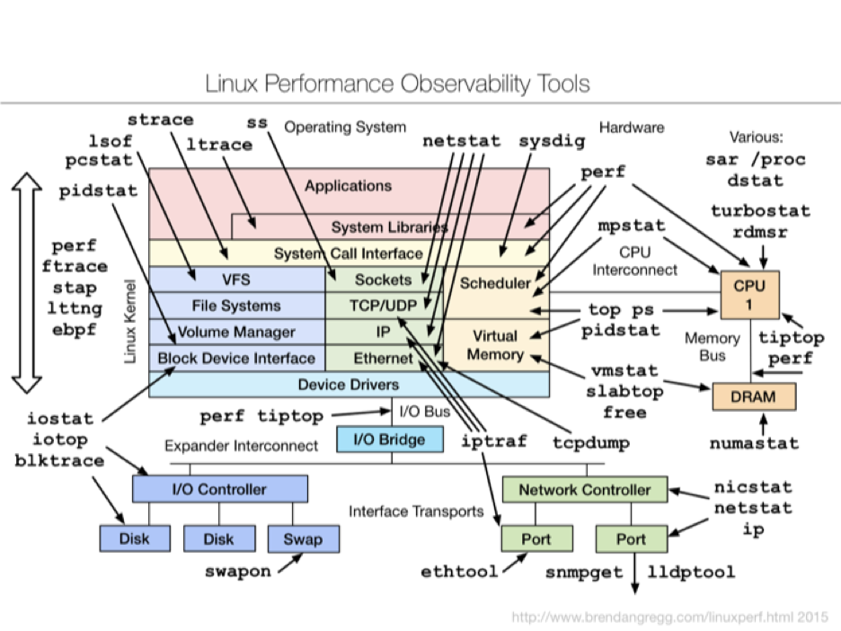
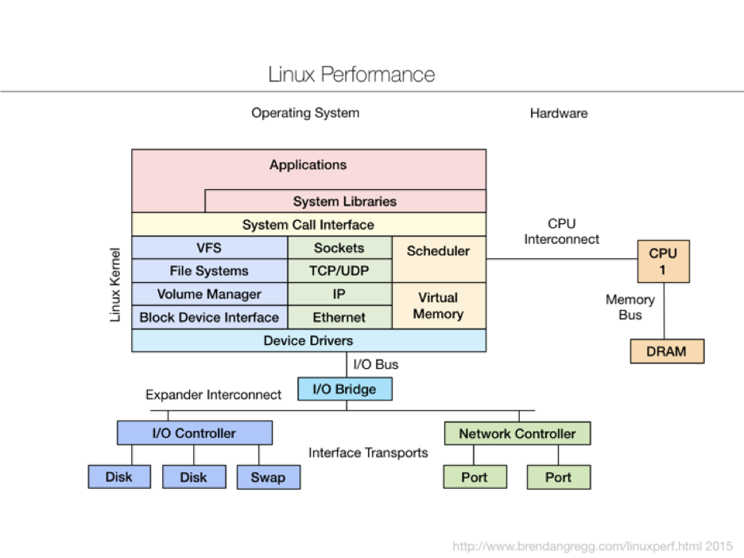
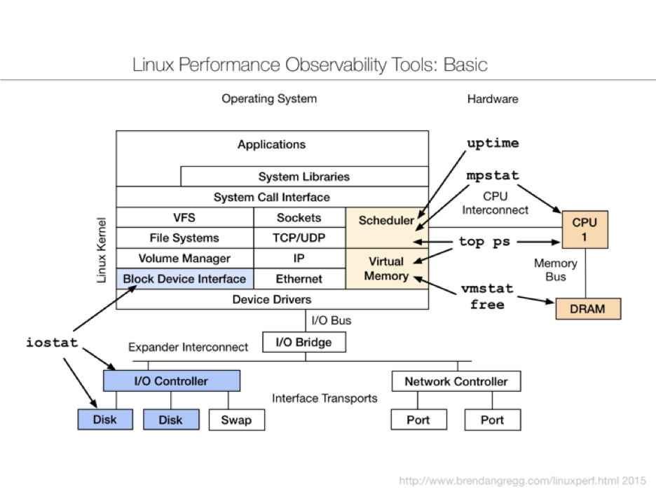
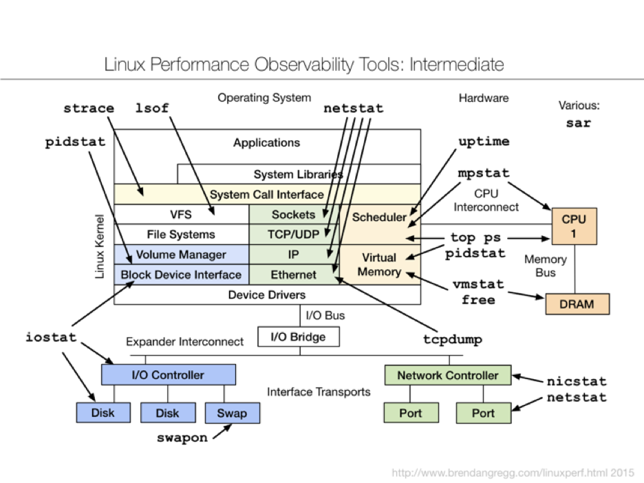
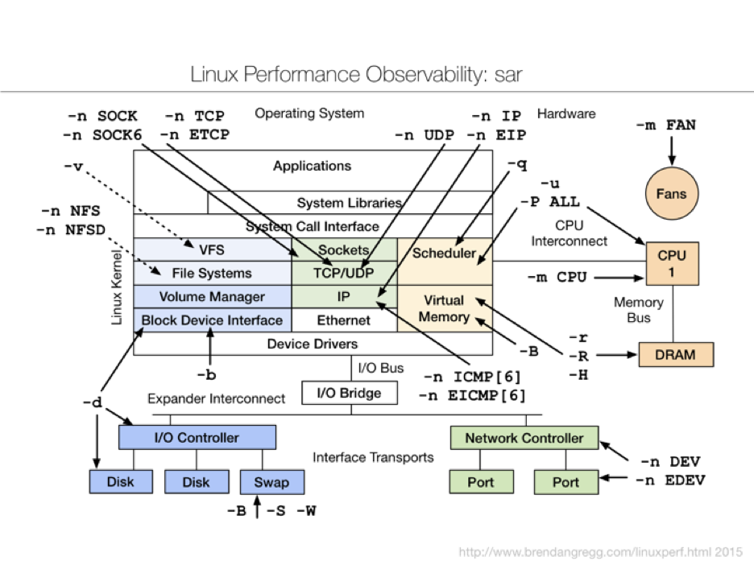
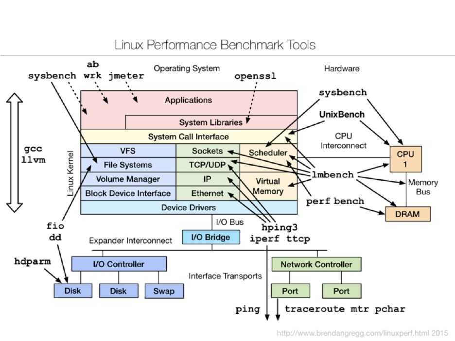
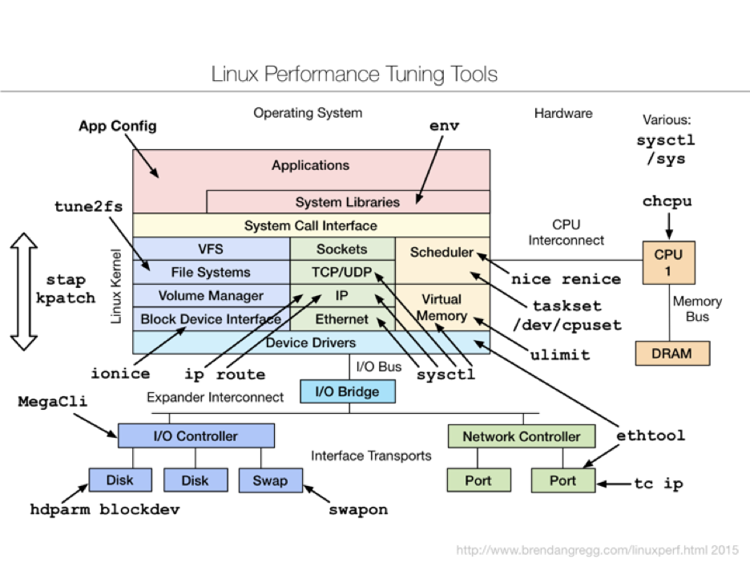
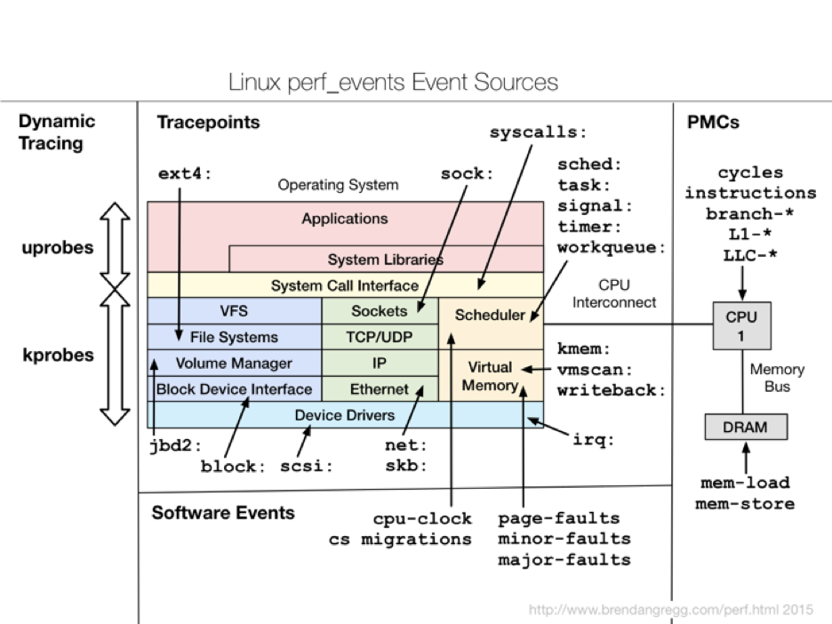
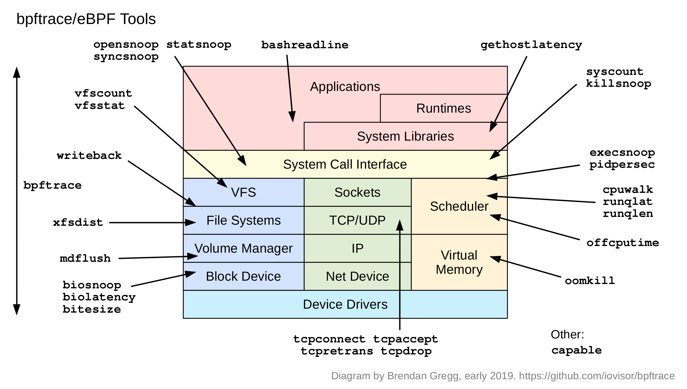

This is the summary of Linux Performance Monitoring and Tuning

[Methodoloty](#Methodologies)
- [Anti-Methodologies](#Anti-Methodologies)
- [Actual Methodologies](#ActualMethodologies)

[Tools](#Tools)
- [Observability Tools](#Observability)
    - [Observability Tools Basic](#ObservabilityBasic)
    - [Observability Tools Intermediate](#ObservabilityIntermediate)
    - [Observability Tools Advanced](#ObservabilityAdvanced)
- [Benchmarking Tools](#Benchmarking)
- [Turning Tools](#Turning)
- [Static Tools](#Static)

[Profiling](#Profiling)

[Tracing](#Tracing)
- [Linux Event Sources](#Sources)
- [eBPF](#BPF)

## Methodologies    {#Methodologies}
•  There are dozens of performance tools for Linux –  Packages: sysstat, procps, coreutils, ...
–  Commercial products
•  Methodologies can provide guidance for choosing and using tools effectively
•  As tarting point,aprocess,and an ending point

### Anti-Methodologies  {#Anti-Methodologies}

•  The lack of a deliberate methodology...

#### Street Light Anti-Methodology
1.  Pick observability tools that are: –  Familiar
–  Found on the Internet –  Found at random
2.  Run tools
3.  Look for obvious issues

#### Drunk Man Anti-Method
•  Tune things at random until the problem goes away

#### Blame Someone Else Anti-Method
1.  Find a system or environment component you are not responsible for
2.  Hypothesize that the issue is with that component
3.  Redirect the issue to the responsible team
4.  When proven wrong, go to 1

### Actual Methodologies    {#ActualMethodologies}
•  Problem Statement Method
•  Workload Characterization Method
•  USE Method
•  Off-CPU Analysis
•  CPU Profile Method
•  RTFM Method
•  Active Benchmarking (covered later)
•  Static Performance Tuning(covered later) 
•  ...

#### Problem Statement Method

1.  What makes you think there is a performance problem?
2.  Has this system ever performed well?
3.  What has changed recently? (Software? Hardware? Load?)
4.  Can the performance degradation be expressed in terms of latency or run time?
5.  Does the problem affect other people or applications (or is it just you)?
6.  What is the environment? Software, hardware, instance types? Versions? Configuration?

#### Workload Characterization Method
1.  Who is causing the load? PID, UID, IP addr, ...
2.  Why is the load called? code path, stack trace
3.  What is the load? IOPS, tput, type, r/w
4.  How is the load changing over time?

#### The USE Method

•  For every resource, check: 
1.  Utilization
2.  Saturation 
3.  Errors

•  Definitions:
–  Utilization: busy time
–  Saturation: queue length or queued time 
–  Errors: easy to interpret (objective)
•  Helps if you have a functional (block) diagram of your system / software / environment, showing all resources

Start with the questions, then find the tools

USE Method for Hardware

•  Foreveryresource,check: 
1.  Utilization
2.  Saturation 
3.  Errors
•  Including busses & interconnects

The USE Method provides a strategy for performing a complete check of system health, identifying common bottlenecks and errors. For each system resource, metrics for utilization, saturation and errors are identified and checked. Any issues discovered are then investigated using further strategies.

#### Off-CPU Analysis

On-CPU Profiling
analize the process executed on CPU

Off-CPU Profiling (everything else)

#### CPU Profile Method

1.  Take a CPU profile
2.  Understand all software in profile > 1%

•  Discoversawiderangeofperformanceissuesbytheir CPU usage
•  Narrowssoftware to study

#### RTFM Method
•  How to understand performance tools or metrics:
1.  Man pages
2.  Books
3.  Web search
4.  Co-workers
5.  Prior talk slides/video (this one!)
6.  Support services
7.  Source code
8.  Experimentation
9.  Social

#### Active Benchmarking (covered later)

#### Static Performance Tuning(covered later) 

## Tools {#Tools}

### Objectives:
    - Perform the USE Method for resource utilization
    - Perform Workload Characterization for disks, network
    - Perform the CPU Profile Method using flame graphs
    - Have exposure to various observability tools:
        - Basic: vmstat, iostat, mpstat, ps, top, ...
        - Intermediate: tcpdump, netstat, nicstat, pidstat, sar, ... •  
        - Advanced: ss, slaptop, perf_events, ...
    - Perform Active Benchmarking
    - Understand tuning risks
    - Perform Static Performance Tuning

### Tool Types

Type    |   Characteristic
--------|   ------------
Observability   | Watch activity. Safe, usually, depending on resource overhead.
Benchmarking    | Load test. Caution: production tests can cause issues due to contention.
Tuning  | Change. Danger: changes could hurt performance, now or later with load.
Static  | Check configuration. Should be safe.

#### Observability Tools    {#Observability}

**Linux Anatomy**:

##### Observability Tools: Basic    {#ObservabilityBasic}
•  uptime
•  top(orhtop) •  ps
•  vmstat
•  iostat
•  mpstat
•  free

###### Observability Tools Basic

###### uptime
- One way to print load averages:
- A measure of resource demand: CPUs+disks
    - Other OSes only show CPUs: easier to interpret
- Exponentially-damped moving averages 
- Time constants of 1, 5, and 15 minutes
- Historic trend without the line graph
- ***Load > # of CPUs, may mean CPU saturation***
    - Don’t spend more than 5 seconds studying these

###### top (or htop)

- System and per-process interval summary
- %CPU is summed across all CPUs
- Can miss short-lived processes(atop won’t)
- Can consume noticeable CPU to read/proc

###### vmstat

- USAGE: vmstat [interval [count]]
- First output line has some summary since boot values
    - Should be all; partial is confusing 
- High level CPU summary
    - “r” is runnable tasks

###### iostat

- Block I/O (disk) stats. 1st output is since boot.

###### mpstat

- Multi-processor statistics, per-CPU
- Look for unbalanced workloads, hotCPUs.

###### free

- Main memory usage
- buffers: block device I/O cache
- cached: virtual page cache

##### Observability Tools: Intermediate     {#ObservabilityIntermediate}
•  strace
•  tcpdump
•  netstat
•  nicstat
•  pidstat
•  swapon
•  lsof
•  sar(andcollectl,dstat,etc.)

###### strace

- System call tracer
- Eg, -ttt: time (us) since epoch; -T: syscall time (s) 
- Translates syscall args
    - Very helpful for solving system usage issues
- Currently has massive overhead (ptrace based) 
    - Can slow the target by > 100x. Use extreme caution.

###### tcpdump

- Sniff network packets for post analysis
- Study packet sequences witht imestamps (us)
- CPU overhead optimized (socket ring buffers), but can still be significant. Use caution.

###### netstat

- Various network protocol statistics using -s
- A multi-tool:
    - -i: interface stats
    - -r: route table
    - default: list conns
- netstat -p: shows process details!
- Per-second interval with -c

###### nicstat

- Network interface stats, iostat-like output
- Check network throughput and interface %util
- Written by Brendon

###### pidstat

- Very useful process stats. eg, by-thread, disk I/O

###### swapon

- Show swap device usage

###### lsof

- More a debug tool,lsof(8) shows file descriptor usage, which for some apps, equals current active network connections

###### sar

- System Activity Reporter. Many stats
- Archive or live mode: (interval [count])
- Well designed. Header naming convention, logical groups: TCP, ETCP, DEV, EDEV, ...

##### Advanced Observability Tools  {#ObservabilityAdvanced}
- Misc:
    - ltrace, ss, iptraf, ethtool, snmpget, lldptool, iotop, blktrace, slabtop, /proc, pcstat
- CPU Performance Counters:
    - perf_events, tiptop, rdmsr 
- Advanced Tracers:
    - perf_events, ftrace, eBPF, SystemTap, ktap, LTTng, dtrace4linux, sysdig

###### ss

- More socket statistics

######  iptraf

- 

###### iotop

- Block device I/O (disk) by process
- Needs kernel support enabled
    - CONFIG_TASK_IO_ACCOUNTING

###### slabtop

- Kernel slab allocator memory usage

###### pcstat

- Show page cache residency by file
- Uses the mincore(2) syscall. Useful for database performance analysis.

###### perf_events

- Provides the "perf" command
- In Linux source code: tools/perf
    - Usually pkg added by linux-tools-common, etc.
- Multi-tool with many capabilities 
    - CPU profiling
    - PMC profiling
    - Static & dynamic tracing
- Covered later in Profiling & Tracing

###### tiptop

- IPC by process, %MISS, %BUS
- Needs somelove. perfmon2 libraryi ntegration?
- Still can’t use it in clouds yet(needs PMCse nabled)

###### rdmsr

- Model Specific Registers (MSRs), unlike PMCs, can be read by default in Xen guests

###### More Advanced Tools...

Tool    | Descrip-on
------  | ---------
ltrace  | Library call tracer
ethtool | Mostly interface tuning; some stats
snmpget | SNMP network host sta<s<cs
lldptool    | Can get LLDP broadcast stats
blktrace    | Block I/O event tracer
/proc   | Many raw kernel counters
pmu-tools   | On- and off-core CPU counter tools

###### Advanced Tracers
- Many options on Linux:
    - perf_events, ftrace, eBPF, SystemTap, ktap, LTTng,
dtrace4linux, sysdig
- Most can do static and dynamic tracing
    - Static: pre-defined events (tracepoints)
    - Dynamic: instrument any software (kprobes, uprobes). Custom metrics on-demand. Catch all.
- Many are in-development

#### Benchmarking Tools     {#Benchmarking}

- Multi:
    - UnixBench, lmbench, sysbench, perf bench
- FS/disk:
    - dd, hdparm, fio
- App/lib:
    - ab, wrk, jmeter, openssl
- Networking:
    - ping, hping3, iperf, ttcp, traceroute, mtr, pchar

##### Benchmarking

- ~100%ofbenchmarksarewrong
- Results are usually misleading:
    - you benchmark A, but actually measure B, and conclude you measured C
- Common mistakes:
    - Testing the wrong target: eg, FS cache instead of disk
    - Choosing the wrong target: eg, disk instead of FS cache ... doesn’t resemble real world usage
    - Invalid results: eg, bugs
- The energy needed to refute benchmarks is multiple orders of magnitude bigger than to run them

##### Active Benchmarking (Method)

- Run the benchmark for hours
- While running, analyze and confirm the performance limiter using observability tools 
    - Disk benchmark: run iostat, ...
    - CPU benchmark: run pidstat, perf, flame graphs, ... 
    - ...
- Answer the question: why isn't the result 10x? 
We just covered the observability tools – use them!

###### lmbench

- CPU, memory, and kernel micro-benchmarks 
- Eg, memory latency by stride size

###### fio

- FS or disk I/O micro-benchmarks
- Results include basic latency distribution

###### pchar

- Trace route with bandwidth per hop!

#### Tuning Tools {#Turning}

- Generic interfaces: 
    - sysctl, /sys
- Many areas have custom tuning tools:
    - Applications: their own config
    - CPU/scheduler: nice, renice, taskset, ulimit, chcpu 
    - Storage I/O: tune2fs, ionice, hdparm, blockdev, ... 
    - Network: ethtool, tc, ip, route
    - Dynamic patching: stap, kpatch

##### Tuning Methods
- Scientific Method: 
    - 1.  Question
    - 2.  Hypothesis 
    - 3.  Prediction 
    - 4.  Test
    - 5.  Analysis
- Any observational or benchmarking tests you can try before tuning?
- Consider risks, and see previous tools

#### Static Tools {#Static}

- Static Performance Tuning: check the static state and configuration of the system
    - CPU types & flags
    - CPU frequency scaling config
    - Storage devices
    - File system capacity
    - File system and volume configuration –  Route table
    - State of hardware
    - etc.
- What can be checked on as ystem without load 
- Methodology by Richard Elling(2000)

###### CPU Types & Flags

- /proc/cpuinfo

###### CPU Frequency Scaling
- Kernel may be configured to dynamically modify CPU frequency
    - See Documentation /cpu-freq/governors.txt, and scaling_governor == performance
- Not to be confused with Intel Turbo Boost (which is H/W)

###### Storage Devices

- /proc/scsi/scsi
- Micro-benchmarking disks (notfilesystems!) is also useful for understanding their characteristics

###### Routing Table

- Use "ip route get" to test a given IP

###### etc...

- Systemm essages: dmesg 
- Network interface config: ifconfig –a; ip link 
- File system capacity: df -h 
- Volume config: mdadm --misc -D /dev/md0 
- Storage device info: smartctl
- NUMA config: numactl -s; numactl -H
- PCI info: lspci
- Installed kernel modules: lsmod
- Root crontab config: crontab –l
- Services: service --status -all
- ...

## Profiling {#Profiling}

### Objectives
- Profile CPU usage by stack sampling
- Generate CPU flame graphs
- Understand gotchas with stacks & symbols

## Tracing {#Tracing}

### Objectives:
- Understand frameworks: tracepoints, kprobes, uprobes
- Understand mainline tracers: ftrace, perf_events, eBPF
- Awareness of other tracers: SystemTap, LTTng, ktap, sysdig 
- Awareness of what tracing can accomplish (eg, perf-tools)

### Linux Event Sources {#Sources}

### eBPF {#BPF}

- Extended BPF: programs on tracepoints     
    - High performance filtering: JIT
    - In-kernel summaries: maps
    - Developed by Alexei Starovoitov (Plumgrid)
- Were added to the Linux 4.x series kernels, allowing BPF to do much more than just filtering packets.
- These enhancements allow custom analysis programs to be executed on Linux dynamic tracing, static tracing, and profiling events.

#### Scenario
eBPF tracing is suited for answering questions like:

- Are any ext4 operations taking longer than 50 ms?
- What is run queue latency, as a histogram?
- Which packets and apps are experiencing TCP retransmits? Trace efficiently (without tracing send/receive).
- What is the stack trace when threads block (off-CPU), and how long do they block for?

#### BCC

#### bpftrace

